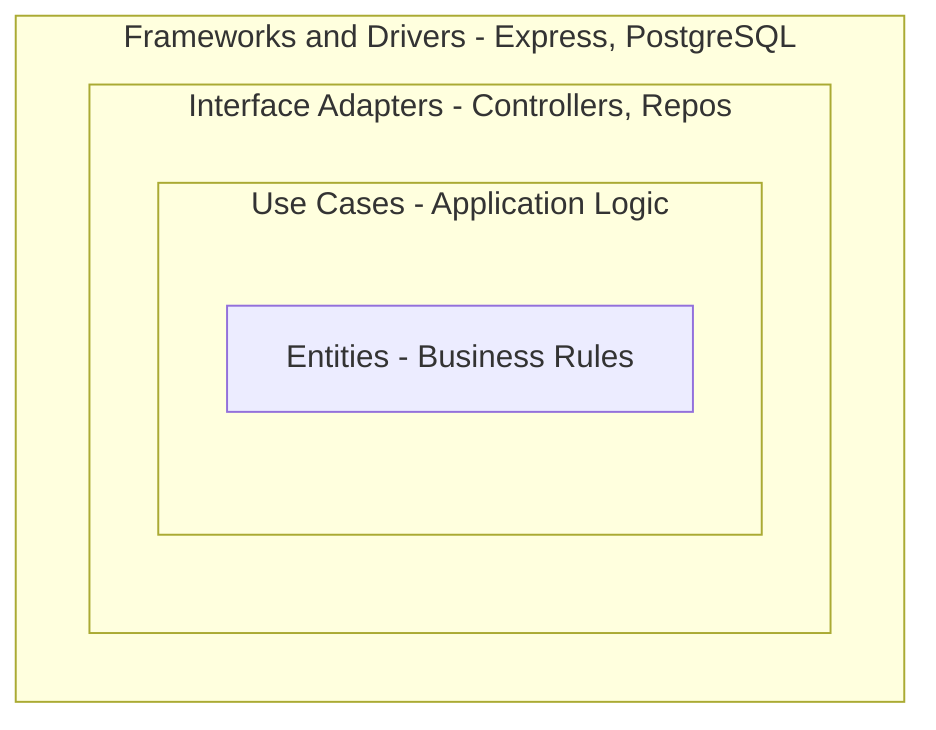
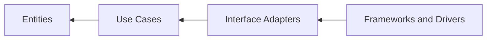
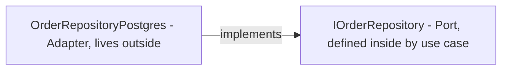
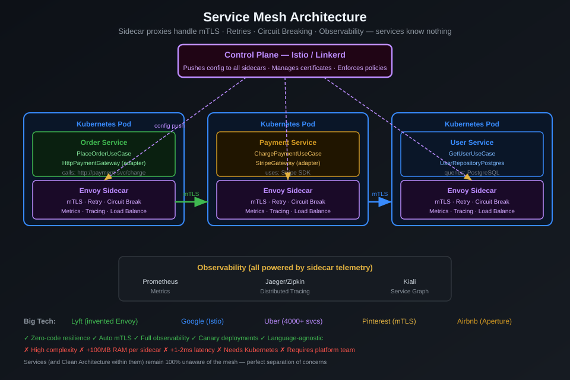

# Clean Architecture - Foundation (Zero to Hero)

> "The goal of software architecture is to minimize the human resources required to build and maintain the required system." - Robert C. Martin

---

## What Problem Does Clean Architecture Solve?

**The core problem:** Business logic entangled with frameworks, databases, and UI makes the codebase brittle. Every change is risky. Testing requires spinning up infrastructure.

**What good looks like:**
- Change your database -> zero business logic changes
- Change your UI framework -> zero business logic changes
- Test business rules -> no database needed, tests run in milliseconds

---

## The Dependency Rule (The ONE Rule)

The four layers nest inside each other - each outer layer contains the one within it:



Dependencies point only inward, toward the domain - inner layers know nothing about outer layers:



**If you ever import an outer-layer module into an inner-layer module, you have violated the architecture.**

---

## The Four Layers Explained

### Layer 1 - Entities (Innermost / Most Stable)

**What:** Pure business objects and rules of your enterprise.
**Examples:** `Order`, `User`, `Product`, `Money`
**Rule:** No framework imports. No database imports. Just business logic.

```typescript
class Order {
  private items: OrderItem[] = [];
  private status = OrderStatus.PENDING;

  addItem(item: OrderItem) {
    if (this.status !== OrderStatus.PENDING)
      throw new Error("Can't add to non-pending order");
    this.items.push(item);
  }

  place() {
    if (this.items.length === 0)
      throw new Error("Can't place empty order");
    this.status = OrderStatus.PLACED;
  }

  total(): Money {
    return this.items.reduce((s, i) => s.add(i.subtotal()), Money.ZERO);
  }
}
```

**Test:** `const order = new Order(); order.addItem(...); order.place();` - no DB, no HTTP, pure logic.

---

### Layer 2 - Use Cases (Application Logic)

**What:** The verbs - what the application CAN DO.
**Examples:** `PlaceOrderUseCase`, `RegisterUserUseCase`, `SearchProductsUseCase`
**Rule:** Depends on entities + interfaces (ports). Never on concrete implementations.

```typescript
class PlaceOrderUseCase {
  constructor(
    private orders: IOrderRepository,    // interface
    private payments: IPaymentGateway,   // interface
    private mailer: IMailService         // interface
  ) {}

  async execute(req: PlaceOrderRequest): Promise<PlaceOrderResponse> {
    const order = await this.orders.findById(req.orderId);
    order.place();                                         // entity rule
    await this.payments.charge(order.total(), req.card);  // via interface
    await this.orders.save(order);                        // via interface
    await this.mailer.sendConfirmation(order);            // via interface
    return { orderId: order.id, total: order.total() };
  }
}
```

**Test:** inject mock implementations of all 3 interfaces -> no real DB, no real Stripe needed.

---

### Layer 3 - Interface Adapters (Translation Layer)

**What:** Converts data between the use-case world and the external world.
**Types:**
- **Inbound adapters:** Controllers (HTTP -> UseCase DTO)
- **Outbound adapters:** Repository implementations (UseCase entity -> DB row)

```typescript
// Inbound: HTTP -> Use Case
class OrderController {
  constructor(private placeOrder: PlaceOrderUseCase) {}

  async post(req: Request, res: Response) {
    const result = await this.placeOrder.execute({
      orderId: req.params.id,
      card: req.body.card,
    });
    res.json(result);
  }
}

// Outbound: Use Case interface -> Real PostgreSQL
class OrderRepositoryPostgres implements IOrderRepository {
  async findById(id: string): Promise<Order> {
    const row = await this.db.query('SELECT * FROM orders WHERE id=$1', [id]);
    return OrderMapper.toDomain(row);   // DB row -> domain entity
  }
  async save(order: Order): Promise<void> {
    const data = OrderMapper.toPersistence(order);
    await this.db.query('UPDATE orders SET ...', data);
  }
}
```

---

### Layer 4 - Frameworks & Drivers (Outermost / Most Volatile)

**What:** The "details" - technology choices that can change without affecting business logic.
**Examples:** Express, NestJS, React, PostgreSQL driver, Redis client, Docker
**Rule:** Only this layer knows about external frameworks. All other layers are framework-free.

```typescript
// main.ts - Composition Root (the ONE place everything is wired)
const db = new PostgresConnection(config.db);
const orderRepo = new OrderRepositoryPostgres(db);
const stripe = new StripeGateway(config.stripe);
const mailer = new SendGridMailer(config.sendgrid);
const placeOrder = new PlaceOrderUseCase(orderRepo, stripe, mailer);
const controller = new OrderController(placeOrder);

const app = express();
app.post('/orders/:id/place', controller.post.bind(controller));
app.listen(3000);
```

---

## SOLID - The Micro-Level Foundation

| Principle | What It Means | Clean Arch Role |
|---|---|---|
| **S** - Single Responsibility | One reason to change | Each use case = one behavior |
| **O** - Open/Closed | Extend without modifying | Add new gateway without changing use case |
| **L** - Liskov Substitution | Subtypes are substitutable | MockRepo replaces PostgresRepo in tests |
| **I** - Interface Segregation | Small, focused interfaces | `IOrderRepository` not `IEverythingRepository` |
| **D** - Dependency Inversion | Depend on abstractions | Use case depends on `IPaymentGateway`, not `StripeGateway` |

**DIP is the mechanism that makes the Dependency Rule work in code.**

---

## Ports and Adapters (Hexagonal) - Same Concept, Different Name

A **port** is an interface defined in the use-case layer; an **adapter** is its implementation, living outside in the adapter/infrastructure layer. The adapter implements the port:



---

## Testing Strategy per Layer

| Layer | Test Type | Speed | Infrastructure Needed |
|---|---|---|---|
| Entities | Pure unit tests |  <1ms | None |
| Use Cases | Unit tests + mocks |  <5ms | None |
| Adapters (inbound) | Integration tests |  ~100ms | HTTP server |
| Adapters (outbound) | Integration tests |  ~200ms | Real DB |
| Full system | E2E tests |  ~2s | Everything |

**The pyramid:** Most tests at entity/use-case level (fast, no infra). Fewer at adapter. Fewer at E2E.

---

## Resource Consumption

| Concern | Impact |
|---|---|
| CPU | Minimal overhead - no extra processes, just code organisation |
| Memory | Minimal - interface dispatch is negligible |
| Developer time | Higher upfront (writing interfaces), massively lower long-term (refactoring, testing) |
| Test run time | Dramatically lower - unit tests run in <1s because no infra needed |

---

## Problems Clean Architecture Solves Best

| Problem | How Clean Architecture Helps |
|---|---|
| "Changing the DB requires touching 50 files" | DB is only in adapters; use cases unchanged |
| "We can't test without running the whole app" | Entities + use cases testable with zero infrastructure |
| "Adding a new client (mobile app) requires rewriting logic" | Use cases reused; only add a new adapter |
| "The framework upgrade broke everything" | Framework only in outermost layer; inner layers untouched |
| "New developer can't find where business logic lives" | Clear layer = clear location |

---

## Zero to Hero Learning Path

| Level | Focus | Time |
|---|---|---|
| 0 - Foundation | Understand layers, dependency rule, interfaces | Week 1 |
| 1 - Basics | Write entities + use cases + unit tests | Week 2 |
| 2 - Adapters | Write controllers + repository impls + integration tests | Week 3 |
| 3 - Patterns | Apply CQRS, Event-Driven inside Clean Arch | Week 4-6 |
| 4 - Distributed | Microservices, Saga, Event Sourcing | Week 7-10 |
| 5 - Hero | Full system design, Strangler Fig migration, Service Mesh | Week 11+ |

---

## How All 14 Patterns Relate to Clean Architecture

| Pattern | Relationship |
|---|---|
| Monolith | Apply Clean Arch within one process |
| Microservices | Clean Arch per service; boundaries become network |
| Event-Driven | Events cross boundaries via message bus interface |
| CQRS | Split use cases: Commands (write) + Queries (read) |
| Event Sourcing | Entity state = event log; same use cases, different repo impl |
| Saga | Use case that orchestrates across multiple services |
| API Gateway | Lives in framework layer; routes to correct service |
| Hexagonal | Same as Clean Arch (ports = interfaces, adapters = implementations) |
| Onion | Same concept; Domain -> Application -> Infrastructure naming |
| Layered (N-Tier) | Predecessor; less strict on dependency direction |
| BFF | Dedicated interface adapter layer per client type |
| Strangler Fig | Migration strategy to move legacy into Clean Arch incrementally |
| Serverless | Function handler = controller; use cases unchanged |
| Service Mesh | Infrastructure concern; invisible to use cases |


---

## Architecture Diagram



