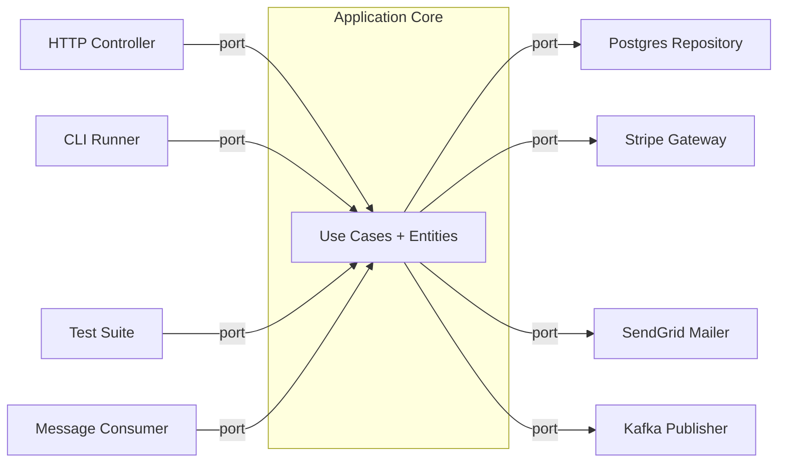

# Architecture 08 - Hexagonal Architecture (Ports & Adapters)

---

## At a Glance

| | |
|---|---|
| **Type** | Application isolation via ports and adapters |
| **Complexity** | Medium |
| **Best for** | Any application that needs to be testable, framework-independent, and driver-independent |
| **Relationship** | Same concept as Clean Architecture - different naming |

---

## What Is It?

Hexagonal Architecture (by Alistair Cockburn, 2005) isolates the application core from all external actors - databases, HTTP, message queues, UIs - through **Ports** (interfaces) and **Adapters** (implementations).

**Hexagon shape:** The application is drawn as a hexagon. On each side, a port. Outside each port, an adapter.

The core insight: **the application should be equally driveable by any driver** - a test suite, an HTTP client, a CLI tool, a message queue consumer.

---

## Diagram Reference
`./diagram.svg`

---

## Terminology Mapping

| Hexagonal Term | Clean Architecture Term |
|---|---|
| Application Core | Entities + Use Cases |
| Primary Port | Use Case interface (inbound) |
| Primary Adapter | Controller (HTTP, CLI, Test) |
| Secondary Port | Repository/Gateway interface (outbound) |
| Secondary Adapter | Repository impl, API client, Message publisher |
| Driving side | Left side - initiates actions |
| Driven side | Right side - reacts to use case calls |

---

## Structure

Driving adapters call the core through primary ports on the left; the core calls driven adapters through secondary ports on the right.



The hexagon has:
- **Left (Primary) Ports:** inbound interfaces - `IOrderUseCase`
- **Right (Secondary) Ports:** outbound interfaces - `IOrderRepository`, `IPaymentGateway`

---

## In Code

```typescript
// PRIMARY PORT (inbound interface)
interface IPlaceOrderUseCase {
  execute(request: PlaceOrderRequest): Promise<PlaceOrderResponse>;
}

// APPLICATION CORE
class PlaceOrderUseCase implements IPlaceOrderUseCase {
  constructor(
    private orders: IOrderRepository,    // SECONDARY PORT
    private payments: IPaymentGateway,   // SECONDARY PORT
    private mailer: IMailService         // SECONDARY PORT
  ) {}

  async execute(req: PlaceOrderRequest): Promise<PlaceOrderResponse> {
    const order = await this.orders.findById(req.orderId);
    order.place();
    await this.payments.charge(order.total(), req.card);
    await this.orders.save(order);
    await this.mailer.sendConfirmation(order);
    return { orderId: order.id };
  }
}

// PRIMARY ADAPTER (driving the use case via HTTP)
class HttpOrderAdapter {
  constructor(private useCase: IPlaceOrderUseCase) {}

  async post(req: Request, res: Response) {
    const result = await this.useCase.execute({ orderId: req.params.id, card: req.body.card });
    res.json(result);
  }
}

// TEST ADAPTER (driving the use case from a test)
// The beauty: no HTTP server needed to test business logic
class TestOrderAdapter {
  constructor(private useCase: IPlaceOrderUseCase) {}

  async testPlaceOrder() {
    return this.useCase.execute({ orderId: 'test-123', card: { number: '4242424242424242' } });
  }
}

// SECONDARY ADAPTER (driven by the use case for persistence)
class PostgresOrderRepository implements IOrderRepository {
  async findById(id: string): Promise<Order> { /* ... */ }
  async save(order: Order): Promise<void> { /* ... */ }
}

// SECONDARY ADAPTER for testing (in-memory)
class InMemoryOrderRepository implements IOrderRepository {
  private orders = new Map<string, Order>();
  async findById(id: string) { return this.orders.get(id)!; }
  async save(order: Order) { this.orders.set(order.id, order); }
}
```

---

## Resource Consumption

Hexagonal Architecture has **zero additional runtime overhead** compared to a non-hexagonal app. The patterns are purely organizational:

| Resource | Impact | Notes |
|---|---|---|
| **CPU** | None | Interface dispatch in modern runtimes is JIT-compiled away |
| **Memory** | None | No extra objects; just organizational structure |
| **Test execution** | Dramatically faster | Tests run without DB (InMemory adapters) |
| **Developer time** | Lower long-term | Clear where everything lives; less time hunting |

---

## Benefits

1. **Framework independence** - swap Express for Fastify: only the primary adapter changes
2. **Database independence** - swap PostgreSQL for MongoDB: only the secondary adapter changes
3. **Testability** - test use cases with InMemoryRepository; no DB needed; tests run in <5ms
4. **Multiple drivers** - same use case driven by HTTP, CLI, tests, and message queue simultaneously
5. **Clear boundaries** - "where does this code go?" is always answered by port/adapter structure
6. **Parallel development** - frontend team uses InMemory adapters; backend team implements real ones

---

## Problems It Solves Best

| Problem | How Hexagonal Helps |
|---|---|
| "Tests need a running DB and are slow (30s per run)" | Use InMemoryRepository; tests run in <1s |
| "We need to add a CLI interface for batch operations" | Add a CLI primary adapter; use case unchanged |
| "Our framework upgrade broke business logic" | Business logic has no framework imports; upgrade is safe |
| "Two teams are blocked waiting on each other's API" | Team A uses InMemory adapters; both develop in parallel |

---

## Costs / Tradeoffs

1. **More interfaces to write** - every boundary needs an interface and at least one implementation
2. **More files** - each adapter is a separate file; project has more files than a simple layered app
3. **Indirection** - tracing a call through port -> adapter -> infrastructure takes one more step
4. **Overkill for scripts** - a 200-line data migration script doesn't need hexagonal architecture

---

## Big Tech Examples

### Netflix (Java Spring ecosystem)
- **Architecture:** Hexagonal-style with ports for storage, queuing, and external APIs
- **Pattern:** Core streaming logic is framework-agnostic; adapters connect to Cassandra, Kafka, EVCache
- **Good at:** Testing streaming logic with in-memory adapters; no real Cassandra needed

### Spotify (Backend services)
- **Architecture:** Python and Java services follow hexagonal structure
- **Ports:** `IPlaylistRepository`, `IMusicRecommendationEngine`, `IAudioStreamAdapter`
- **Good at:** Swapping recommendation engine vendor without touching playlist logic

### Zalando (E-commerce, Germany)
- **Architecture:** Strong hexagonal architecture mandate across 200+ microservices
- **Good at:** Each service is independently testable; DB schema changes don't cascade

### ThoughtWorks (pioneered enterprise adoption)
- **Architecture:** The consulting firm that popularized Ports & Adapters in enterprise Java
- **Projects:** Banking systems, insurance platforms, healthcare - all using hexagonal
- **Good at:** Long-lived enterprise systems where technology changes (DB vendor, framework) must not break business logic

---

## Key Takeaway

> Hexagonal Architecture IS Clean Architecture - just different names for the same structure. Port = interface in use-case layer. Adapter = implementation in infrastructure layer. The hexagon metaphor emphasizes that ANY external actor (HTTP, CLI, test, queue) can drive the same application core through the same port. Master hexagonal = master Clean Architecture.
