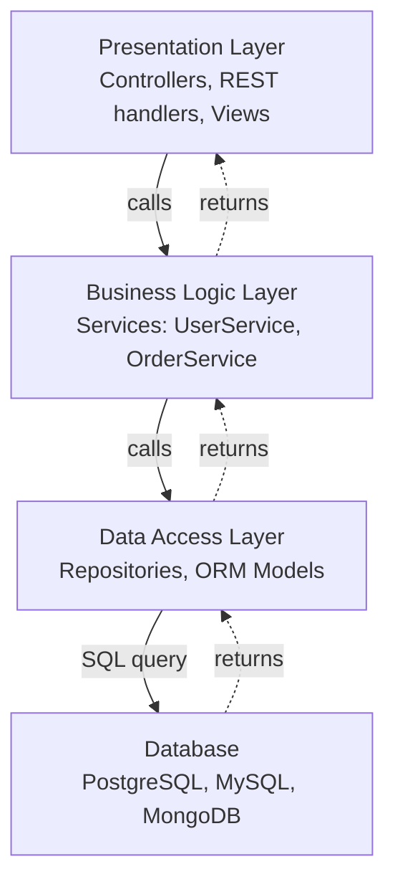

# Architecture 10 - Layered Architecture (N-Tier)

---

## At a Glance

| | |
|---|---|
| **Type** | Horizontal layer separation |
| **Complexity** | Low |
| **Best for** | Simple enterprise apps, beginner projects, CRUD systems |
| **Relationship** | Predecessor to Clean Architecture; less strict on dependency direction |

---

## What Is It?

Layered Architecture (also called N-Tier) organizes code into horizontal layers:
1. **Presentation Layer** - UI, controllers, REST endpoints
2. **Business Logic Layer** - services, domain logic
3. **Data Access Layer** - repositories, ORM models
4. **Database Layer** - the actual database

Each layer only talks to the layer directly below it.

---

## Diagram Reference
`./diagram.svg`

---

## Structure

Each tier calls down to the one directly below it, and results flow back up the same path.



---

## Comparison: Layered vs Clean Architecture

| Aspect | Layered (N-Tier) | Clean Architecture |
|---|---|---|
| Dependency direction | Strictly top-down | All inward (to center) |
| Business logic testability | Requires DB to test (tight coupling) | Pure unit tests (via interfaces) |
| DB coupling | Business layer often imports DB model directly | Business layer depends on interface only |
| Framework coupling | Business layer often imports HTTP framework | Business layer is framework-free |
| Anti-corruption | Weaker - "lower layer" can be imported anywhere | Strict - inner layer never imports outer |
| Common smell | "Smart Services, Dumb Models" | Entities have rich behavior |

---

## The Main Problem: Open Layers

In practice, layered architectures suffer from **layer skip**: the presentation layer imports the data access layer directly, bypassing business logic.

```typescript
// [X] Classic layered architecture "shortcut"
// Presentation layer directly importing Data Access layer
class OrderController {
  constructor(private orderRepository: OrderRepository) {} // skips service layer!

  async getOrder(req, res) {
    const order = await this.orderRepository.findById(req.params.id);
    res.json(order);  // raw DB model sent to client!
  }
}
```

Clean Architecture prevents this entirely by design.

---

## Resource Consumption

| Resource | Usage |
|---|---|
| CPU | Very low overhead - simple function call chain |
| Memory | Low - one process, simple stack |
| Network | Minimal - same process for all layers |
| Ops cost | Very low - one service, one DB |
| Test speed | Medium - often requires DB for BLL testing |

---

## Benefits

1. **Simple to understand** - even junior developers grasp "Presentation -> Service -> Repository -> DB"
2. **Fast to build** - less boilerplate than Clean Architecture; no interfaces required upfront
3. **Wide tool support** - most MVC frameworks (Spring MVC, Laravel, Rails, Django) enforce this by convention
4. **Easy onboarding** - new developers know exactly where to look

---

## Problems It Solves Best

| Problem | Why Layered Wins |
|---|---|
| "We're building a simple admin CRUD panel" | MVC framework gives you layered for free |
| "Team is junior; need a simple mental model" | "Controllers call Services call Repositories" is clear |
| "Fast prototype / MVP" | No interfaces, no ports - just write the code |
| "Rails/Django/Laravel project" | Framework enforces layered; no choice needed |

---

## Costs / Tradeoffs

1. **Coupling to DB** - business layer often imports DB entities directly; DB schema changes cascade
2. **Hard to test** - services often can't be tested without real DB
3. **Layer leakage** - nothing stops presentation from calling data access directly
4. **Tight framework coupling** - business layer often imports HTTP framework types
5. **Not suitable for complex domains** - business rules buried in "fat services"

---

## Big Tech Examples

### Most Early Web Applications
**Google's original web frontend (Python Django)**
- Presentation (Django views) -> Business logic (Python functions) -> Database (BigTable/MySQL)
- Simple and effective for CRUD operations at early stage

**Facebook's original PHP architecture (2004)**
- PHP template (presentation) -> PHP business logic -> MySQL queries
- Scaled to millions before architectural problems forced a rewrite to more isolated services

**Twitter's original Rails architecture (2006)**
- Rails MVC (presentation + routing) -> ActiveRecord models (business + data access) -> MySQL
- Rails' ActiveRecord blurs the BLL/DAL boundary by design - common in layered systems

**Amazon in early days (OBIDOS system in Perl, 1996-2001)**
- CGI scripts -> business logic -> DB queries
- Classic 3-tier layered; scaled with hardware before architectural limits were hit

### Enterprise Systems (Java Spring)
**SAP, Oracle enterprise apps**
- Spring MVC controllers -> Spring Services -> JPA repositories -> Oracle DB
- Layered is the default Spring Boot architecture; most tutorials show 3-tier

### Key Lesson from Big Tech
Every large company started with layered architecture. Every large company eventually:
1. Hit scaling issues from DB coupling
2. Hit testing issues from lack of interfaces
3. Migrated toward Clean/Hexagonal/DDD patterns - or extracted microservices

**Layered architecture is where you START. Clean Architecture is where you go when it hurts.**

---

## Key Takeaway

> Layered Architecture is the starting point - simple, fast, and supported by every MVC framework. It becomes problematic as the domain grows complex or teams grow large. The migration path is: introduce interfaces at the service boundary -> layer becomes Clean Architecture's "use case + adapter" pattern. This migration can be done incrementally, file by file.
