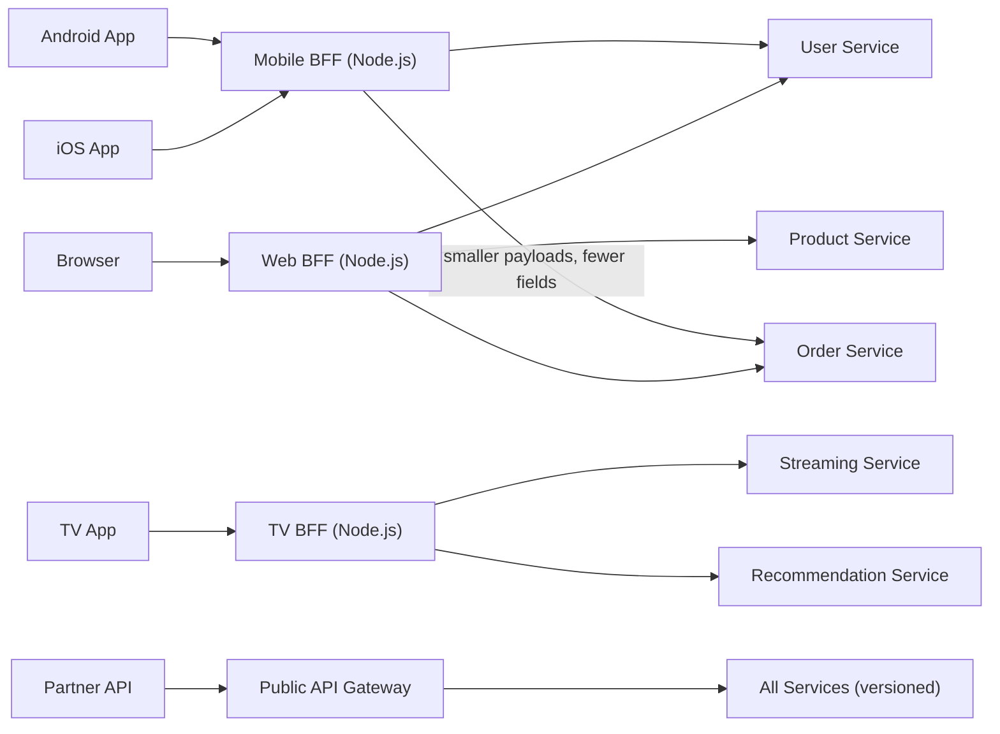

# Architecture 11 - BFF (Backend for Frontend)

---

## At a Glance

| | |
|---|---|
| **Type** | Dedicated backend per client type |
| **Complexity** | Medium |
| **Best for** | Multiple client types with very different data needs (mobile vs web vs TV) |
| **Avoid when** | Single client type, simple APIs, low team size |

---

## What Is It?

BFF (coined by Sam Newman, 2015) creates a **dedicated backend for each frontend type**. Instead of one general-purpose API that tries to serve web, mobile, and TV apps equally, each client gets its own optimized API.

**Why:** Mobile apps need small payloads and battery-efficient queries. Web dashboards need rich aggregated data. TV apps need different fields. One API trying to serve all = over-fetching for mobile, under-fetching for web.

---

## Diagram Reference
`./diagram.svg`

---

## Structure

Each client type talks to its own BFF, and the BFFs call the shared downstream services.



---

## In Clean Architecture Terms

Each BFF is its own **Interface Adapter** layer - an aggregating adapter that:
1. Receives client-specific requests
2. Calls multiple downstream service APIs (through interfaces/ports)
3. Aggregates, transforms, and returns client-optimized responses

```typescript
// Mobile BFF - Use Case: GetOrderSummaryForMobile
class GetOrderSummaryMobileUseCase {
  constructor(
    private orderClient: IOrderServiceClient,    // port
    private userClient: IUserServiceClient,       // port
    private productClient: IProductServiceClient  // port
  ) {}

  async execute(orderId: string): Promise<MobileOrderSummary> {
    // Fetch in parallel
    const [order, user, products] = await Promise.all([
      this.orderClient.getOrder(orderId),
      this.userClient.getUser(order.userId),
      this.productClient.getProductNames(order.items.map(i => i.productId)),
    ]);

    // Return ONLY what mobile needs - minimal payload
    return {
      id: order.id,
      status: order.status,
      total: order.total,
      items: order.items.length,  // just the count, not the full list
      customerName: user.name,   // just the name, not full profile
    };
  }
}

// Web BFF - SAME services, but returns MUCH more data for rich dashboard
class GetOrderSummaryWebUseCase {
  async execute(orderId: string): Promise<WebOrderDetail> {
    // Returns full order details + customer address + all product details + history
  }
}
```

---

## Resource Consumption

| Resource | Usage | Notes |
|---|---|---|
| **CPU** | Low-Medium per BFF | Aggregation + transformation overhead |
| **Memory** | Low per BFF | Stateless; no DB of its own |
| **Network** | Medium-High | Each BFF call = N downstream calls (fan-out) |
| **Latency** | Optimized per client | Mobile BFF minimizes data; web BFF aggregates |
| **Maintenance** | Medium | N BFFs to maintain; can diverge over time |
| **Team ownership** | Clear | Frontend team owns their BFF |

---

## Benefits

1. **Client-optimized responses** - mobile gets small payload; web gets rich data
2. **Frontend team autonomy** - frontend team owns and deploys their own BFF
3. **Parallel fetching** - BFF fetches from multiple services concurrently (Promise.all)
4. **Protocol flexibility** - mobile BFF uses REST, web BFF uses GraphQL - same backends
5. **Performance** - mobile saves bandwidth + battery; web reduces waterfall requests
6. **Security isolation** - mobile API can expose different fields than partner API

---

## Problems It Solves Best

| Problem | Why BFF Wins |
|---|---|
| "Mobile app over-fetches data designed for web" | Mobile BFF returns only mobile-needed fields |
| "Web dashboard needs to combine data from 5 services in one request" | Web BFF aggregates all 5 in parallel server-side |
| "iOS and Android teams need slightly different response shapes" | Each can have its own BFF or same mobile BFF with feature flags |
| "Adding a TV app requires different data than mobile" | New TV BFF; doesn't touch existing mobile or web BFF |
| "Partner API must be versioned separately from internal API" | Public API Gateway / BFF is isolated from internal frontend changes |

---

## Costs / Tradeoffs

1. **Code duplication** - some aggregation logic duplicated across BFFs
2. **N BFFs to maintain** - more deployments, more monitoring
3. **BFF sprawl** - without discipline, every team creates a BFF for everything
4. **Latency from fan-out** - BFF must wait for slowest downstream service
5. **Ownership ambiguity** - who owns the BFF when frontend and backend teams merge?

---

## Big Tech Examples

### Netflix
- **Architecture:** BFF for each device type: Browser, iOS, Android, Samsung TV, Roku, PlayStation
- **Web BFF:** Returns full movie details, reviews, trailers, recommendations
- **Mobile BFF:** Returns thumbnail, title, brief description, 30-second trailer
- **TV BFF:** Returns content optimized for 10-foot interface (large tiles, minimal text)
- **Good at:** Netflix's device footprint spans 2000+ device types - BFF per device category

### Airbnb
- **Architecture:** "Gatekeeper" BFF serving iOS, Android, and web separately
- **Mobile BFF:** Returns aggregated listing data (host info + pricing + availability) in one call
- **Web BFF:** Returns full listing with neighbourhood stats, host history, full calendar
- **Good at:** Mobile users get one API call instead of 3 sequential calls (faster first-meaningful-paint)

### SoundCloud
- **Architecture:** First company to publicly describe the BFF pattern (2015, Sam Newman talk)
- **Pattern:** Created separate API backends for iOS, Android, and web
- **Problem it solved:** Mobile API was returning 60KB JSON payloads designed for web; mobile was discarding 80% of data

### Zalando
- **Architecture:** BFF per product area (fashion, sports, beauty)
- **Good at:** Each product area has unique discovery and checkout flows; BFF tailors the API

### Monzo (UK Neobank)
- **Architecture:** Mobile BFF (Go) serving iOS and Android apps
- **Mobile BFF:** Aggregates account balance + recent transactions + pending payments in one call
- **Good at:** Banking apps need atomic snapshots of multiple data types; BFF fetches in parallel

---

## Key Takeaway

> BFF is a specialized Interface Adapter in Clean Architecture - one that aggregates and transforms data from multiple downstream services into a client-optimal response. Its power comes from team autonomy: the frontend team owns their BFF, controls its evolution, and can ship features without coordinating with backend teams on API shape.
