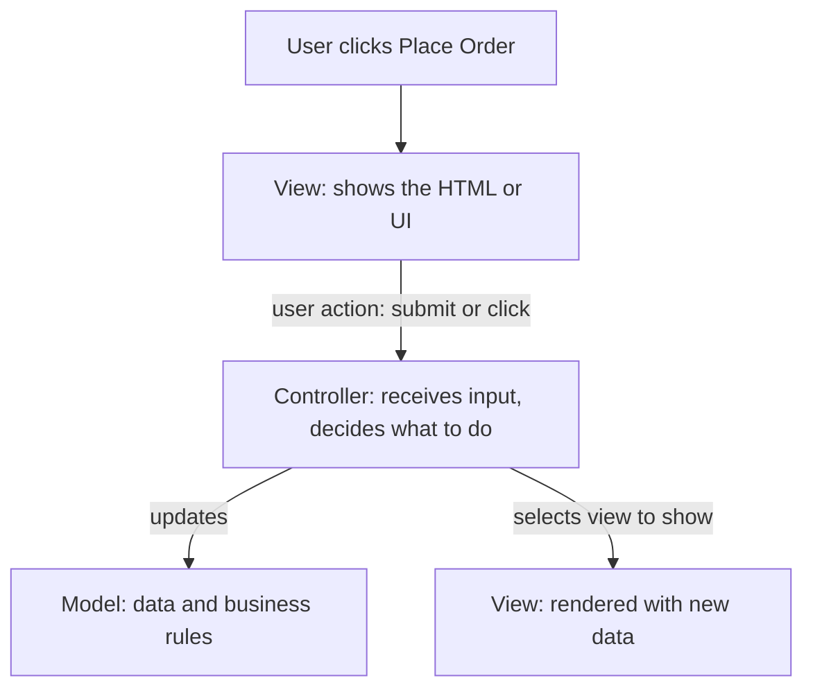
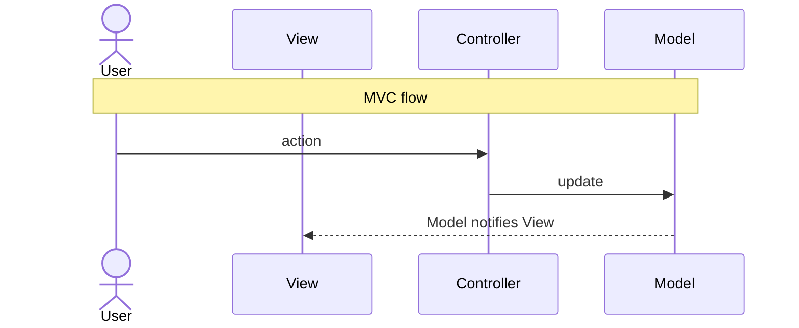
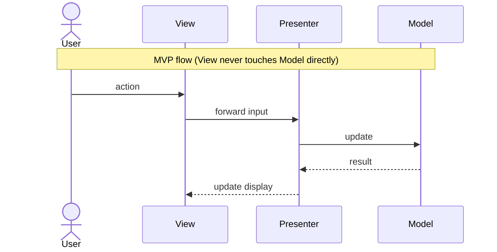
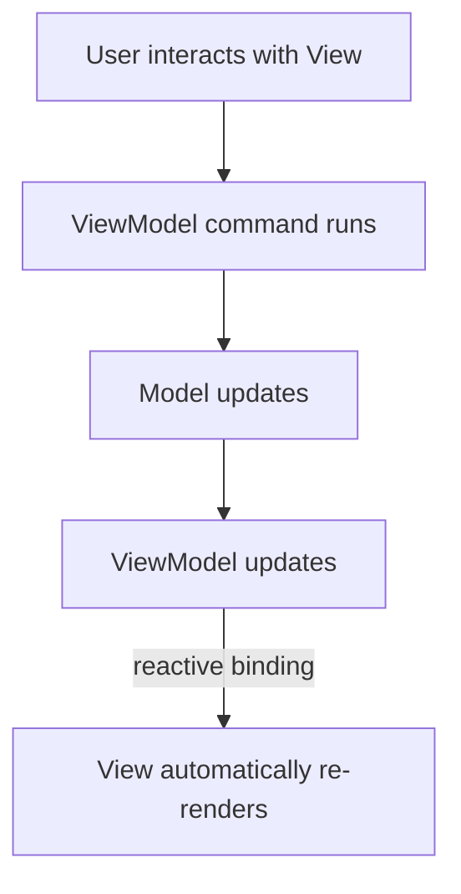
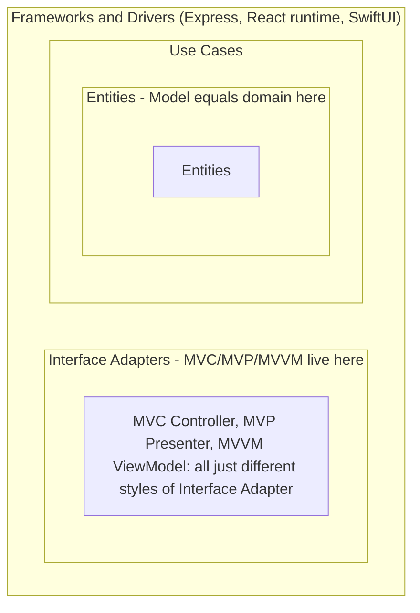

# MVC, MVP, MVVM - UI Architecture Patterns

> **IMPORTANT CLARIFICATION FIRST:**
> - **MVC** = Model-View-Controller -> a UI architecture pattern (how you organize application code)
> - **MVCC** = Multiversion Concurrency Control -> a DATABASE internal mechanism (how PostgreSQL handles concurrent reads/writes)
>
> These are completely unrelated. This file covers MVC/MVP/MVVM. See `33_mvcc_database_concurrency/` for MVCC.

---

## At a Glance

| Pattern | Era | Best Used In | Key Idea |
|---|---|---|---|
| **MVC** | 1970s (Smalltalk), popularized 2000s | Web (Rails, Laravel, Django, Spring) | Controller is the middleman |
| **MVP** | 1990s | Android (old style), WinForms | Presenter owns all display logic |
| **MVVM** | 2005 (Microsoft WPF) | Modern frontend (React, Vue, Angular, SwiftUI) | Two-way data binding via ViewModel |

---

## The Core Problem All Three Solve

**Without any pattern (spaghetti code):**

```javascript
// Everything mixed together - impossible to test or maintain
document.getElementById('buy-btn').onclick = function() {
  const qty = parseInt(document.getElementById('qty').value);
  if (qty <= 0) {
    document.getElementById('error').style.display = 'block';
    return;
  }
  fetch('/api/orders', {
    method: 'POST',
    body: JSON.stringify({ qty, productId: 42 })
  }).then(r => r.json()).then(order => {
    document.getElementById('order-id').textContent = order.id;
    document.getElementById('total').textContent = '$' + order.total;
    document.getElementById('success').style.display = 'block';
  });
};
// Problems: UI logic + business logic + network calls all in one event handler
// Can't unit test - needs a real browser DOM
// Change the API -> change this handler -> change the UI display -> all tangled
```

**With separation of concerns (MVC/MVP/MVVM):**
- UI (View) doesn't know how data is fetched
- Business logic (Model) doesn't know how it's displayed
- The "glue" (Controller/Presenter/ViewModel) mediates between them

---

## MVC - Model View Controller

### How It Works

Control flow when a user submits an action: the View forwards the input to the Controller, which updates the Model and then selects a View to render with the new data.



### The Three Components in Detail

**Model - "What the app knows"**
```typescript
// Model: data + business logic, no UI concerns
class OrderModel {
  private items: OrderItem[] = [];

  addItem(item: OrderItem): void {
    if (item.quantity <= 0) throw new Error('Quantity must be positive');
    this.items.push(item);
  }

  calculateTotal(): number {
    return this.items.reduce((sum, i) => sum + i.price * i.quantity, 0);
  }

  async save(): Promise<Order> {
    return await fetch('/api/orders', {
      method: 'POST',
      body: JSON.stringify({ items: this.items }),
    }).then(r => r.json());
  }
}
// Model never touches the DOM, never touches UI framework
// Testable with zero browser
```

**Controller - "What happens when user does X"**
```typescript
// Controller: receives user input, coordinates Model + View
class OrderController {
  constructor(
    private model: OrderModel,
    private view: OrderView
  ) {}

  async handlePlaceOrder(formData: FormData): Promise<void> {
    try {
      // 1. Parse user input
      const item = {
        productId: formData.get('productId') as string,
        quantity: parseInt(formData.get('quantity') as string),
        price: parseFloat(formData.get('price') as string),
      };

      // 2. Update model (business logic)
      this.model.addItem(item);

      // 3. Persist
      const order = await this.model.save();

      // 4. Update view with result
      this.view.showSuccess(order.id, order.total);
    } catch (error) {
      this.view.showError(error.message);
    }
  }
}
```

**View - "What the user sees"**
```typescript
// View: ONLY rendering logic - no business rules, no API calls
class OrderView {
  private form = document.getElementById('order-form')!;
  private successMsg = document.getElementById('success')!;
  private errorMsg = document.getElementById('error')!;

  showSuccess(orderId: string, total: number): void {
    this.successMsg.textContent = `Order ${orderId} placed! Total: $${total}`;
    this.successMsg.style.display = 'block';
    this.errorMsg.style.display = 'none';
  }

  showError(message: string): void {
    this.errorMsg.textContent = message;
    this.errorMsg.style.display = 'block';
    this.successMsg.style.display = 'none';
  }

  // View tells controller about user actions (not doing anything itself)
  bindPlaceOrder(handler: (data: FormData) => void): void {
    this.form.addEventListener('submit', (e) => {
      e.preventDefault();
      handler(new FormData(this.form));
    });
  }
}
```

**Wiring them together:**
```typescript
// Entry point: create components, wire them
const model = new OrderModel();
const view = new OrderView();
const controller = new OrderController(model, view);

// View tells controller: "when user submits, call handlePlaceOrder"
view.bindPlaceOrder((data) => controller.handlePlaceOrder(data));
```

### MVC in Frameworks

**Rails (Ruby):**
```
app/
  models/order.rb                     Model: ActiveRecord, business rules
  views/orders/show.html.erb          View: ERB template
  controllers/orders_controller.rb    Controller: routes HTTP to model to view
```

**Django (Python):**
```
# Django calls it MVT (Model-View-Template) but it IS MVC:
# Template = View, View = Controller, Model = Model
```

**Spring MVC (Java):**
```java
@Controller
public class OrderController {
    @PostMapping("/orders")
    public String placeOrder(@ModelAttribute OrderForm form, Model model) {
        Order order = orderService.place(form);  // uses Model
        model.addAttribute("order", order);
        return "order-success";  // selects View template
    }
}
```

### MVC Problems (Why MVP and MVVM Were Invented)

```
Problem 1: Massive Controllers ("Fat Controllers")
  As app grows, controller becomes enormous:
  - Handles 20 different user actions
  - Contains business logic (should be in model)
  - Contains view logic (should be in view)
  - Untestable (tightly coupled to both model and view)

Problem 2: View and Model coupling
  In classic MVC, View can observe Model directly
 -> Model changes -> View updates itself
 -> View has direct reference to Model
 -> Tightly coupled -> hard to test View without Model

Problem 3: Not suitable for modern reactive UIs
  React, Vue: "UI = f(state)" - UI is a function of data
  This doesn't fit the imperative "update the view" style of MVC
```

---

## MVP - Model View Presenter

### How It Differs from MVC

In MVC the View can observe the Model directly (coupling). In MVP the View only talks to the Presenter, which mediates everything. The two flows below are ordered interactions; note the View never touches the Model directly in MVP.





### The Presenter Pattern

```typescript
// View interface (View hides behind an interface)
interface IOrderView {
  showLoading(): void;
  showSuccess(orderId: string, total: number): void;
  showError(message: string): void;
  getFormData(): { productId: string; quantity: number; price: number };
}

// Presenter: owns ALL presentation logic
class OrderPresenter {
  constructor(
    private view: IOrderView,   // reference to the view INTERFACE
    private orderService: IOrderService  // reference to service INTERFACE
  ) {}

  async onPlaceOrderClicked(): Promise<void> {
    this.view.showLoading();  // presenter tells view what to show

    try {
      const formData = this.view.getFormData();  // presenter asks view for data

      // Business logic (or delegates to model/service)
      if (formData.quantity <= 0) {
        this.view.showError('Quantity must be positive');
        return;
      }

      const order = await this.orderService.place(formData);
      this.view.showSuccess(order.id, order.total);
    } catch {
      this.view.showError('Something went wrong. Please try again.');
    }
  }
}

// Concrete View (implements the interface)
class OrderViewImpl implements IOrderView {
  showLoading() { /* show spinner */ }
  showSuccess(id: string, total: number) { /* update DOM */ }
  showError(msg: string) { /* show error banner */ }
  getFormData() { /* read from DOM */ }
}

// Test View (implements same interface - no DOM needed for testing!)
class MockOrderView implements IOrderView {
  public shownSuccess = false;
  public shownError: string | null = null;
  showSuccess() { this.shownSuccess = true; }
  showError(msg: string) { this.shownError = msg; }
  showLoading() {}
  getFormData() { return { productId: 'p1', quantity: 2, price: 100 }; }
}

// TEST: no DOM, no browser, just pure logic
const mockView = new MockOrderView();
const presenter = new OrderPresenter(mockView, mockOrderService);
await presenter.onPlaceOrderClicked();
expect(mockView.shownSuccess).toBe(true);
```

**Why MVP is better than MVC for testability:**
- Presenter tested without a real View (MockView)
- View tested without a real Presenter (just check it calls the right methods)
- Model tested without any UI

**Where MVP is used:** Old Android (pre-Jetpack), Windows Forms (C#), old iOS

---

## MVVM - Model View ViewModel

### The Big Idea: Data Binding

In MVC/MVP the Presenter or Controller manually calls `view.update()` after every model change. In MVVM the ViewModel exposes reactive data and the View binds to its properties, so the View re-renders automatically with no manual "tell the view to update". The flow below traces a user interaction through the round trip back to the re-render.



### MVVM in React (the most common MVVM implementation today)

```typescript
// Model: domain data and business logic
interface Order {
  id: string;
  items: OrderItem[];
  total: number;
  status: 'pending' | 'placed' | 'failed';
}

// ViewModel: React custom hook - exposes state + commands
function useOrderViewModel() {
  // State (the "View Model" - what the View binds to)
  const [items, setItems] = useState<OrderItem[]>([]);
  const [isLoading, setIsLoading] = useState(false);
  const [error, setError] = useState<string | null>(null);
  const [order, setOrder] = useState<Order | null>(null);

  // Derived state (computed properties from model)
  const total = items.reduce((sum, item) => sum + item.price * item.quantity, 0);
  const canPlace = items.length > 0 && !isLoading;

  // Commands (what View can trigger)
  const addItem = (item: OrderItem) => {
    setItems(prev => [...prev, item]);
  };

  const placeOrder = async () => {
    setIsLoading(true);
    setError(null);
    try {
      const result = await orderService.place(items);  // calls Model/Service
      setOrder(result);
    } catch (e) {
      setError('Failed to place order. Please try again.');
    } finally {
      setIsLoading(false);
    }
  };

  return { items, total, canPlace, isLoading, error, order, addItem, placeOrder };
}

// View: ONLY renders what ViewModel exposes. No logic.
function OrderPage() {
  const vm = useOrderViewModel();  // binds to ViewModel

  // View automatically re-renders when ViewModel state changes
  return (
    <div>
      {vm.error && <ErrorBanner message={vm.error} />}
      {vm.order ? (
        <SuccessBanner orderId={vm.order.id} total={vm.order.total} />
      ) : (
        <>
          <ItemList items={vm.items} />
          <OrderTotal total={vm.total} />
          <button
            onClick={vm.placeOrder}  // View calls ViewModel command
            disabled={!vm.canPlace}
          >
            {vm.isLoading ? 'Placing...' : `Place Order ($${vm.total})`}
          </button>
        </>
      )}
    </div>
  );
}
```

**Key MVVM advantage:** The View is a pure function of ViewModel state. No imperative DOM updates. No "go find the button and change its text". Just: "if `isLoading` is true, show spinner" - React handles the rest.

### MVVM in Vue.js

```vue
<template>
  <!-- View: declarative binding to ViewModel data -->
  <div>
    <p>Total: {{ total }}</p>
    <button @click="placeOrder" :disabled="!canPlace">
      {{ isLoading ? 'Placing...' : 'Place Order' }}
    </button>
    <span v-if="error">{{ error }}</span>
  </div>
</template>

<script setup>
// ViewModel: reactive state + methods
const items = ref([]);
const isLoading = ref(false);
const error = ref(null);
const total = computed(() => items.value.reduce((s, i) => s + i.price * i.qty, 0));
const canPlace = computed(() => items.value.length > 0 && !isLoading.value);

async function placeOrder() {
  isLoading.value = true;
  try {
    await orderService.place(items.value);  // Model/Service
  } catch(e) {
    error.value = 'Failed';
  } finally {
    isLoading.value = false;
  }
}
// Vue's reactivity system: when items/isLoading/error change -> template auto-updates
</script>
```

### MVVM in Mobile (SwiftUI / Jetpack Compose)

```swift
// iOS - SwiftUI + MVVM
// ViewModel: ObservableObject = ViewModel
class OrderViewModel: ObservableObject {
  @Published var items: [OrderItem] = []      // @Published = triggers View update
  @Published var isLoading: Bool = false
  @Published var error: String? = nil

  var total: Double { items.reduce(0) { $0 + $1.price * Double($1.quantity) } }

  func placeOrder() async {
    isLoading = true
    do {
      let order = try await orderService.place(items)
      // success handling
    } catch {
      self.error = "Failed to place order"
    }
    isLoading = false
  }
}

// View: observes ViewModel, auto-updates
struct OrderView: View {
  @StateObject var vm = OrderViewModel()  // BINDS to ViewModel

  var body: some View {
    VStack {
      Text("Total: $\(vm.total)")
      Button(vm.isLoading ? "Placing..." : "Place Order") {
        Task { await vm.placeOrder() }
      }
      .disabled(vm.isLoading)
    }
  }
}
```

---

## MVC vs MVP vs MVVM - Complete Comparison

| Aspect | MVC | MVP | MVVM |
|---|---|---|---|
| **Era** | 1970s (web: 2000s) | 1990s | 2005 |
| **View-Model coupling** | Can be direct | None (via interface) | None (via binding) |
| **Testing View** | Hard (DOM needed) | Easy (mock view) | Easy (test ViewModel state) |
| **Testing logic** | Medium | Easy | Easy |
| **Data sync** | Manual (controller updates view) | Manual (presenter updates view) | Automatic (binding) |
| **Boilerplate** | Medium | High (interfaces for everything) | Low (binding handles updates) |
| **Best for** | Server-side web (Rails, Django) | Android old, desktop apps | Modern SPA, mobile, React/Vue |
| **Used by** | Ruby on Rails, Spring, Laravel | Old Android, WinForms | React, Vue, Angular, SwiftUI |

---

## How All Three Map to Clean Architecture

All three patterns live in the Interface Adapters layer of Clean Architecture. The nesting below shows containment: each outer layer wraps the inner ones, with Entities at the core.



!!! warning "The word 'Model' means different things"
    The "Model" in MVC/MVVM is not the same as an Entity in Clean Architecture.

    - MVC's "Model" often bundles business rules *and* data access together (too much).
    - Clean Architecture splits that apart: business rules go in the Entity layer, data access goes in a Repository adapter (Infrastructure).
    - The "Model" a View should receive is really a ViewModel/DTO returned by the Use Case - a data transfer object shaped for the UI.

---

## Senior's Advice: Which One to Choose?

> "Use the pattern your framework chooses for you:
> - Rails project? MVC. It's baked in. Don't fight it.
> - React project? MVVM (hooks-based). Custom hooks are your ViewModels.
> - Vue 3 project? MVVM (Composition API). `ref`, `computed` = ViewModel.
> - Jetpack Compose (Android)? MVVM. `ViewModel` + `StateFlow`.
> - SwiftUI? MVVM. `ObservableObject` + `@Published`.
> - Old Android? MVP or MVVM (both work).
>
> The pattern should disappear into the framework. If you're fighting the framework's conventions to implement a different pattern, you've made the wrong choice. Pick the pattern that fits naturally - then invest the saved time in making the Model layer (business logic) clean and testable."

---

## Sources
- [The Model View Controller Pattern - freeCodeCamp](https://www.freecodecamp.org/news/the-model-view-controller-pattern-mvc-architecture-and-frameworks-explained/)
- [Architecture Patterns for Beginners: MVC, MVP, MVVM - DEV Community](https://dev.to/chiragagg5k/architecture-patterns-for-beginners-mvc-mvp-and-mvvm-2pe7)
- [MVC vs MVP vs MVVM - Bacancy Technology](https://www.bacancytechnology.com/blog/mvc-vs-mvp-vs-mvvm)
- [UI Architecture Patterns: MVC and MVVM - Medium](https://medium.com/@a.kago1988/mvc-vs-mvvm-understanding-the-pros-and-cons-in-real-world-projects-efdb2544d450)
