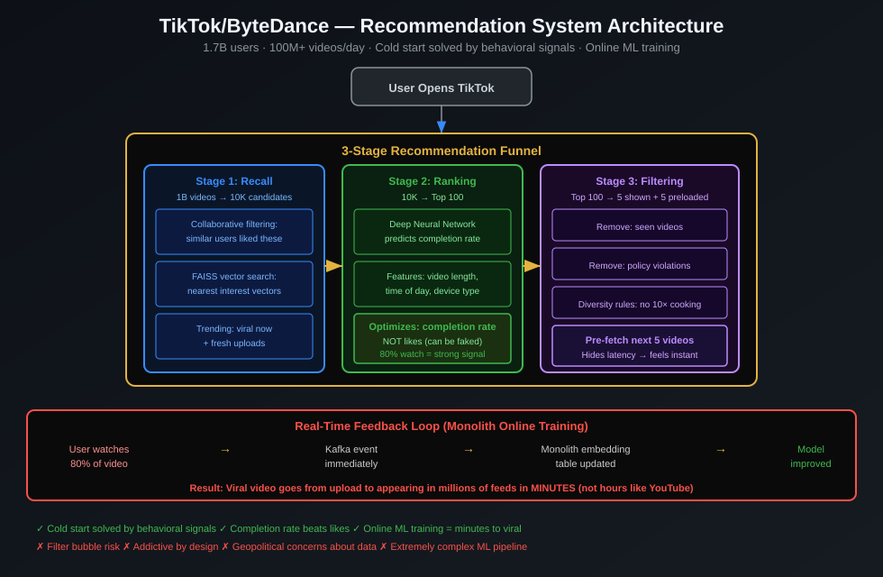

# Amazon — Architecture Case Study

> "It's all about the long term. We don't care about being right — we care about being right eventually." — Jeff Bezos

---

## Company Profile

| | |
|---|---|
| **Founded** | 1994 |
| **Scale** | 300M+ active customers, 12M+ products, $500B+ annual revenue |
| **Engineering team** | 80,000+ engineers |
| **Peak load** | 66,000 orders/minute on Prime Day |
| **Architecture today** | Domain-Oriented Microservices on AWS |

---

## The Senior Architect Tells the Story

> "Amazon's architecture story is the most important one in software engineering. They literally invented the cloud as a side effect of solving their own scalability problems. Let me walk you through it chronologically — because every phase teaches a different lesson."

---

## Phase 1: The Monolith (1994–2001)

**What they had:** OBIDOS — a Perl monolith that ran the entire Amazon.com

```
Customer Browser
      │
      ▼
OBIDOS (Perl monolith)
  ├── Product catalog logic
  ├── Shopping cart logic
  ├── Checkout logic
  ├── Recommendation logic
  ├── User account logic
  └── Order fulfillment logic
      │
      ▼
Oracle Database (one giant DB)
```

**Problems they hit:**
- **Deployment coupling:** Changing the recommendation algorithm required deploying the ENTIRE system — risky for checkout
- **Team blocking:** 30 teams committing to one codebase = constant merge conflicts
- **Scaling all-or-nothing:** The product catalog gets 10× more traffic during holidays than the checkout — but both lived in the same process, so you scaled the whole thing
- **DB bottleneck:** One Oracle DB couldn't handle peak Holiday traffic

**Why they couldn't just "scale up":**
> "We reached the biggest Oracle instance that existed. Then we bought 4 of them. Then we ran out of options. Vertical scaling has a ceiling; horizontal scaling requires architectural change." — Amazon engineering retrospective

---

## Phase 2: The Bezos Mandate (2002) — The Turning Point

Jeff Bezos sent an internal memo (now famous) that became the foundation of modern cloud computing:

```
The Bezos Mandate (2002):
━━━━━━━━━━━━━━━━━━━━━━━━
1. All teams will expose their data and functionality
   through SERVICE INTERFACES.

2. Teams must communicate with each other
   THROUGH THESE INTERFACES — no back doors,
   no direct DB access, no shared memory.

3. It doesn't matter what technology you use.

4. All service interfaces must be designed
   from the ground up to be EXTERNALIZABLE —
   someone outside the company must be able to call them.

5. Anyone who doesn't do this will be fired.

6. Thank you. Have a nice day.
```

**Why this worked:**
- Forced clean interface boundaries (= Clean Architecture's Dependency Rule)
- Prevented teams from sharing databases directly
- Required each team to think of their service as a product
- Created the foundational APIs that became AWS

---

## Phase 3: Service-Oriented Architecture (2002–2010)

**The Two-Pizza Team Rule:**
> "If you need more than two pizzas to feed the team working on a service, the service is too big." — Bezos

Each service:
- Owned by ≤8 people (one two-pizza team)
- Deployed independently
- Had its own database
- Exposed its functionality only through APIs

```
Customer Browser
      │
      ▼
ELB (Load Balancer)
      │
      ├──► ProductCatalogService    → Oracle (products)
      ├──► ShoppingCartService      → Dynamo (carts)
      ├──► CheckoutService          → RDS (orders)
      ├──► RecommendationService    → S3 + DynamoDB
      ├──► UserAccountService       → RDS (users)
      └──► FulfillmentService       → Aurora (inventory)
```

**Problems this solved:**
- Teams deploy on their own schedule
- ProductCatalog can scale ×20 for holidays; Checkout stays at ×1
- Recommendation service can be rewritten without touching Checkout

**New problems this created:**
- Network calls everywhere (service A calls B calls C calls D — 100ms stack)
- Distributed transactions (order + payment + inventory must all succeed)
- Service discovery (how does Checkout find FulfillmentService?)

---

## Phase 4: AWS Born From Internal Need (2003–2006)

Building 1000+ internal services required:
- Compute on demand → **EC2**
- Storage on demand → **S3**
- Database on demand → **RDS**, then **DynamoDB**
- Queue for async messaging → **SQS**
- Notification service → **SNS**

> "We built AWS because we needed it ourselves. Then we realized every company in the world has the same problems." — Andy Jassy

**DynamoDB: The Dynamo Paper (2007)**
Amazon's internal key-value store became the most influential distributed database paper ever written:
- **Problem:** Need a DB that never goes down, scales infinitely, handles peak Holiday traffic
- **Solution:** Consistent hashing, eventual consistency, vector clocks, gossip protocol
- **Result:** DynamoDB — powers Amazon's shopping cart, session data, and hundreds of external customers

---

## Phase 5: Domain-Oriented Microservices (2010–present)

With 2000+ microservices, Amazon discovered the same problem Uber would later solve with DOMA:
- Service dependencies became a tangled web
- Building a feature required coordinating 10 teams
- "Who owns this service?" became unclear

**Amazon's solution: Domain-based organization**

```
Domain: Shopping
  ├── ProductCatalogService
  ├── SearchService
  └── PricingService

Domain: Orders
  ├── ShoppingCartService
  ├── CheckoutService
  └── OrderManagementService

Domain: Fulfillment
  ├── InventoryService
  ├── WarehouseService
  └── ShippingService

Domain: Payments
  ├── PaymentProcessingService
  ├── FraudDetectionService
  └── RefundService
```

Each domain has one team. The team owns ALL services in their domain.

---

## Architecture Decisions Explained (Senior → Junior)

### Why DynamoDB for shopping cart, not PostgreSQL?

> "The shopping cart has one requirement above all else: it must NEVER be unavailable. If checkout is down, we lose money. DynamoDB is designed with availability as the #1 priority — it's AP in CAP theorem (Available + Partition-tolerant). PostgreSQL is CP (Consistent + Partition-tolerant). For financial transactions (actual payment), we want Consistency. For the cart (just storing items), we want Availability."

### Why SQS between services instead of direct calls?

> "If FulfillmentService calls ShippingService directly and ShippingService is down, the whole fulfillment fails. With SQS: FulfillmentService puts a message in the queue and returns. ShippingService processes it when it's healthy. The queue absorbs the failure. This is decoupling at the architecture level."

### Why the two-pizza team rule?

> "Communication overhead scales as O(n²) with team size. 5 people = 10 communication paths. 10 people = 45 communication paths. 20 people = 190 paths. Beyond ~8 people, everyone's in meetings instead of coding. Two pizzas forces the right team size."

---

## Key Technologies

| Problem | Solution | Why |
|---|---|---|
| Scalable key-value storage | DynamoDB | Always available; scales automatically |
| Relational data | Aurora | MySQL-compatible; 5× faster; auto-replicated |
| Event streaming | Kinesis | Kafka-like; managed; no cluster to maintain |
| Async decoupling | SQS + SNS | Queue for guaranteed delivery; topic for fan-out |
| Search | OpenSearch (Elasticsearch) | Full-text search across product catalog |
| Caching | ElastiCache (Redis) | Cache product pages, session data |
| CDN | CloudFront | Static assets, product images served at edge |

---

## Clean Architecture Mapping

```
Amazon's Services = Clean Architecture applied at organizational scale

Each service has its own:
  domain/       → Entities (Product, Order, Cart, Payment)
  application/  → Use Cases (PlaceOrder, ReserveInventory, ProcessPayment)
  adapters/     → REST/gRPC controllers + Repository implementations
  infra/        → DynamoDB, SQS, SNS, Aurora adapters

The Bezos Mandate's "service interface" = Clean Architecture's Port
The service API contract = the Interface (port) between services
No direct DB access = enforcing the Dependency Rule at org level
```

---

## Lessons for Your Architecture

1. **Start as a monolith** — Amazon ran OBIDOS for 8 years before extracting services
2. **Define boundaries first** — the Bezos Mandate forced API boundaries BEFORE splitting
3. **Choose storage by access pattern** — not "just use PostgreSQL for everything"
4. **Design for failure** — SQS absorbs failures; DynamoDB is always up; everything fails, design for it
5. **Two-pizza team = right service size** — if one team can't understand the whole service, it's too big

---

## Sources
- [Introducing Domain-Oriented Microservice Architecture — Uber (similar pattern)](https://www.uber.com/blog/microservice-architecture/)
- [AWS Architecture Blog](https://aws.amazon.com/blogs/architecture/)
- [DynamoDB Paper (2007) — the original Dynamo](https://www.allthingsdistributed.com/2007/10/amazons_dynamo.html)
- [A Brief History of Scaling Netflix — ByteByteGo](https://blog.bytebytego.com/p/a-brief-history-of-scaling-netflix)


---

## Architecture Diagram



