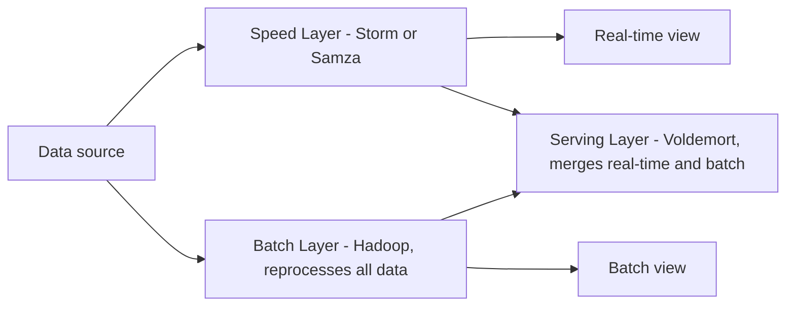
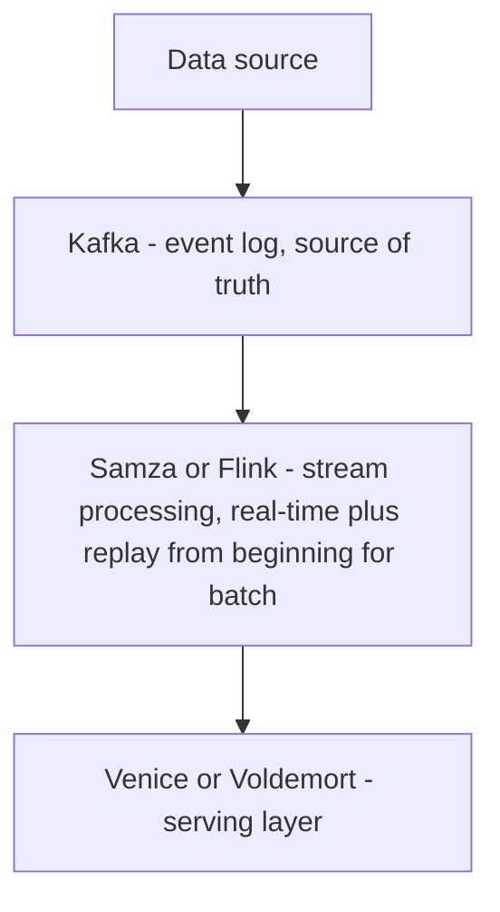

# LinkedIn - Architecture Case Study

> "We invented Kafka because we needed it. Then we gave it to the world." - LinkedIn Engineering

---

## Company Profile

| | |
|---|---|
| **Founded** | 2003 |
| **Scale** | 950M+ members, 200+ countries |
| **Messages** | 500+ billion Kafka messages per day |
| **Architecture today** | Kafka + Samza + Venice + Espresso + DALI |

---

## Why LinkedIn Matters for Architecture

LinkedIn is responsible for creating some of the most important infrastructure in the world: **Apache Kafka** (the standard for event streaming), **Apache Samza** (stream processing), and pioneering the Lambda Architecture debate (and its successor, the Kappa Architecture).

---

## Phase 1: The Original Monolith (2003-2010)

**"Leo" - The Rails/Java Monolith:**

```
Browser -> Leo (Ruby on Rails / Java) -> Oracle Database
```

**The problems:**

1. **Thundering herd on the Oracle DB:** The "People You May Know" feature queried your graph of connections and their connections - exponential graph traversal on a relational DB
2. **Single point of failure:** Leo went down, ALL of LinkedIn went down
3. **Deployment coupling:** 400+ engineers committing to one codebase

**The "People You May Know" performance problem:**
> "The algorithm: find everyone connected to your connections who isn't already connected to you. On a relational DB, this is a self-JOIN on the connections table which had hundreds of millions of rows. The query took minutes. Users bounced."

---

## Phase 2: The Graph Problem and Voldemort

**The insight:** LinkedIn is fundamentally a graph problem (people -> connections -> companies -> skills). SQL is designed for relational data, not graph traversal.

**Voldemort (2009)** - LinkedIn's own distributed key-value store:
```
Key: user_id
Value: { connections: [...], skills: [...], recommendations: [...] }

Benefits:
  - O(1) lookup by user_id (vs O(n) JOIN in SQL)
  - Distributes across nodes via consistent hashing
  - Handles millions of reads per second

Used for: profile data, connections graph, job recommendations
```

**Espresso (2012)** - LinkedIn's distributed document database:
```
Replaces Oracle for structured data
MySQL under the hood (battle-tested) + distributed routing layer on top
Handles: member profiles, InMail, company pages
Sharded by member_id using consistent hashing
```

---

## Phase 3: The Kafka Origin Story (2011)

**The problem that created Kafka:**

LinkedIn had over 100 data pipelines:
- Activity data (who clicked what, when)
- Metrics data (CPU, memory per server)
- Log data (application errors)
- Notification data (someone viewed your profile)

```
Before Kafka (every pipeline was point-to-point):
  Database -> (custom ETL script) -> Hadoop
  Database -> (different custom ETL) -> Metrics system
  Database -> (yet another script) -> Analytics DB
  Application -> (another script) -> Notification system

Problem:
  100 sources x 100 destinations = 10,000 custom pipelines
  Every new data source needs N integrations (one per destination)
  Every new destination needs M integrations (one per source)
  This is an O(MxN) complexity problem
  Maintenance nightmare: 500 ETL scripts, each slightly different
```

**The Kafka solution:**

```
After Kafka (hub-and-spoke):
  Any producer -> [Kafka] -> Any consumer

  LinkedIn Database -> Kafka -> Hadoop (batch analytics)
 -> Metrics system (real-time)
 -> Analytics DB
 -> Notification system

Adding a new data source: publish to Kafka. Done.
Adding a new consumer: subscribe from Kafka. Done.
Complexity: O(M+N) instead of O(MxN)
```

**Kafka's key design decisions:**

```
1. Log-structured storage (append-only)
   - Sequential writes are 10-100x faster than random writes
   - Consumers read from an offset (position in the log)
   - Can replay messages from any point in history

2. Consumer groups (parallelism)
   - Multiple consumers in a group each get a subset of partitions
   - Scale consumers independently of producers

3. Retention (events are durable)
   - Unlike traditional queues (delete after consume)
   - Kafka keeps messages for configurable time (e.g., 7 days)
   - Multiple consumers can read the same message independently

4. Partitioning (ordering guarantee)
   - Messages with the same key go to the same partition
   - Ordering guaranteed within a partition
   - LinkedIn: all events for member_id 12345 -> same partition -> ordered
```

**Scale achieved:**
- 500 billion messages per day
- 7 trillion messages per day at peak periods
- 500 terabytes of data processed per day

---

## Phase 4: The Lambda Architecture Problem (and Solution)

**Lambda Architecture (LinkedIn's original design):**

The same data source feeds two parallel layers; a serving layer merges their outputs.



**The problem with Lambda:**

> "We had to implement every computation TWICE - once in the real-time layer (Java/Storm), once in the batch layer (Java/Hadoop). Different APIs, different semantics, different bug patterns. When we found a bug in the batch logic, we had to fix it in two codebases. And the outputs sometimes disagreed. Which one do you trust?"

**Kappa Architecture (LinkedIn's answer, 2014):**

A single linear pipeline: Kafka is the source of truth, one stream processor handles both real-time and replay, then a serving layer.



One codebase. One processing framework. "Batch" = stream processing over historical data.

> "The insight: if your streaming system can replay from the beginning of the log, you don't need a separate batch system. A stream over historical data IS a batch job."

---

## The Feed Architecture (CQRS in Practice)

**LinkedIn's news feed:**

```
Write path (someone posts an update):
  POST /updates -> Kafka (update.published event)
 -> FeedFanout Service: fan out to all followers
 -> Venice: store pre-computed feed per user
 -> Notification Service: send push notifications

Read path (someone opens LinkedIn):
  GET /feed -> Venice (pre-computed feed for user_id)
 -> Returns in <10ms (no real-time computation)
 -> Feed is already computed and stored

This is CQRS:
  Command: PostUpdate -> event-driven write pipeline
  Query: GetFeed -> direct read from pre-computed store
```

**Why Venice (LinkedIn's own read-optimized store):**

Venice is purpose-built for "derived data" - data that's computed from Kafka events and stored for fast reads:
- Immutable store (updated by replacing, not patching)
- Push-based: Kafka writes to Venice via compaction
- Read-optimized: any node can serve reads without coordination
- Versioned: atomic swap of entire dataset with zero downtime

---

## Architecture in Clean Architecture Terms

```
LinkedIn's Architecture:

Kafka = the event bus (IEventBus port implemented by KafkaProducer/Consumer adapters)
  Use cases publish events via IEventBus - never import Kafka directly

Venice = read model store (IFeedRepository implemented by VeniceClient adapter)
  GetFeedUseCase reads from IFeedRepository - never imports Venice directly

Espresso = write model store (IMemberRepository implemented by EspressoClient adapter)
  Use cases write member data via IMemberRepository

Samza/Flink = stream processing services = specialized use cases
  Each Samza job = a use case that processes a stream of domain events
  Input: Kafka topic; Output: Venice or Kafka topic

Lambda -> Kappa migration = from "two implementations of same logic"
  to "one stream processor that can replay" = DRY principle at architecture level
```

---

## Lessons for Your Architecture

1. **Kafka solves the MxN pipeline problem** - point-to-point integrations don't scale
2. **Pre-compute reads where possible** - LinkedIn's feed is pre-computed (CQRS write -> Venice read)
3. **Lambda Architecture has a maintenance tax** - Kappa is simpler if your streaming framework can replay
4. **Purpose-built storage wins at specific access patterns** - Venice for derived reads, Espresso for structured writes, Voldemort for graph lookups
5. **Graph problems need graph solutions** - Voldemort (key-value) beats Oracle (relational) for "who are my connections' connections"

---

## Sources
- [Running Kafka at Scale - LinkedIn Engineering](https://engineering.linkedin.com/kafka/running-kafka-scale)
- [LinkedIn Migrates away from Lambda Architecture - InfoQ](https://www.infoq.com/news/2020/12/linkedin-lambda-architecture/)
- [How LinkedIn uses Apache Kafka in production - Factor House](https://factorhouse.io/articles/linkedin-kafka-architecture)
- [Operating Apache Samza at Scale - LinkedIn Engineering](https://engineering.linkedin.com/samza/operating-apache-samza-scale)


---

## Architecture Diagram


