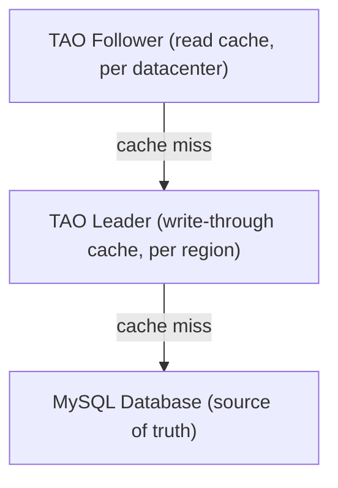

# Meta (Facebook) - Architecture Case Study

> "Move fast and break things - but don't break the social graph." - Meta engineering culture

---

## Company Profile

| | |
|---|---|
| **Founded** | 2004 |
| **Scale** | 3.2B daily active users across all apps |
| **Engineering** | 60,000+ engineers |
| **Data** | 100+ petabytes of data generated daily |
| **Architecture today** | TAO (social graph) + GraphQL + Scuba + Presto + React Native |

---

## The Senior Architect Tells the Story

> "Meta's hardest problem is unique in the world: a social graph with 3 billion nodes (people) and trillions of edges (friendships, likes, follows, comments). Every user action touches this graph. The entire architecture - TAO, GraphQL, React - was built to answer one question: how do you read and write a graph of 3 billion people efficiently?"

---

## The Core Problem: The Social Graph

```
Facebook's data model:
  Objects:  User, Post, Photo, Comment, Page, Group (3 billion+ objects)
  Edges:    friendOf, likedBy, commentedOn, memberOf (trillions of edges)

When you open Facebook, we need:
  - Your 500 friends' recent posts (500 edge traversals)
  - For each post: like count, comment count (500 more edge reads)
  - For each post: did YOU like it? (500 more edge reads)
  - Total: ~1,500 graph reads in <100ms

With traditional SQL:
  SELECT posts.*
  FROM posts
  JOIN friendships ON friendships.friend_id = posts.user_id
  WHERE friendships.user_id = ?
  ORDER BY created_at DESC
  LIMIT 20

This query JOIN across a 3B row table takes seconds.
TAO was built to make it milliseconds.
```

---

## Phase 1: The PHP Monolith (2004-2009)

**What they had:** LAMP stack - Linux, Apache, MySQL, PHP

```
Browser -> Apache -> PHP (the entire Facebook logic) -> MySQL (one DB)
```

**Problems:**
- **MySQL bottleneck:** Social graph queries (JOIN across billions of rows) were slow
- **PHP performance:** Dynamic language, interpreted, slow per-request
- **Memcache as duct tape:** Cached everything in Memcache to avoid hitting MySQL
- **Cache invalidation hell:** 500 engineers updating caches manually led to stale data, thundering herds

**The thundering herd problem:**
> "A celebrity posts a photo. Millions of friends hit the cache simultaneously. Cache miss. Millions of requests all hit MySQL at once. MySQL dies. Cache is now empty. More requests come. MySQL dies again. We called this the 'thundering herd' and it was our #1 scaling nightmare."

---

## Phase 2: TAO - The Social Graph Engine (2013)

**TAO** = "The Associations and Objects" - Meta's purpose-built graph data store.

**What TAO solves:**
```
Traditional cache-aside pattern (what they had):
  1. App reads from Memcache
  2. Cache miss -> read from MySQL
  3. Write to Memcache + MySQL separately
  Problem: List updates are wrong; read-after-write inconsistency; thundering herd

TAO pattern:
  1. App reads from TAO
  2. TAO manages its own cache (tiered: Leader + Follower)
  3. TAO handles invalidation, thundering herd protection, consistency
  Result: Consistent reads, no thundering herd, automatic cache management
```

**TAO Architecture:** reads flow down through cache tiers on a miss, ending at MySQL as the source of truth.



**Why TAO uses MySQL as the source of truth:**
> "MySQL is battle-tested, ACID-compliant, and we understand its failure modes. TAO is a CACHE layer above MySQL, not a replacement. The graph is stored in MySQL. TAO makes it fast."

---

## Phase 3: GraphQL (2012, open-sourced 2015)

**The problem that created GraphQL:**

```
Facebook News Feed in 2012 (mobile):
  User opens iOS app
  App makes REST API call: GET /user/123/feed
  Server returns: 200 fields of data (all user fields + all post fields)
  Mobile app uses: 12 of those 200 fields
  Wasted bandwidth: 94%

User clicks on a post:
  App needs post details
  Makes another API call: GET /posts/456
  But we already had SOME of this data in the feed response
  Had to make a SECOND call for the rest

Problems:
  1. Over-fetching: getting data you don't need
  2. Under-fetching: making multiple calls for related data
  3. No type safety: client doesn't know what fields are available
```

**GraphQL solution:**
```graphql
# Client asks for EXACTLY what it needs - no more, no less
query NewsFeed {
  user(id: "123") {
    name
    profilePhoto { url }
    friends(first: 10) {
      posts(first: 5) {
        id
        text
        likeCount
        commentCount
        didILike  # boolean for THIS user
      }
    }
  }
}
```

**Why this was revolutionary:**
- **One request** fetches the entire news feed with nested data
- **Client specifies exactly what fields** it needs
- **Type system** documents the API automatically
- **Server handles joins** - client doesn't do sequential API calls

> "GraphQL removed the negotiation between mobile and backend teams. Before: 'I need a new field in the API' -> file a ticket -> backend team adds field -> 2 weeks. After GraphQL: 'I need this field' -> add it to my query -> the API already has it if the data exists. Self-documenting, self-serving."

---

## Phase 4: React and the Frontend Revolution

**The problem:**

Facebook's homepage was a PHP template that server-rendered HTML. When you liked a post, the count would update - but only after a page refresh. The user experience was terrible.

**The insight:**

> "Our UI is really a function of data. If the data changes, the UI should automatically reflect that. Instead of manually finding the DOM element for 'like count' and updating its text, what if we just described WHAT the UI should look like given the current data, and let the framework figure out the DOM changes?"

**React (2013):**
```jsx
// Old way (jQuery):
$('#like-count-' + postId).text(newCount);
// Manual DOM manipulation - what if the element doesn't exist yet? Race conditions?

// React way:
function Post({ post }) {
  return <div className="like-count">{post.likeCount}</div>;
}
// When post.likeCount changes, React automatically re-renders
// No manual DOM manipulation. No race conditions.
```

**Why React changed everything:**
- Components are pure functions of state (like entities in Clean Architecture)
- Declarative: describe WHAT the UI looks like, not HOW to update it
- Virtual DOM: React calculates the minimum DOM changes needed
- Composable: build complex UIs from simple components

---

## The Scuba Real-Time Analytics System

**Problem:** 60,000 engineers push code 100+ times per day. How do you know if a deployment broke something?

**Solution: Scuba** - Facebook's in-memory time-series database

```
Every metric sampled: CPU, memory, error rate, latency per endpoint
Scuba ingests: 2 BILLION samples per second
Query latency: <1 second for any query over the last 24 hours
Storage: All in RAM across a cluster of servers

Engineering workflow:
  Deploy new code at 2pm
  Scuba dashboard: "Error rate on /feed endpoint jumped from 0.1% to 2%"
  Roll back in 5 minutes
  Zero users affected
```

---

## Architecture in Clean Architecture Terms

```
Meta's architecture = Clean Architecture applied to social graph scale

TAO = Repository implementation (IGraphRepository)
  Use cases call IGraphRepository.getEdges(userId, 'friends', limit: 10)
  TAO decides: check follower cache -> leader cache -> MySQL
  Use case doesn't know about this 3-tier caching

GraphQL = Interface Adapter (inbound)
  GraphQL resolver = Controller that calls use cases
  Client specifies the DTO shape via the query
  Server returns exactly that shape

React = Framework & Drivers layer
  Pure JavaScript function that renders given the data
  Business logic is NOT in React components
```

---

## Lessons for Your Architecture

1. **Data model drives architecture** - Facebook's social graph problem required TAO; your CRUD app doesn't need it
2. **Over-fetching/under-fetching is real** - GraphQL is the right answer when clients have diverse data needs
3. **Design for observability** - Scuba lets 60K engineers deploy safely because they can see metrics in real-time
4. **Cache invalidation is hard** - TAO solved it; understand the problem before rolling your own cache
5. **Declarative > Imperative** - React's "describe what you want" beats jQuery's "describe how to get there"

---

## Sources
- [TAO: The Power of the Graph - Engineering at Meta](https://engineering.fb.com/2013/06/25/core-infra/tao-the-power-of-the-graph/)
- [GraphQL: A Data Query Language - Engineering at Meta](https://engineering.fb.com/2015/09/14/core-infra/graphql-a-data-query-language/)
- [Tech Stack Rebuild for Facebook.com](https://engineering.fb.com/2020/05/08/web/facebook-redesign/)
- [TAO - Meta's Scalable Architecture](https://engineeringatscale.substack.com/p/tao-metas-scalable-architecture-powering)


---

## Architecture Diagram


