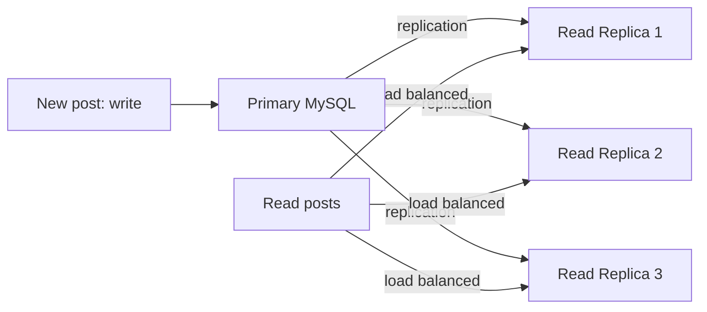

# Pantip - Architecture Case Study

> "แพนทิปอยู่มานานกว่า 30 ปี เราเห็นอินเทอร์เน็ตไทยเติบโตมาตั้งแต่ต้น และเราต้องปรับตัวเสมอ" - Pantip Engineering

---

## Company Profile

| | |
|---|---|
| **Founded** | 1993 (web version 1996) |
| **Scale** | 5M+ registered members, 30M+ unique visitors/month |
| **Content** | Thailand's largest online community - 40M+ posts |
| **Position** | Like Reddit for Thai users - 30+ year legacy |
| **Architecture today** | LAMP -> PHP -> MySQL sharding + Redis + Elasticsearch |

---

## What Is Pantip?

Pantip is Thailand's oldest and largest internet community platform - predating Facebook, Twitter, and Reddit. Founded in 1993 as an offline computer club, it launched a web version in 1996. For Thai internet users, Pantip is the go-to place for:

- Advice and recommendations ("ถามเรื่องซื้อบ้าน", "รีวิวร้านอาหาร")
- Current events discussion
- Technical support (IT, cars, home appliances)
- Entertainment forums
- Consumer complaints and reviews

This makes Pantip's access pattern unique: **highly concentrated traffic by topic (board)** rather than evenly distributed.

---

## The Senior Architect Explains Pantip's Unique Challenge

> "Pantip ไม่ได้มีปัญหาเหมือน Netflix หรือ Twitter ที่ traffic กระจายทั่วระบบ ปัญหาของ Pantip คือ traffic มันกระจุกตัวมาก ถ้าวันนี้มีข่าวใหญ่ - เลือกตั้ง, น้ำท่วม, ดารามีเรื่อง - board นั้น board เดียวอาจได้ traffic 100 เท่าของปกติ ในขณะที่ board อื่นเงียบสนิท เราต้องออกแบบระบบให้รับ spike แบบนี้ได้"

**Translation:**
> "Pantip's problem is not like Netflix or Twitter where traffic is spread across the system. Pantip's problem is highly concentrated traffic. If today there's big news - election, flood, celebrity scandal - that one board gets 100x normal traffic while other boards are quiet. We must design to handle this kind of spike."

---

## Phase 1: The Classic LAMP Stack (1996-2010)

**Original architecture:**

```
Browser -> Apache -> PHP scripts -> MySQL (one server)
```

**Early problems:**

```
By 2005, Pantip had millions of visitors:
  Single MySQL server:
    CPU: 90%+ during daytime
    Storage: growing rapidly (posts, images, user data)
    Memory: buffer pool exhausted -> disk reads -> slow queries

  Peak traffic events:
    Thai New Year (Songkran) discussions -> 10x normal traffic
    Political events -> everyone posts opinions simultaneously
    Single MySQL -> overwhelmed -> site goes down -> 503 errors

  Forum-specific query:
    SELECT posts.* FROM posts WHERE board_id = 12 ORDER BY created_at DESC LIMIT 20

    board_id = 12 (Entertainment board): 50M rows -> slow
    board_id = 45 (Gardening board): 100K rows -> fast
    Same query, 500x different performance based on board
```

**Why Pantip's problem is different from big tech:**

```
Twitter: celebrity tweets -> fanout to millions of followers
Pantip: celebrity news -> concentration to one board

Twitter solution: push tweet to follower caches
Pantip solution: aggressive per-board caching, board-level isolation
```

---

## Phase 2: MySQL Read Replicas (2010-2014)

**The read replica pattern:**

Write load is moderately sized (people write less than they read); read load is massive (everyone reads the same popular posts). The solution is a primary with read replicas: writes go to the primary, reads are load-balanced across the replicas.



Benefit: 3x read capacity without sharding complexity. Drawback: replication lag (post appears 1-2 seconds after write) - acceptable for a forum, but not for financial transactions.

**The board-based caching strategy:**

```php
// Pantip's board cache strategy
function getRecentPosts(int $boardId, int $page = 1): array {
    $cacheKey = "board:{$boardId}:page:{$page}";

    // Try Redis first
    $cached = Redis::get($cacheKey);
    if ($cached) {
        return json_decode($cached, true);
    }

    // Cache miss: query read replica
    $posts = DB::readReplica()->query(
        "SELECT * FROM posts WHERE board_id = ? ORDER BY last_reply DESC LIMIT 20 OFFSET ?",
        [$boardId, ($page - 1) * 20]
    );

    // Cache with board-specific TTL
    // Hot boards: 30 seconds (data changes fast)
    // Cold boards: 5 minutes (data rarely changes)
    $ttl = $this->getBoardTTL($boardId);
    Redis::setex($cacheKey, $ttl, json_encode($posts));

    return $posts;
}
```

---

## Phase 3: Board-Based Sharding (2014-present)

**The sharding insight:**

> "Pantip's data access pattern maps naturally to boards (categories). Users browse BY board. Post searches are almost always within one board. Join between boards is rare. Board is the natural shard key."

**Pantip's shard structure:**

```
Shard Group 1 (High-traffic boards):
  MySQL Cluster A -> Board 1 (Pantip Cafe - general), Board 5 (IT), Board 12 (Entertainment)
  Primary + 5 Read Replicas (these boards get the most traffic)

Shard Group 2 (Medium-traffic boards):
  MySQL Cluster B -> Board 20 (Cars), Board 25 (Food), Board 30 (Travel)
  Primary + 3 Read Replicas

Shard Group 3 (Low-traffic boards):
  MySQL Cluster C -> Board 40 (Gardening), Board 45 (Pets), Board 50 (Elderly)
  Primary + 1 Read Replica

Routing:
  Request: GET /board/12/posts
  PHP middleware: board_id 12 -> Cluster A -> read from replica pool

Benefits:
  Entertainment board goes viral -> Cluster A is stressed
  Car board traffic is normal -> Cluster B unaffected
  Board-level failure isolation
```

**The event-driven traffic spike handling:**

```
Normal day: Cluster A at 30% CPU
2019 Thai election day: political board traffic 100x normal
 -> Cluster A at 95% CPU
 -> Read replicas at 100% CPU

Response:
  Emergency: spin up 3 additional read replicas for Cluster A (AWS)
  Pre-emptive: for known events (Songkran, elections), scale up 24h before

Post-event:
  Traffic normalizes -> additional replicas terminated
  Cost: temporary; availability: maintained
```

---

## The Search Architecture

**Pantip's full-text search requirements:**

```
Thai language search challenges:
  Thai has no spaces between words
  "ซื้อบ้านในกรุงเทพ" (Buy house in Bangkok)
    = ซื้อ + บ้าน + ใน + กรุงเทพ (need word segmentation)

  Search engines (Elasticsearch default) are NOT Thai-aware
  Must add Thai word segmentation (PyThaiNLP or icu_analyzer)

Architecture:
  New post saved -> MySQL (primary)
  Post saved -> async event -> Elasticsearch indexer
  Elasticsearch: indexed with Thai tokenizer

  User searches "รีวิวร้านอาหาร" (restaurant review):
 -> Elasticsearch (full-text, Thai tokenizer)
 -> Returns post IDs
 -> Fetch post details from MySQL read replica
 -> Return to user

Board-specific search:
  "ค้นหาใน board IT เรื่อง MacBook"
 -> Elasticsearch with board_id filter
 -> Fast: Elasticsearch keeps board_id as indexed field
```

---

## The Image Architecture

**Pantip posts are image-heavy (Thai community culture):**

```
Problem: Posts often contain 5-20 images each
  Direct upload to server -> server disk fills up
  Serve images from server -> server bandwidth maxed out

Solution:
  Image upload -> PHP processes -> CDN origin storage
  CDN (Cloudflare or similar) -> serves images at edge

  Thai users: CDN PoP in Bangkok -> low latency
  Image processing: thumbnail generation on upload
    Original: 5MB JPEG
    Thumbnail: 200KB WebP (resize + compress on upload)
    Mobile view: 500KB WebP (medium quality)

  Redis for image metadata:
    image:{id} -> { width, height, url, board_id }
    Used to render image tags without DB query
```

---

## Event Spike Architecture for Thai Events

**The Songkran / Election / Disaster pattern:**

```
Regular day:
  10M page views/day
  Average response time: 200ms
  MySQL CPU: 40%

Songkran (Thai New Year, 5 days):
  30M page views/day (3x normal)
  Traffic is predictable -> pre-scale 3 days before
  Additional read replicas added, CDN cache TTL extended

Unexpected disaster (flood, earthquake):
  Traffic to news/disaster board: 50-100x in minutes
  Auto-scaling triggers: CloudWatch alert -> AWS ASG adds capacity

  CDN strategy for disaster events:
    Emergency posts cached for 30 seconds (fresher than normal)
    Images cached for 24 hours (static, no expiry)
    Thread lists cached for 10 seconds (high update rate)

Circuit breaker for the hot board:
  If database behind the board can't keep up:
    Serve stale cached content (from 2 minutes ago)
    vs
    Serve 503 error

  Pantip chooses: serve stale content
  Users see slightly old data but site stays up
```

---

## Architecture in Clean Architecture Terms

```
Pantip's Architecture:

PostRepository = Use Case dependency (interface)
  IPostRepository.getRecentPosts(boardId, page) -> port
  MySQLPostRepository -> primary adapter (reads from correct shard)
  CachedPostRepository -> decorator (wraps MySQL repo with Redis cache)

  Use case: GetRecentPostsUseCase
    Calls IPostRepository (doesn't know about sharding or caching)
    CachedPostRepository checks Redis first, then MySQL shard

Board Shard Router = Infrastructure (outbound)
  MySQLPostRepository -> selects correct MySQL cluster based on board_id
  Routing table: board_id -> cluster_connection stored in config

Elasticsearch = Secondary read adapter
  ISearchRepository -> ElasticsearchRepository (adapter)
  SearchPostsUseCase depends on ISearchRepository
  ElasticsearchRepository handles Thai tokenization internally

Redis = Cache adapter (decorator pattern)
  CachedPostRepository wraps IPostRepository with cache logic
  Cache TTL is a configuration concern (not business logic)
```

---

## Key Thai-Context Lessons

1. **Thai language requires special handling** - Thai word segmentation is non-trivial; use PyThaiNLP or ICU analyzer in Elasticsearch
2. **Board-based sharding matches the access pattern** - Pantip users browse by board; shard by board
3. **Predict spikes from the calendar** - Thai events are culturally predictable; pre-scale for Songkran, elections
4. **Stale content > unavailability** - for a community forum, showing 2-minute-old data is better than a 503 error
5. **CDN is essential for Thai users** - without Bangkok PoP, latency from overseas servers is 200ms+; with Bangkok CDN, it's 10ms

---

## Lessons for Your Architecture (Universally Applicable)

1. **Access patterns determine shard key** - Pantip shards by board because queries are always board-scoped
2. **Read replicas before sharding** - Pantip used read replicas for years before needing board sharding
3. **Event-driven scaling is cost-effective** - scale up before events, down after; pay only for what you need
4. **Caching TTL is a business decision** - 30-second TTL for hot boards vs 5-minute for cold boards = product decision, not just engineering
5. **Domain-specific search requires domain-specific config** - Thai text search requires Thai tokenizer; don't assume Elasticsearch defaults work for your language


---

## Architecture Diagram


