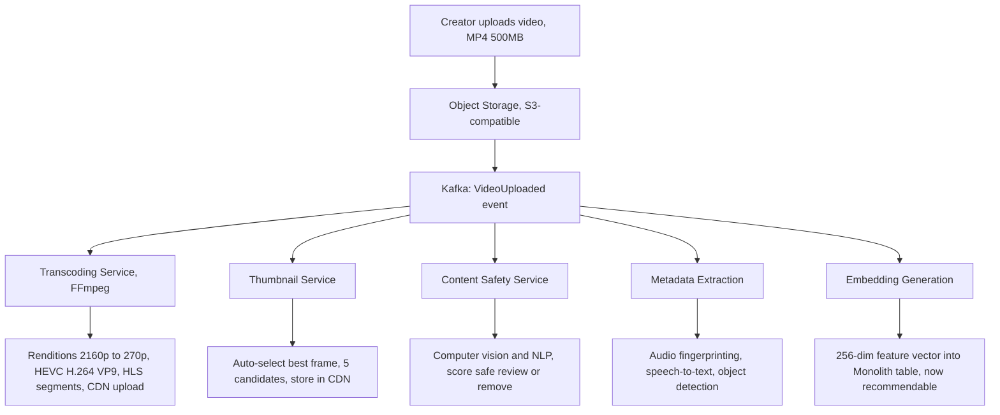
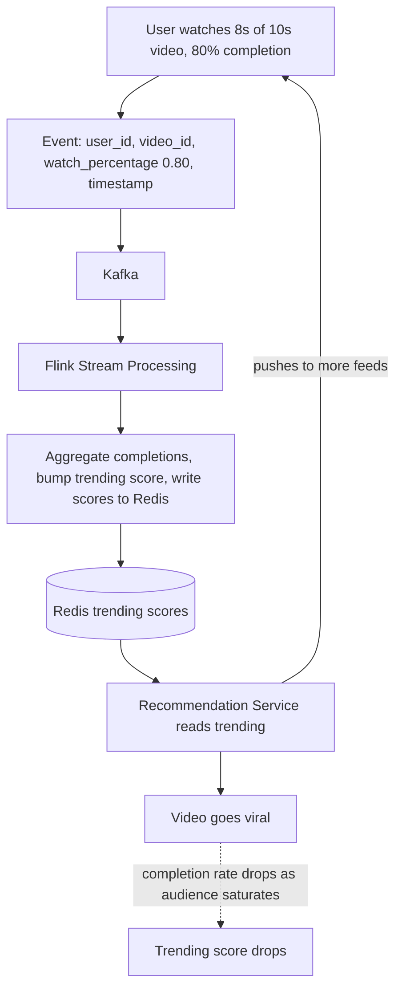

# TikTok / ByteDance - Architecture Case Study

> "TikTok's recommendation system is so effective that the average user spends 95 minutes per day on the platform - not because of content quality, but because of algorithmic precision." - Industry analysis

---

## Company Profile

| | |
|---|---|
| **Founded** | 2012 (ByteDance), 2016 (TikTok) |
| **Scale** | 1.7B monthly active users, 150M in the US alone |
| **Content** | 1B+ videos, 100M+ videos uploaded per day |
| **Engineering** | 10,000+ engineers, offices in Beijing, Singapore, Mountain View |
| **Architecture today** | Recommendation ML + Microservices + Kafka + Flink + Kubernetes |

---

## The Core Problem: The Cold Start Problem

> "Every other platform tries to show you content from people you follow. We start with: 'I know nothing about you. Here's a random popular video. Let me watch what you do for 10 seconds.' Our algorithm learns faster than any other platform."

**The fundamental architectural difference:**

```
YouTube/Instagram (follow-based):
  Content pool = videos from people you follow
  Algorithm: rank this pool by engagement probability
  Cold start: follow people first -> only then get good content

TikTok (interest-based):
  Content pool = ALL videos (filtered by quality)
  Algorithm: predict which video you'll finish watching
  Cold start: first video is random popular -> algorithm learns immediately

  After 10 videos: TikTok knows more about your taste than YouTube
                   knows after 100 follow-choices
```

---

## The Recommendation System Architecture

**The three-stage funnel:**

```
Stage 1: Candidate Generation (Recall)
  Input: Your user profile (inferred interests, watch history, location, time)
  Goal: Reduce 1 billion videos to ~10,000 candidates
  Method:
    - Collaborative filtering: users similar to you liked these videos
    - Content-based filtering: videos similar to what you finished
    - Trending: globally/regionally popular right now
    - Fresh content: new videos that haven't had engagement yet

  This is a distributed nearest-neighbor search:
    Your interest vector: [sports: 0.8, cooking: 0.2, music: 0.6, ...]
    Video embedding vectors: precomputed for every video
    Find videos whose vectors are most similar to your vector
    Using FAISS (Facebook AI Similarity Search) at billion-video scale

Stage 2: Ranking
  Input: ~10,000 candidates from recall stage
  Goal: Rank them by "probability you'll watch to completion"
  Method: Deep neural network
    Features: video length, caption text, hashtags, creator follower count,
              your historical watch rate for this topic, time of day,
              device type, network speed
    Output: predicted completion rate for each candidate

  Why completion rate (not likes)?
    Likes can be gamed (buy fake likes)
    Completion = you actually watched it = strongest engagement signal
    TikTok optimizes for attention, not just clicks

Stage 3: Filtering and Deduplication
  Remove: videos you've already seen
  Remove: content from blocked creators
  Remove: content that violates policies (pre-scored by safety models)
  Apply: diversity rules (don't show 10 cooking videos in a row)
  Final: top 5 videos shown, next 5 preloaded
```

**The Monolith Paper (ByteDance's recommendation engine):**

> "ByteDance published a paper: 'Monolith: Real Time Recommendation System With Collisionless Embedding Table' (RecSys 2022). The key innovation: their embedding table (the dictionary mapping video IDs to their learned feature vectors) must be updated in real-time as videos go viral. Traditional ML systems train in batch - update the model every few hours. Monolith trains continuously: every view -> update embeddings -> model improves immediately."

```
Traditional recommendation pipeline:
  Collect events (batch, every few hours)
 -> Retrain model (hours)
 -> Deploy new model
 -> Model is now 6 hours out of date

Monolith (online training):
  User watches video -> event immediately -> model parameters update
  New viral video -> TikTok adapts to it in minutes, not hours

  The "collisionless" part: embedding tables using hash tables
  without collisions means two different videos never share
  the same feature vector -> more accurate representations
```

---

## The Video Processing Pipeline

**From upload to feed in under 60 seconds.** A single upload fans out into five parallel processing services off one Kafka event:



Total time: under 60 seconds from upload to appearing in feeds.

---

## The Real-Time Engagement Architecture

**The feedback loop that makes TikTok addictive.** Watch events flow through Flink into Redis, and the recommendation service closes the loop by pushing trending videos to more feeds:



Time from "good video" to "going viral": minutes. The same on YouTube: hours to days.

---

## The CDN Architecture (Delivering to 1.7B Users)

**TikTok's CDN challenge is unique:**

```
YouTube video:
  One video, 1M views, same bytes delivered to everyone
  CDN efficiency: very high (one copy served from edge)

TikTok video:
  One video, 1M views, BUT:
  - Different quality levels for different users (adaptive streaming)
  - Different subtitle tracks (100 languages)
  - Different timestamps (everyone watches from the start each time)
  - Each user's first-open loads a DIFFERENT video based on preferences

  CDN efficiency: lower than YouTube (more unique content requests)
  Solution: pre-fetch the next 5 videos while you're watching the current one
            = hide latency, appear instant
```

---

## Architecture in Clean Architecture Terms

```
TikTok's Architecture:

Recommendation Engine = Use Case layer
  GetFeedUseCase: depends on IUserInterestModel (interface)
  IUserInterestModel -> MonolithRecommendationModel (adapter)
  Use case doesn't import ML model code directly

Monolith Embedding Table = Infrastructure layer
  Stores learned representations of users and videos
  Updated by Flink stream processor = separate infrastructure concern
  Use case reads embeddings via IEmbeddingStore interface

Kafka = Event bus (Interface Adapter)
  VideoUploaded event crosses from Video Service to Recommendation Service
  Each service publishes/subscribes via IEventBus interface

Flink Jobs = Specialized Use Cases for stream processing
  TrendingVideoAggregationJob: processes view events -> updates trending scores
  UserInterestUpdateJob: processes completions -> updates user preference vector
  These ARE use cases - they transform domain events into domain state

CDN + Transcoding = Infrastructure / Framework layer
  Video Service calls IStorageAdapter.store(video)
  IStorageAdapter -> CDNStorageAdapter (handles CDN upload)
  Use case doesn't know about CDN infrastructure
```

---

## Lessons for Your Architecture

1. **Optimize for the right signal** - TikTok optimizes completion rate, not likes; choose what actually measures value
2. **Online ML beats batch ML for personalization** - real-time feedback loop = algorithm improves in minutes, not hours
3. **Cold start is a design problem, not a data problem** - TikTok's solution: show popular content -> learn immediately
4. **Pre-fetch aggressively** - preloading the next 5 videos makes infinite scroll feel instant
5. **Trending is a stream processing problem** - Flink aggregates engagement events in real-time -> trending scores update continuously

---

## Sources
- [How TikTok Works: Decoding System Design & Architecture](https://dev.to/techahead/how-tiktok-works-decoding-system-design-architecture-with-recommendation-system-ok3)
- [Monolith: ByteDance's Recommendation System - Aaron Abraham](https://www.aaronabraham.ca/technical-writing/tiktok-monolith-system)
- [What Makes TikTok's Algorithms So Effective? - The New Stack](https://thenewstack.io/what-makes-tiktoks-algorithms-so-effective/)
- [ByteDance System Design Interview Guide](https://www.systemdesignhandbook.com/guides/bytedance-system-design-interview/)


---

## Architecture Diagram


