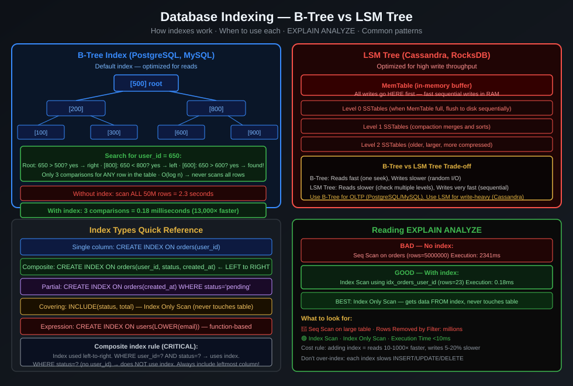

# Database Types — Complete Comparison

> "Choosing the wrong database is like choosing the wrong foundation for a house. It holds everything. Changing it later is demolition." — Senior architect

---

## At a Glance

There is no "best database." There is only the right database for your access pattern.

```
Data model → Choose the right type first
Access pattern → Then choose the specific product
Scale requirement → Then consider distribution strategy
```

---

## The Complete Database Taxonomy

```
Database
├── Relational (SQL)
│   ├── Traditional: PostgreSQL, MySQL, SQL Server, Oracle
│   └── NewSQL (distributed): CockroachDB, TiDB, Google Spanner
│
├── Document: MongoDB, Firestore, Couchbase
│
├── Key-Value
│   ├── In-memory: Redis, Memcached
│   └── Persistent: DynamoDB, Riak, Voldemort
│
├── Wide-Column: Cassandra, HBase, ScyllaDB, Bigtable
│
├── Graph: Neo4j, Amazon Neptune, ArangoDB
│
├── Time-Series: InfluxDB, TimescaleDB, Prometheus, ClickHouse
│
├── Search: Elasticsearch, Typesense, MeiliSearch
│
└── Vector: Pinecone, Weaviate, Chroma, pgvector (PostgreSQL extension)
```

---

## Senior to Junior: The Decision Framework

> "Junior developers ask 'which database should I use?' Senior developers ask 'what are my queries?' The database choice follows from the query pattern, never the other way around."

**5 questions to ask before choosing:**

1. **What is the primary access pattern?** By key? By range? Graph traversal? Full-text?
2. **What is the read/write ratio?** 100:1 reads → optimize for reads; 1:100 writes → optimize for writes
3. **Do I need ACID transactions?** Financial systems → yes. User sessions → probably not
4. **How does data scale?** 1GB → single node. 1TB → sharding. 10TB+ → distributed from day one
5. **What are the query shapes?** Fixed queries known upfront? → SQL. Flexible, evolving queries? → document store

---

## Relational Databases (SQL) — The Default Choice

### PostgreSQL — The Universal Recommendation

**Best for:** OLTP (transactional), moderate OLAP (analytics), JSON documents, full-text search, geospatial

```sql
-- PostgreSQL does almost everything:
-- Relational data with ACID
SELECT * FROM orders JOIN users ON orders.user_id = users.id WHERE ...;

-- JSON documents (JSONB — indexed)
SELECT * FROM products WHERE metadata->>'brand' = 'Apple';

-- Full-text search
SELECT * FROM posts WHERE to_tsvector('english', content) @@ plainto_tsquery('search terms');

-- Geospatial (PostGIS extension)
SELECT * FROM restaurants WHERE ST_DWithin(location, ST_MakePoint(100.5, 13.7), 1000);

-- Time-series (TimescaleDB extension)
SELECT time_bucket('1 hour', time) AS hour, avg(temperature) FROM sensors GROUP BY hour;

-- Vector similarity (pgvector extension)
SELECT * FROM embeddings ORDER BY vector <-> '[0.1, 0.2, ...]' LIMIT 10;
```

**Real companies using PostgreSQL:** Instagram (original), Shopify, GitHub, Heroku, Notion

**When NOT to use:** 1M+ writes/second (single node limit), heavy graph traversal, time-series at IoT scale

### MySQL — The Web Default

**Best for:** Read-heavy web apps, e-commerce, CMS

```sql
-- MySQL quirk: JSON support (5.7+) but less powerful than PostgreSQL JSONB
-- MySQL InnoDB: row-level locking, MVCC, B-tree indexes by default
-- MySQL MyISAM (old): table locking, full-text search, no transactions
```

**Real companies using MySQL:** Facebook (core for many years), Twitter (legacy), Shopify (MySQL pods), Wikipedia

### NewSQL — Distributed SQL

When you need SQL semantics but one PostgreSQL can't handle the scale:

```
Traditional SQL: one machine → scale up (buy bigger machine) → hits ceiling

NewSQL solution: multiple machines → appears as one SQL database
  - CockroachDB: inspired by Google Spanner, PostgreSQL wire protocol
  - TiDB: MySQL wire protocol, HTAP (handles both OLTP and OLAP)
  - Google Spanner: uses atomic clocks for global consistency (see Google case study)
```

**Resource consumption:**
| | Traditional SQL | NewSQL |
|---|---|---|
| Latency | 1-5ms | 5-15ms (consensus overhead) |
| Throughput | Limited to one machine | Scales horizontally |
| Consistency | Strong (one machine) | Strong (distributed, with overhead) |
| Operational complexity | Low | High |

**When to use NewSQL:**
- PostgreSQL is your bottleneck (measured, not assumed)
- You need SQL + horizontal write scaling
- You need global distribution with strong consistency
- DoorDash uses CockroachDB for config management (globally consistent config)

---

## Document Databases — Flexible Schema

### MongoDB

**Best for:** Hierarchical data, evolving schema, content management, user profiles

```javascript
// Document model — data stored as it's accessed (no JOIN needed)
{
  "_id": "order_123",
  "customer": {
    "name": "Suphakin",
    "email": "suphakin@example.com",
    "address": { "street": "...", "city": "Bangkok" }
  },
  "items": [
    { "productId": "p1", "name": "MacBook", "qty": 1, "price": 59900 },
    { "productId": "p2", "name": "Case", "qty": 1, "price": 1200 }
  ],
  "total": 61100,
  "status": "shipped"
}

// One document = one query (no JOIN)
// But: updating customer address across all orders = scan all documents
```

**When MongoDB shines:**
```
✓ Schema changes frequently (just add new fields, no migration)
✓ Data is hierarchical (blog post + comments + author info all in one document)
✓ Each document is self-contained (no need to join across documents)
✓ Developer speed is priority (flexible schema = fast iteration)
```

**When MongoDB fails:**
```
✗ Complex relationships between entities (JOIN in MongoDB = $lookup = slow)
✗ Strong ACID transactions across documents (now supported, but with limitations)
✗ Complex aggregations (SQL GROUP BY is easier than MongoDB aggregate pipeline)
✗ Data that naturally fits relational model
```

**Real companies:** Airbnb (listing metadata), EA Games (player profiles), Forbes (CMS)

---

## Key-Value Databases — Maximum Speed

### Redis — The Speed King

**Best for:** Cache, session storage, rate limiting, pub/sub, leaderboards, queues

```
Redis data structures:
  String:  cache values, counters, flags
  Hash:    user sessions, objects with fields
  List:    message queues, recent activity feeds
  Set:     unique visitors, tags, social graph
  Sorted Set: leaderboards, priority queues, timeline
  Stream:  event log, real-time feeds (Kafka-lite)
  Bitmap:  tracking which users saw a notification

Redis speed: all data in RAM → sub-millisecond response
Redis limit: all data must fit in RAM (expensive at scale)
```

```typescript
// Real-world Redis usage patterns:

// 1. Cache (most common)
async function getProduct(id: string): Promise<Product> {
  const cached = await redis.get(`product:${id}`);
  if (cached) return JSON.parse(cached);

  const product = await db.query('SELECT * FROM products WHERE id = $1', [id]);
  await redis.setex(`product:${id}`, 3600, JSON.stringify(product)); // 1hr TTL
  return product;
}

// 2. Rate limiting
async function isRateLimited(userId: string): Promise<boolean> {
  const key = `rate:${userId}:${Math.floor(Date.now() / 60000)}`; // per minute
  const count = await redis.incr(key);
  if (count === 1) await redis.expire(key, 60);
  return count > 100; // max 100 req/minute
}

// 3. Sorted Set leaderboard
async function updateScore(userId: string, score: number) {
  await redis.zadd('leaderboard', score, userId);
}
async function getTopPlayers(n: number) {
  return redis.zrevrange('leaderboard', 0, n - 1, 'WITHSCORES');
}
```

**Real companies using Redis:** Twitter (timeline cache), Instagram (feed), GitHub (session), Stack Overflow (cache)

### Amazon DynamoDB — Serverless Scale

**Best for:** Key-value + simple document at internet scale, serverless applications

```
DynamoDB design philosophy:
  - Access by primary key: O(1), guaranteed
  - Every access pattern must be designed into the table structure
  - No JOIN, no GROUP BY, no complex queries
  - Auto-scales from 1 to millions of requests with no config

Trade-off:
  ✓ Infinitely scalable, always available
  ✗ You must know ALL access patterns upfront
  ✗ Wrong design = rewrite the entire table
```

---

## Wide-Column Databases — Write at Scale

### Apache Cassandra / ScyllaDB

**Best for:** Time-series, event logs, write-heavy workloads, multi-datacenter

```
Cassandra data model:
  Table → partitioned by partition key
  Within partition → rows sorted by clustering key

  Design principle: "Design for queries, not for normalization"

Example: Discord messages
  Partition key: channel_id + bucket (time range)
  Clustering key: message_id (time-ordered)

  Query: "Get last 50 messages in channel 12345"
  → one partition → sequential read → fast

Cassandra limitations:
  ✗ No JOIN
  ✗ Aggregations (COUNT, SUM) are full table scans
  ✗ Updates are expensive (uses tombstones → compaction)
  ✗ No ACID (eventual consistency by default)
```

**Discord's lesson:** Cassandra was perfect at 1B messages. At 1T, hot partitions caused latency spikes. They migrated to ScyllaDB (same model, C++ instead of JVM = no GC pauses).

---

## Graph Databases — Relationship-First

### Neo4j

**Best for:** Social networks, fraud detection, recommendation engines, knowledge graphs

```
When graph databases beat SQL:

SQL (finding friends of friends):
  SELECT u2.name
  FROM users u1
  JOIN friendships f1 ON u1.id = f1.user_id
  JOIN friendships f2 ON f1.friend_id = f2.user_id
  JOIN users u2 ON f2.friend_id = u2.id
  WHERE u1.id = 123 AND u2.id != 123;

  At 3M users with 500M friendships → this JOIN is catastrophically slow

Neo4j (Cypher query — same operation):
  MATCH (u1:User {id: 123})-[:FRIEND]-()-[:FRIEND]-(u2:User)
  WHERE u2.id <> 123
  RETURN u2.name

  Graph traversal is O(log n) not O(n²) → fast even at millions of nodes

Why:
  In a graph DB, relationships are stored as pointers (constant time traversal)
  In SQL, JOIN requires scanning the friendship table (O(n))
```

**Real companies using Graph DBs:**
- LinkedIn (People You May Know) — graph traversal to find connection suggestions
- Twitter (Who to Follow) — graph of mutual connections
- Uber (fraud detection) — graph of suspicious behavior patterns

---

## Time-Series Databases

### InfluxDB / TimescaleDB / ClickHouse

**Best for:** IoT sensor data, metrics, monitoring, financial tick data

```
Time-series problem: 1 million IoT devices × 1 reading/second = 86B rows/day
  Regular SQL: INSERT 86B rows, then query with WHERE timestamp BETWEEN...
  → Full table scan for every time range query → catastrophically slow

Time-series solution:
  Data partitioned by time (automatic)
  Automatic compression of old data (downsampling)
  Time-based functions built in (time_bucket, rate, derivative)

  TimescaleDB query:
  SELECT time_bucket('1 hour', time) AS hour, avg(temperature)
  FROM sensor_readings
  WHERE device_id = 'sensor_1' AND time > NOW() - INTERVAL '24 hours'
  GROUP BY hour;
  → Uses time-based index → reads only today's partition → fast
```

**Real companies:**
- Grafana/Prometheus stack (monitoring at every company)
- Airbnb (metrics), Netflix (Spectator metrics), Cloudflare (traffic metrics)
- Bloomberg (financial tick data), Binance (cryptocurrency OHLCV data)

---

## Vector Databases — AI Era

### Pinecone / Weaviate / pgvector

**Best for:** Semantic search, RAG (Retrieval Augmented Generation), recommendation by similarity

```
The vector problem: "Find documents similar in MEANING to this query"

Traditional search (keyword):
  "Thai restaurant Bangkok" → finds docs with those exact words
  Misses: "Pad Thai place in the capital of Thailand"

Vector search:
  Convert text to 1536-dimensional vector via embedding model
  "Thai restaurant Bangkok" → [0.1, -0.2, 0.5, ...]
  All documents also stored as vectors
  Query: find vectors CLOSEST to query vector (cosine similarity)
  → Finds semantically similar content, not just keyword matches

How LLM + Vector DB works (RAG pattern):
  1. Index your company docs → generate embeddings → store in vector DB
  2. User asks question → generate query embedding
  3. Vector DB finds most relevant document chunks (similarity search)
  4. Send: question + relevant context → LLM
  5. LLM answers using your specific knowledge base
```

**Real companies:**
- OpenAI's ChatGPT uses vector search for context retrieval
- Notion AI uses pgvector for document search
- Shopify uses vector search for product recommendations

---

## The CAP Theorem — Why Distributed DBs Must Compromise

```
CAP Theorem: In a distributed database, you can ONLY guarantee 2 of 3:
  C — Consistency: all nodes see the same data at the same time
  A — Availability: every request gets a response (even if it's stale)
  P — Partition Tolerance: system works even if some nodes can't communicate

In practice: Network Partitions ALWAYS happen.
So real choice is: C vs A when partition occurs.

CP systems (Consistency + Partition Tolerance):
  Sacrifice availability when partition: return error instead of stale data
  Examples: HBase, Zookeeper, CockroachDB, etcd
  Use when: financial data, inventory (can't have stale stock count)

AP systems (Availability + Partition Tolerance):
  Sacrifice consistency during partition: return possibly stale data
  Examples: Cassandra, DynamoDB, CouchDB, DNS
  Use when: social feeds, session data, metrics (stale is OK)

CA systems (Consistency + Availability):
  Sacrifice partition tolerance: doesn't exist in practice (single-node DBs)
  "PostgreSQL is CA" means: consistent + available when no partitions
```

**PACELC — The Extension:**
Even when there's NO partition, there's still a trade-off:
- P → Partition: choose A or C
- ELC → Else (no partition): choose Latency vs Consistency

---

## Database Selection Decision Tree

```
What is your primary data model?
│
├─ Relationships between entities, complex queries
│   → PostgreSQL (default choice, handles most cases)
│
├─ Hierarchical, flexible schema, documents
│   → MongoDB (if schema evolves frequently)
│
├─ Simple key-value, ultra-low latency
│   ├─ Caching, session, real-time → Redis (in-memory)
│   └─ Durable, internet scale → DynamoDB
│
├─ High write throughput, time-ordered data
│   └─ Cassandra / ScyllaDB
│
├─ Graph traversal, relationship analysis
│   └─ Neo4j
│
├─ Time-series, metrics, IoT
│   └─ InfluxDB or TimescaleDB
│
├─ Full-text search
│   └─ Elasticsearch (or PostgreSQL full-text for small scale)
│
├─ Semantic/vector similarity (AI)
│   └─ pgvector (if on PostgreSQL) or Pinecone/Weaviate
│
└─ Need SQL + horizontal write scaling
    └─ CockroachDB or TiDB
```

---

## Clean Architecture Mapping

```
Database choice = Infrastructure / Frameworks & Drivers layer

Use Case depends on:
  IUserRepository (interface / port)
  IOrderRepository
  ISearchService

These interfaces NEVER mention:
  PostgreSQL, MongoDB, Redis, Cassandra

Each implementation is an adapter:
  PostgresUserRepository implements IUserRepository
  MongoUserRepository implements IUserRepository  ← swap without changing use case
  RedisUserCache implements IUserRepository         ← or a cache decorator

This is why database selection belongs in the Infrastructure layer:
  Changing from PostgreSQL to MongoDB = change adapters only
  Business logic (use cases, entities) = unchanged
  This is the entire point of Clean Architecture
```


---

## Architecture Diagram



