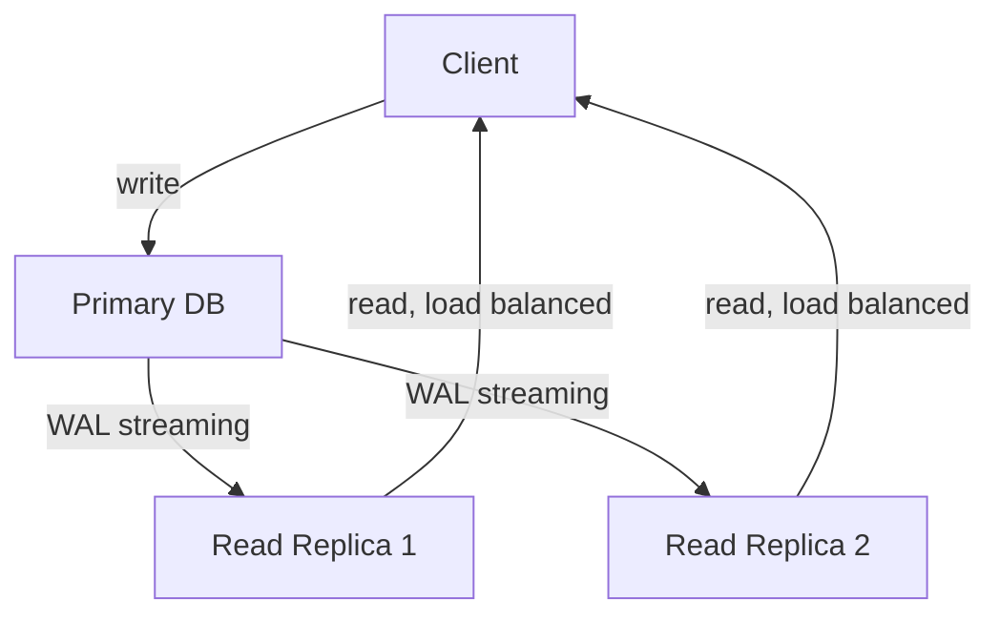
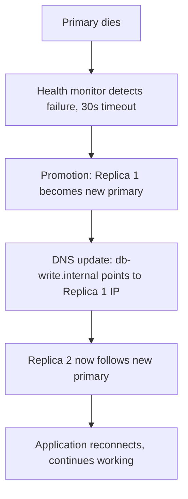
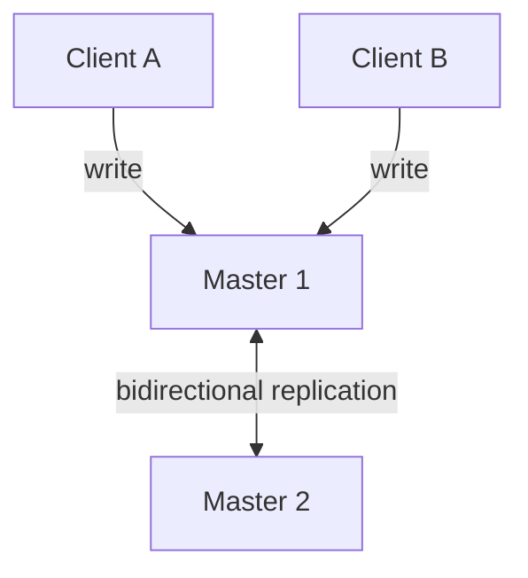

# Database Replication - Complete Guide

> "Replication solves two problems: availability (if the primary dies, promote a replica) and scalability (spread reads across replicas). Never confuse these two - they require different designs." - Senior DBA

---

## At a Glance

| | |
|---|---|
| **What it solves** | Single point of failure, read scalability |
| **Core trade-off** | Replication lag (writes on primary, reads may see old data) |
| **CAP position** | Primary-Replica = CP; Multi-Master = AP |

---

## Senior to Junior: Why Replication First

> "Before you shard, replicate. Before you replicate, add read replicas. This is the correct order:
> 1. One database (works for most apps up to 10M rows)
> 2. Add read replicas (works for 10M-500M rows, read-heavy)
> 3. Shard (for beyond that)
>
> Most apps never need step 3. Many never need step 2. Start where you are."

---

## Primary-Replica (Master-Slave) Replication

### How It Works

```
All WRITES -> Primary (Leader)
All READS -> Can go to Primary or Replica(s)

Primary writes WAL (Write-Ahead Log):
  INSERT INTO orders (user_id, total) VALUES (123, 9900)
 -> WAL entry: {table: orders, op: INSERT, data: {...}}
 -> Applied to primary's storage
 -> WAL shipped to all replicas

Replica receives WAL:
 -> Applies same operations in same order
 -> Eventually has identical data to primary
```

Writes go to the primary; the primary ships its WAL to replicas, which serve load-balanced reads.



### Synchronous vs Asynchronous Replication

```
Synchronous (strong consistency):
  Primary writes -> waits for replica to confirm -> commits

  Timeline:
    t=0ms:  Primary receives INSERT
    t=5ms:  Primary writes to WAL
    t=10ms: Replica receives WAL, writes to its storage
    t=11ms: Replica sends ACK to primary
    t=12ms: Primary acknowledges to client -> WRITE COMMITTED

  [OK] No data loss: replica always has latest data
  [X] Write latency increased (wait for replica ACK)
  [X] If replica is slow/down: primary is also slowed
  Use when: financial systems, anything where data loss is unacceptable

Asynchronous (higher throughput):
  Primary writes -> commits immediately -> sends WAL to replica "eventually"

  Timeline:
    t=0ms:  Primary receives INSERT
    t=5ms:  Primary writes to WAL + commits -> WRITE COMMITTED to client
    t=15ms: WAL shipped to replica
    t=20ms: Replica applies WAL

  [OK] Write latency not affected by replica speed
  [X] Replication lag: replica may be 10-500ms behind
  [X] Data loss if primary crashes before WAL ships to replica
  Use when: social apps, blogs, read-heavy apps where eventual consistency is OK

PostgreSQL: synchronous_commit = 'on' (sync) or 'off' (async) per transaction
MySQL: semi-synchronous (at least one replica must confirm)
```

### Failover: When Primary Dies

Automatic failover with Patroni (PostgreSQL) or MHA (MySQL) walks through these steps in order.



Total downtime: typically 30-60 seconds

```
Managed services (AWS RDS Multi-AZ, Google Cloud SQL):
  Automatic failover built in, ~60s
  No manual intervention needed
```

### Read Replica Load Balancing

```typescript
// Application-level read/write splitting
class DatabasePool {
  private readonly primary: DatabaseConnection;
  private readonly replicas: DatabaseConnection[];
  private replicaIndex = 0;

  getWrite(): DatabaseConnection {
    return this.primary;  // Always write to primary
  }

  getRead(): DatabaseConnection {
    // Round-robin across replicas
    const replica = this.replicas[this.replicaIndex];
    this.replicaIndex = (this.replicaIndex + 1) % this.replicas.length;
    return replica;
  }
}

// In repository adapter (Infrastructure layer):
class OrderRepositoryPostgres implements IOrderRepository {
  async save(order: Order): Promise<void> {
    await this.db.getWrite().query('INSERT INTO orders ...'); // primary
  }

  async findById(id: string): Promise<Order> {
    const row = await this.db.getRead().query('SELECT ...'); // replica
    return OrderMapper.toDomain(row);
  }
}

// WARNING: Read-after-write consistency issue
// User submits order -> written to primary
// User immediately sees order list -> reads from replica (lagged by 100ms)
// User might not see their own order!

// Solution: read your own writes from primary
async findMyOrders(userId: string, justWrote: boolean = false) {
  const conn = justWrote ? this.db.getWrite() : this.db.getRead();
  return conn.query('SELECT * FROM orders WHERE user_id = $1', [userId]);
}
```

---

## Multi-Master (Active-Active) Replication

### How It Works

Writes can go to any node, and every node replicates its changes to all the others.



Both masters accept writes simultaneously, and each replicates its changes to the other.

### The Write Conflict Problem

```
The fundamental challenge of multi-master:

t=0ms: Master 1 receives: UPDATE users SET balance = 100 WHERE id = 1
t=0ms: Master 2 receives: UPDATE users SET balance = 200 WHERE id = 1
t=5ms: Master 1 applies its update: balance = 100
t=5ms: Master 2 applies its update: balance = 200
t=10ms: Master 1 receives Master 2's update: balance = 200
t=10ms: Master 2 receives Master 1's update: balance = 100

Now:
  Master 1 has: balance = 200 (applied its own then received 200 from M2)
  Master 2 has: balance = 100 (applied its own then received 100 from M1)
  INCONSISTENT! Two masters, two different answers.

Conflict resolution strategies:
  1. Last Write Wins (LWW): timestamp comparison -> highest timestamp wins
     Risk: clock skew between nodes -> wrong winner

  2. Application-level resolution: expose conflict to application to decide
     Complex but most flexible

  3. CRDT (Conflict-free Replicated Data Types): mathematically guaranteed to converge
     Works for counters, sets, text (not arbitrary data)

  4. Consensus (Paxos/Raft): all nodes must agree before commit
     Eliminates conflicts but adds latency
```

### When to Use Multi-Master

```
[OK] You MUST write from multiple geographic regions (latency requirement)
  Example: EU users must write to EU datacenter, US users to US datacenter

[OK] High availability (any node can handle writes, no single point of write failure)

[X] Same data written by multiple users simultaneously (conflict resolution needed)
[X] Financial transactions (never use eventual consistency for money)

Real-world multi-master:
  - Amazon DynamoDB (global tables): multi-region, eventual consistency
  - CockroachDB: distributed consensus (not true multi-master - uses Raft)
  - Cassandra: multi-master with configurable consistency levels
  - MongoDB: primary in each region, eventual consistency across regions
```

---

## Replication Lag - The Hidden Problem

```
Replication lag = the delay between a write on primary and when it's visible on replicas

Causes of high lag:
  1. Heavy write load on primary (replica can't keep up)
  2. Large transactions (replica must apply entire transaction atomically)
  3. Network latency between primary and replica (cross-region replication)
  4. Replica doing heavy reads (competes for I/O with replication)

Measuring lag (PostgreSQL):
  SELECT
    client_addr,
    state,
    sent_lsn,
    write_lsn,
    replay_lsn,
    (sent_lsn - replay_lsn) AS replication_lag_bytes
  FROM pg_stat_replication;

Acceptable lag:
  Same-datacenter replication: < 10ms typical
  Cross-region replication: 50-200ms typical
  During heavy load: can spike to seconds

The read-your-own-writes problem:
  User creates post -> written to primary
  User refreshes page -> reads from replica (100ms lagged)
  User's own post not visible yet -> confusing UX

Solutions:
  1. Always read from primary for the creating user (session-based routing)
  2. Wait for replication before confirming to user (sync replication for writes)
  3. Cache the written record in the user's session (read from cache, not replica)
  4. Add created item to response payload (so client doesn't need to re-read)
```

---

## Change Data Capture (CDC) - Replication as Events

```
CDC treats the database log (WAL in PostgreSQL) as an event stream.
Every INSERT, UPDATE, DELETE = one event.

Debezium + Kafka:
  PostgreSQL WAL -> Debezium connector -> Kafka topic -> any consumer

Use cases:
  1. Sync to Elasticsearch for search
     orders table -> CDC -> Kafka -> Elasticsearch indexer

  2. Invalidate Redis cache when data changes
     products table -> CDC -> Kafka -> Cache invalidation service

  3. CQRS read model updates
     orders table -> CDC -> Kafka -> OrderSummaryProjection (denormalized read model)

  4. Audit log
     ANY table -> CDC -> audit log service -> immutable audit store

Why CDC beats polling:
  Polling: SELECT * FROM orders WHERE updated_at > last_poll_time
    Problem: updated_at must be indexed, deletes are invisible, polling interval = lag

  CDC: captures ALL changes including deletes, immediately, with zero polling overhead
  Netflix, LinkedIn, Airbnb all use CDC heavily
```

---

## Replication Strategy by Use Case

| Use Case | Strategy | Why |
|---|---|---|
| High-read web app | Primary + 3 read replicas (async) | Scale reads without write overhead |
| Financial system | Primary + 1 synchronous replica | Zero data loss, automatic failover |
| Multi-region app | Multi-master with conflict resolution | Write locally, replicate globally |
| CQRS read model | CDC -> Kafka -> projection | Decouple read model from write model |
| Full-text search | CDC -> Elasticsearch | Keep search index in sync automatically |
| Cache invalidation | CDC -> Kafka -> cache flush | Never serve stale cache after write |
| Analytics | Async replica for OLAP queries | Don't let analytics queries slow production |

---

## In Clean Architecture Terms

```
Replication = Infrastructure layer concern

IOrderRepository (port in Use Case layer):
  findById(id): reads from wherever makes sense
  save(order): writes to wherever is authoritative

DatabasePool (adapter in Infrastructure layer):
  Manages primary + replicas connections
  Routes reads to replicas
  Routes writes to primary
  Handles failover transparently

Use Case code never changes when you:
  Add a new read replica
  Change from async to sync replication
  Implement failover
  Add CDC

This is Clean Architecture's promise: infrastructure changes
are isolated to the Infrastructure layer.
```

---

## Real-World Replication Examples

| Company | Strategy | Details |
|---|---|---|
| **Instagram** | PostgreSQL primary + 5 replicas | All writes to primary; read replicas for feed, explore |
| **Shopify** | MySQL primary + replicas per pod | Per-merchant pods with read replicas |
| **GitHub** | MySQL + ProxySQL read routing | ProxySQL routes reads to replicas automatically |
| **Airbnb** | MySQL async replication + CDC | Debezium -> Kafka for search index and cache updates |
| **Discord** | ScyllaDB multi-datacenter | Cassandra replication factor 3 across 3 DCs |
| **Netflix** | Cassandra multi-region | Each region has full copy, eventual consistency |
| **Stripe** | PostgreSQL sync replica | Financial data: zero tolerance for replication lag |
