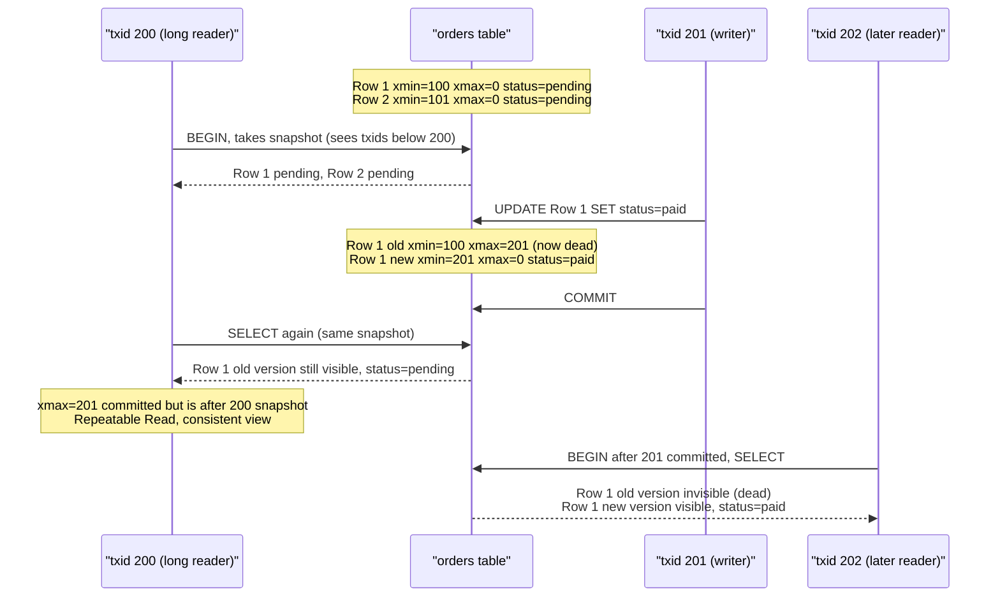

# MVCC - Multiversion Concurrency Control

> "MVCC is the reason PostgreSQL can have 10,000 readers and 1,000 writers all running simultaneously without anyone waiting for anyone else. Readers never block writers. Writers never block readers. This sounds impossible - MVCC makes it real." - PostgreSQL documentation

---

## At a Glance

| | |
|---|---|
| **What** | A database mechanism for handling concurrent reads and writes |
| **Used by** | PostgreSQL, MySQL InnoDB, Oracle, CockroachDB, MongoDB |
| **Key promise** | Readers never block writers. Writers never block readers. |
| **Trade-off** | Dead rows accumulate - VACUUM needed to reclaim storage |

---

## IMPORTANT: MVCC != MVC

```
MVC  = Model-View-Controller -> UI architecture pattern (how you organize app code)
MVCC = Multiversion Concurrency Control -> database engine mechanism (how DB handles concurrent transactions)

These are completely unrelated. Only the letters M, V, C are shared.
This file is about MVCC (the database one).
See 32_mvc_mvp_mvvm_architecture/ for MVC.
```

---

## The Problem MVCC Solves

**Without MVCC - Traditional Locking:**

```
Scenario: User A reads a report. User B updates data.

Traditional lock-based system:
  User A: SELECT * FROM orders WHERE date = today <- acquires READ LOCK
  User B: UPDATE orders SET status = 'shipped' <- blocked! waiting for read lock
  User A: (still reading, report takes 5 seconds)
  User B: (waiting 5 seconds... 10 seconds...)
  User A: done. releases lock.
  User B: finally runs.

At scale:
  1000 readers x 5 seconds = writers waiting 5000 seconds in a queue
  Database becomes a bottleneck
  Users see slow updates
```

**With MVCC:**

```
User A: SELECT * FROM orders WHERE date = today <- sees SNAPSHOT of data
User B: UPDATE orders SET status = 'shipped' <- creates NEW VERSION of the row
                                                    User A's snapshot unchanged!

Both run simultaneously. Neither blocks the other.

User A sees:    orders with old status (their snapshot)
User B creates: new row version with 'shipped' status
Other readers after B commits: see the new status
```

---

## How MVCC Works: Row Versioning

The core idea: **never overwrite data in place - create a new version.**

### Every Row Has Hidden System Columns

```sql
-- What you see:
SELECT * FROM orders WHERE id = 1;
-- id | customer_id | total | status
-- 1  | 42          | 9900  | pending

-- What PostgreSQL actually stores (hidden system columns):
SELECT xmin, xmax, *, ctid FROM orders WHERE id = 1;
-- xmin | xmax | id | customer_id | total | status  | ctid
-- 101  | 0    | 1  | 42          | 9900  | pending | (0,1)

-- xmin = transaction ID that CREATED this row version
-- xmax = transaction ID that DELETED/UPDATED this row version (0 = still live)
-- ctid  = physical location of this row on disk (page, offset)
```

### What Happens on UPDATE

```sql
-- Before update:
-- xmin=101, xmax=0,   id=1, status='pending' <- LIVE row

-- Transaction 200 runs: UPDATE orders SET status='paid' WHERE id = 1;

-- After update:
-- xmin=101, xmax=200, id=1, status='pending' <- DEAD row (xmax set = this tx deleted it)
-- xmin=200, xmax=0,   id=1, status='paid' <- NEW LIVE row (xmin = tx that created it)

-- The old row is NOT deleted immediately.
-- It's marked as "dead" by setting xmax = current transaction ID.
-- The new version is inserted as a completely new physical row.
```

### What Happens on DELETE

```sql
-- DELETE FROM orders WHERE id = 1;

-- Before:
-- xmin=101, xmax=0, id=1, status='pending' <- LIVE

-- After delete by transaction 201:
-- xmin=101, xmax=201, id=1, status='pending' <- DEAD (xmax marks it deleted)

-- The row still exists on disk! Just marked as dead.
-- Future transactions with txid > 201 won't see it.
-- VACUUM will eventually reclaim the space.
```

### Transaction Visibility Rules

```
A row version is VISIBLE to transaction T if:
  1. xmin committed BEFORE T started (the creator committed)
  2. xmax is either:
     - 0 (not deleted/updated yet), OR
     - NOT committed (the deleter hasn't finished), OR
     - > T's snapshot (the deletion happened AFTER T's snapshot)

In plain English:
  "You see rows that were fully committed before your transaction started,
   and that haven't been deleted by any committed transaction since then."
```

---

## MVCC in Action - Step by Step

This sequence shows how a long-running reader (txid 200) keeps seeing the old row version even after a writer (txid 201) commits a change, while a later reader (txid 202) sees the new version.



---

## MVCC and Isolation Levels

MVCC is the mechanism that enables PostgreSQL's isolation levels:

```sql
-- READ COMMITTED (default):
-- Each statement gets a fresh snapshot
-- You might see different data within the same transaction

BEGIN;
SELECT count(*) FROM orders;  -- sees snapshot at T1: result = 1000
-- (another transaction inserts 50 orders and commits)
SELECT count(*) FROM orders;  -- sees snapshot at T2: result = 1050
-- Different results! Non-repeatable reads possible
COMMIT;


-- REPEATABLE READ:
-- The entire transaction uses ONE snapshot (taken at transaction start)

BEGIN ISOLATION LEVEL REPEATABLE READ;
SELECT count(*) FROM orders;  -- snapshot taken here: 1000
-- (another transaction inserts 50 orders and commits)
SELECT count(*) FROM orders;  -- SAME snapshot: still 1000!
-- Consistent reads throughout transaction
COMMIT;


-- SERIALIZABLE:
-- Full isolation - appears as if transactions ran one after another
-- PostgreSQL uses "Serializable Snapshot Isolation" (SSI)
-- Detects conflicts and aborts transactions that would violate serializability

BEGIN ISOLATION LEVEL SERIALIZABLE;
-- PostgreSQL tracks which data you read
-- If another transaction modifies data you read, your transaction may be aborted
-- with: "ERROR: could not serialize access due to concurrent update"
COMMIT;
```

---

## The VACUUM Problem - MVCC's Hidden Cost

**Dead rows accumulate:**

```
Every UPDATE creates a dead row (old version).
Every DELETE creates a dead row.

A table updated 1 million times/day:
 -> 1 million dead rows accumulate per day
 -> Dead rows take disk space (even though invisible to queries)
 -> Table bloat: logical size 1GB, physical size 10GB
 -> Index bloat: indexes still point to dead rows (wasted I/O)
 -> Query performance degrades as table grows with dead rows
```

**VACUUM reclaims dead rows:**

```sql
-- Manual vacuum:
VACUUM orders;          -- marks dead rows as free space (doesn't shrink file)
VACUUM FULL orders;     -- rewrites entire table (shrinks file, locks table)
VACUUM ANALYZE orders;  -- vacuums + updates statistics for query planner

-- Autovacuum (runs automatically):
-- PostgreSQL's autovacuum daemon monitors all tables
-- When dead row % exceeds threshold -> runs VACUUM automatically
-- Default: vacuum when 20% + 50 rows are dead

-- Check vacuum health:
SELECT
  schemaname,
  tablename,
  n_dead_tup AS dead_rows,
  n_live_tup AS live_rows,
  round(n_dead_tup * 100.0 / NULLIF(n_live_tup + n_dead_tup, 0), 1) AS dead_pct,
  last_autovacuum
FROM pg_stat_user_tables
ORDER BY dead_pct DESC NULLS LAST;
-- If dead_pct > 10% for a hot table -> autovacuum may be falling behind
```

**Tuning autovacuum for high-traffic tables:**

```sql
-- For a high-write table, vacuum more aggressively:
ALTER TABLE orders SET (
  autovacuum_vacuum_scale_factor = 0.01,  -- vacuum when 1% dead (default: 20%)
  autovacuum_analyze_scale_factor = 0.005, -- analyze when 0.5% changed
  autovacuum_vacuum_cost_delay = 2         -- less delay between vacuum cycles (ms)
);
-- This tells autovacuum: "don't let orders table bloat - vacuum aggressively"
```

---

## Transaction ID Wraparound - The "VACUUM Freeze" Problem

```
PostgreSQL transaction IDs are 32-bit integers -> max ~4.3 billion transactions.
When txid wraps around, old rows could appear "newer" than new rows -> catastrophic data corruption.

Solution: VACUUM FREEZE
  Scans all rows and sets xmin to a special "frozen" state
  Frozen rows are visible to ALL transactions (no txid comparison needed)

PostgreSQL autovacuum handles this automatically.
If it falls behind on a huge database:
  PostgreSQL will WARN you: "database XYZ must be vacuumed within N transactions"
  If ignored: PostgreSQL SHUTS DOWN to prevent corruption

Monitor with:
SELECT datname, age(datfrozenxid) AS txid_age
FROM pg_database
ORDER BY txid_age DESC;
-- age > 200,000,000 = warning territory
-- age > 2,000,000,000 = emergency VACUUM immediately
```

---

## MVCC vs Locking - When to Use Each

```
MVCC (PostgreSQL default):
  Reads never block writes
  Writes never block reads
  Perfect for: OLTP (lots of reads + writes simultaneously)
  Trade-off: dead row accumulation -> VACUUM needed

Traditional Locking (still needed for some cases):
  SELECT ... FOR UPDATE: explicitly lock rows for update
  LOCK TABLE: lock entire table (use sparingly, causes blocking)

When to use explicit locks:
  1. "I need to update a row AND ensure no one else updates it between my read and write"
     SELECT balance FROM accounts WHERE id = 1 FOR UPDATE;
     UPDATE accounts SET balance = balance - 100 WHERE id = 1;
     -- FOR UPDATE locks the row: other transactions wait until you commit

  2. "I'm doing an exclusive maintenance operation"
     LOCK TABLE orders IN ACCESS EXCLUSIVE MODE;
     ALTER TABLE orders ADD COLUMN promo_code TEXT;
     -- Full lock during schema change
```

---

## MVCC in Other Databases

| Database | MVCC Implementation | Notes |
|---|---|---|
| **PostgreSQL** | Row-level versioning with xmin/xmax | VACUUM required for dead row cleanup |
| **MySQL InnoDB** | Undo log (separate from main table) | Rollback segment in system tablespace |
| **Oracle** | Undo tablespace | Similar to MySQL InnoDB approach |
| **CockroachDB** | Distributed MVCC (timestamps, not txids) | Based on Google Spanner's TrueTime |
| **MongoDB** | Snapshot isolation (since 4.0) | For multi-document transactions |
| **SQLite** | Write-Ahead Log (WAL) mode | Simpler MVCC: one writer, many readers |

---

## Real-World Impact

**Instagram + PostgreSQL:**
> Instagram (before Facebook acquisition) processed tens of millions of reads/writes per day on PostgreSQL. MVCC meant their millions of simultaneous read queries (viewing photos, feeds) never blocked the write queries (posting photos, likes). Autovacuum was carefully tuned for their high-update tables.

**Booking.com:**
> PostgreSQL MVCC critical for their pricing system: thousands of users reading room prices simultaneously, while pricing engines update them. No reader ever sees a partial price update (MVCC snapshot isolation). No price read ever blocks a price write.

**GitHub:**
> MySQL InnoDB's MVCC handles millions of pull request reads while CI systems are writing test results concurrently. Readers (viewing PR) never block writers (posting CI status).

---

## In Clean Architecture Terms

```
MVCC = completely invisible to your business logic

Your Use Case:
class PlaceOrderUseCase {
  async execute(req: PlaceOrderRequest) {
    const order = await this.orders.findById(req.orderId);  // read
    order.place();
    await this.orders.save(order);  // write
  }
}
// This use case has NO IDEA that:
// - The read created a snapshot (MVCC)
// - The write created a new row version (MVCC)
// - An autovacuum is cleaning dead rows in the background (MVCC)

Your Repository Adapter knows slightly more:
class OrderRepositoryPostgres {
  async findById(id: string) {
    // This SELECT sees a snapshot - guaranteed by MVCC
    // No lock needed for a simple read
    return this.db.query('SELECT * FROM orders WHERE id = $1', [id]);
  }

  async save(order: Order) {
    // This UPDATE creates a new row version - MVCC at work
    // xmax set on old row, new row inserted
    // Future readers will see new version, in-progress readers keep old snapshot
    await this.db.query('UPDATE orders SET status = $1 WHERE id = $2', [order.status, order.id]);
  }
}

MVCC is a database engine concern.
It lives entirely in the Infrastructure layer.
Your Entities and Use Cases are blissfully unaware.
This is Clean Architecture's Dependency Rule in practice:
inner layers never depend on, or even know about, infrastructure mechanisms.
```

---

## Summary

| | MVCC |
|---|---|
| **What** | Database creates new row versions instead of overwriting |
| **Why** | Readers never block writers, writers never block readers |
| **How** | xmin/xmax system columns mark row version visibility |
| **Cost** | Dead rows accumulate -> VACUUM needed to reclaim space |
| **Isolation** | MVCC enables READ COMMITTED, REPEATABLE READ, SERIALIZABLE |
| **Monitor** | pg_stat_user_tables for dead row %, pg_database for txid age |
| **Tune** | autovacuum settings per table for high-write workloads |

---

## Sources
- [Understanding MVCC in PostgreSQL - Medium](https://nagvekar.medium.com/understanding-multi-version-concurrency-control-mvcc-in-postgresql-a-comprehensive-guide-9b4f82153860)
- [PostgreSQL MVCC Introduction - Official Docs](https://www.postgresql.org/docs/current/mvcc-intro.html)
- [PostgreSQL Concurrency with MVCC - Heroku Dev Center](https://devcenter.heroku.com/articles/postgresql-concurrency)
- [MVCC in PostgreSQL - GeeksforGeeks](https://www.geeksforgeeks.org/postgresql/multiversion-concurrency-control-mvcc-in-postgresql/)
- [What is MVCC - TheServerSide](https://www.theserverside.com/blog/Coffee-Talk-Java-News-Stories-and-Opinions/What-is-MVCC-How-does-Multiversion-Concurrencty-Control-work)
