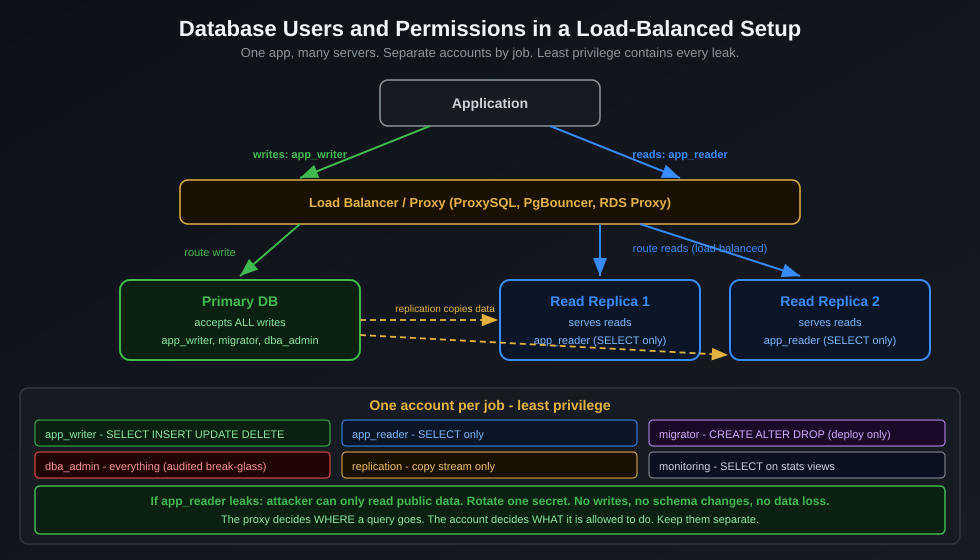
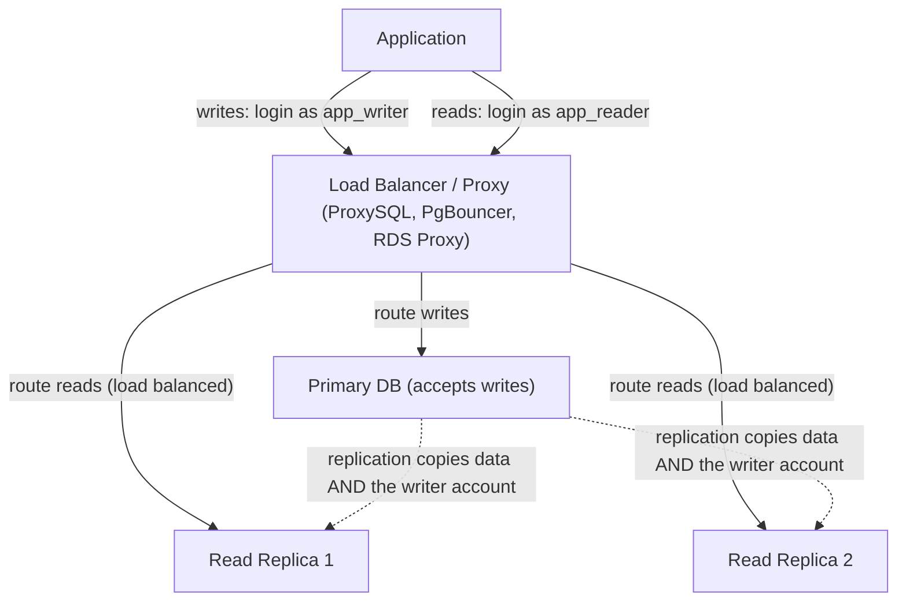
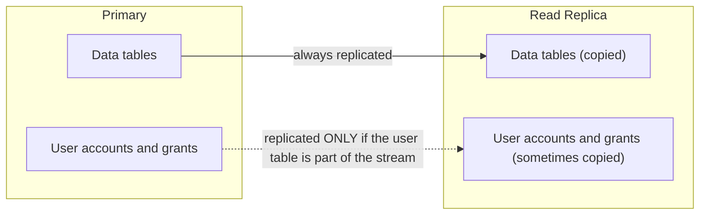
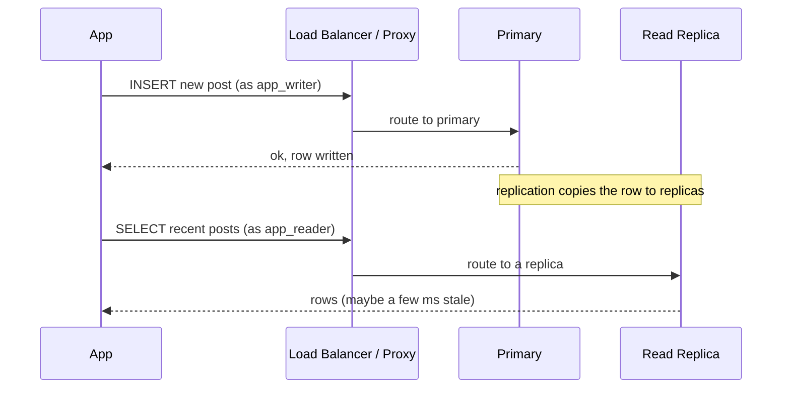
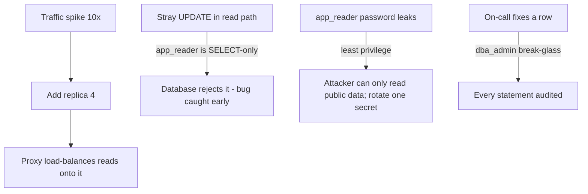

# Database Users and Permissions in a Load-Balanced Setup

> "Your application does not have one database account. It has several, each allowed to do exactly one job - no more. The day someone leaks the read-only password, nothing bad happens. That is the whole point." - Senior DBA

---

## At a Glance

| | |
|---|---|
| **The problem** | One app, many database servers behind a load balancer. Who connects as whom, and what are they allowed to do? |
| **The core idea** | Separate database users by job (write vs read vs admin), not by person. Give each the least privilege it needs. |
| **The trap** | Using one all-powerful `root`/`admin` account everywhere. One leak and the attacker owns everything. |
| **Where permissions live** | On every server. Replicas copy data automatically, but you must still create the accounts and grants. |

---

## The Story First (Read This Even If You Skip the Rest)

Imagine a busy forum like Pantip. Millions of people read posts; far fewer write them. So you do not run one database - you run a small fleet:

- **One primary** that accepts all writes (new posts, edits, likes).
- **Several read replicas** that copy the primary's data and serve the reads.
- A **load balancer** (or smart proxy) that sends each query to the right server.

Now the question this page answers: when your app opens a connection, *who is it logging in as*, and *what is that account allowed to do*? Get this wrong and you either (a) hand an attacker the keys to everything, or (b) accidentally send a write to a read-only replica at 2am and page yourself.

The answer is simple to say and worth saying slowly: **give each job its own database user, and give that user the least power it needs to do the job.**

---

## The Big Picture

The diagram below shows the whole shape of the system. Notice there is no single "the database user" - there are three, one per job.





Two things to lock in from this picture:

1. The app uses **different accounts for reads and writes**, even though it is one app.
2. The proxy decides **which server** a query goes to. The account decides **what the query is allowed to do**. These are two separate concerns - do not mix them up.

---

## Step 1: Separate Users by Job, Not by Person

A common beginner mistake is one account per developer, or worse, one `admin` account shared by the app and the humans. Instead, model accounts around *jobs*:

| Account | Job | Allowed to | Connects to |
|---|---|---|---|
| `app_writer` | Handle writes from the app | `SELECT`, `INSERT`, `UPDATE`, `DELETE` | Primary only |
| `app_reader` | Handle reads from the app | `SELECT` only | Replicas (and primary if needed) |
| `migrator` | Run schema migrations on deploy | `CREATE`, `ALTER`, `DROP` + DML | Primary only, used briefly |
| `dba_admin` | Human break-glass / on-call | Everything, including user management | Primary, audited |
| `replication` | The replica logging in to copy data | Replication stream only | Primary |
| `monitoring` | Metrics scraper (Prometheus, etc) | `SELECT` on stats views only | Any server |

Why this matters: if `app_reader`'s password leaks, the attacker can read data - bad, but recoverable. They **cannot** drop a table, change a price, or create new accounts. You have contained the blast radius. This is the principle of **least privilege**, and it is the single most valuable habit on this page.

---

## Step 2: Create the Accounts (with Concrete SQL)

Here is the actual SQL for both major engines. Read the comments - they explain the *why*.

=== "PostgreSQL"

    ```sql
    -- Writer: full DML on the app's tables, but NOT schema changes
    CREATE ROLE app_writer LOGIN PASSWORD 'use-a-secret-manager';
    GRANT CONNECT ON DATABASE forum TO app_writer;
    GRANT USAGE ON SCHEMA public TO app_writer;
    GRANT SELECT, INSERT, UPDATE, DELETE
      ON ALL TABLES IN SCHEMA public TO app_writer;
    -- Apply the same grant to tables created in the future:
    ALTER DEFAULT PRIVILEGES IN SCHEMA public
      GRANT SELECT, INSERT, UPDATE, DELETE ON TABLES TO app_writer;

    -- Reader: SELECT only. Cannot change a single row.
    CREATE ROLE app_reader LOGIN PASSWORD 'use-a-secret-manager';
    GRANT CONNECT ON DATABASE forum TO app_reader;
    GRANT USAGE ON SCHEMA public TO app_reader;
    GRANT SELECT ON ALL TABLES IN SCHEMA public TO app_reader;
    ALTER DEFAULT PRIVILEGES IN SCHEMA public
      GRANT SELECT ON TABLES TO app_reader;
    ```

=== "MySQL"

    ```sql
    -- Writer: DML only, restricted to connections from the app network
    CREATE USER 'app_writer'@'10.0.%' IDENTIFIED BY 'use-a-secret-manager';
    GRANT SELECT, INSERT, UPDATE, DELETE ON forum.* TO 'app_writer'@'10.0.%';

    -- Reader: SELECT only
    CREATE USER 'app_reader'@'10.0.%' IDENTIFIED BY 'use-a-secret-manager';
    GRANT SELECT ON forum.* TO 'app_reader'@'10.0.%';

    FLUSH PRIVILEGES;
    ```

!!! tip "Notice what is missing"
    Neither account can `CREATE`, `DROP`, or `GRANT`. Those powers belong to the `migrator` and `dba_admin` accounts, which you use rarely and audit closely.

---

## Step 3: The Detail Everyone Misses - Permissions Live on Every Server

Here is the question that trips people up: *"If I create `app_reader` on the primary, do the replicas get it automatically?"*

The honest answer is: **it depends on the engine, and you must verify.**



- **MySQL / MariaDB:** the user accounts live in the `mysql` system database. If your replication includes that database (the common default), `CREATE USER`/`GRANT` run on the primary *do* flow to replicas. If you filter out the `mysql` schema, they do **not** - you must create the accounts on each server yourself.
- **PostgreSQL:** roles are **cluster-wide and are NOT copied by streaming replication** in the way table data is. With physical (streaming) replication the replica is a byte-for-byte copy, so roles created before the replica was cloned exist on it - but a role you add *later* needs care, and with logical replication you manage roles on each node yourself.

The safe rule that always works: **manage accounts and grants as code (migrations or a tool like Terraform/Ansible), and apply them to every node.** Never click-create a user on one box and assume the fleet caught up.

---

## Step 4: Route the Right Account to the Right Server

The account controls *what is allowed*. The proxy controls *where the query lands*. You want both to agree: writes go to the primary as `app_writer`; reads go to a replica as `app_reader`.



How the routing decision is made, in practice:

- **Two connection pools in the app.** The simplest, most portable approach: one pool configured with `app_writer` pointing at the primary, one pool with `app_reader` pointing at the replica endpoint. Your code picks the pool based on whether it is reading or writing.
- **A query-aware proxy** (ProxySQL for MySQL, PgPool/PgCat for PostgreSQL, RDS Proxy on AWS). It inspects the SQL and sends writes to the primary, reads to replicas - so the app can use one endpoint. Powerful, but it is another moving part to operate.

!!! warning "Replication lag is real"
    A read replica is usually a few milliseconds to a few seconds behind the primary. Right after a user writes something, reading it back from a replica may show the *old* value. For "read-your-own-writes" cases (the user just posted and expects to see it), route that specific read to the **primary**, or use the engine's session-consistency feature. This is a routing decision, not a permission one.

---

## A Concrete Case: The Forum on Black Friday

Let us walk one real incident, because the abstract rules click once you see them save you.

**Setup:** the forum runs 1 primary + 3 read replicas behind ProxySQL. The app has two pools: `app_writer` to the primary, `app_reader` to the replica endpoint.

**What happens:**

1. **Traffic spikes 10x.** Reads (people browsing) dominate. Because reads use `app_reader` against three replicas, you scale by **adding a fourth replica** - no app change, the proxy load-balances onto it automatically.
2. **A bug ships** in the read path that tries to `UPDATE` a "view count" on every page load. Because the read pool logs in as `app_reader` (SELECT only), the stray `UPDATE` is **rejected by the database**, not silently executed against a replica. You get a clean error in logs instead of corrupted data spread across replicas. Least privilege just caught a bug for you.
3. **The `app_reader` password leaks** in a misconfigured log shipper. An attacker connects. They can read public forum posts (already public) but **cannot** delete posts, change users, or read the `mysql`/admin tables. You rotate one secret and move on. No data loss.
4. **On-call needs to fix a stuck row.** They use the `dba_admin` break-glass account, every statement of which is **audited**. The fix is logged, attributable, and time-boxed.



Every good outcome above came from one decision made months earlier: **separate accounts, least privilege.**

---

## Common Mistakes (and the Fix)

| Mistake | Why it hurts | Fix |
|---|---|---|
| One `root` account for the app | One leak = total compromise | Split into `app_writer` / `app_reader`, drop the rest |
| Reads sent to the primary "to be safe" | Primary becomes the bottleneck; replicas sit idle | Route reads to replicas via a reader pool/endpoint |
| Creating users by hand on one server | Replicas/new nodes drift out of sync | Manage users as code, apply to every node |
| Same password baked into the image | Cannot rotate without a redeploy; leaks everywhere | Pull credentials from a secret manager at runtime |
| Giving `app_writer` `DROP`/`CREATE` | A SQL-injection bug can now destroy schema | Keep DDL in the `migrator` account, used only on deploy |
| Ignoring replication lag | Users do not see their own writes | Route read-your-writes to the primary |

---

## In Clean Architecture Terms

Database accounts map cleanly onto the layers you already know:

- The **use case layer** declares an interface like `IOrderReader` (reads) and `IOrderWriter` (writes). It does not know about replicas or proxies.
- The **infrastructure layer** provides two adapters: a reader adapter wired to the `app_reader` pool/replica endpoint, and a writer adapter wired to the `app_writer` pool/primary.
- Swapping a single database for a primary-plus-replicas fleet then changes **only the infrastructure layer**. Your business rules never learn that the database grew from one box into five.

That is the same payoff Clean Architecture gives everywhere: an operational change (scaling the database) stays out of your business logic.

---

## Checklist

- [ ] One account per job (writer, reader, migrator, admin, replication, monitoring).
- [ ] Each account has the least privilege it needs - readers cannot write.
- [ ] Accounts and grants are defined as code and applied to every node.
- [ ] Writes route to the primary; reads route to replicas.
- [ ] Read-your-own-writes paths route to the primary (or use session consistency).
- [ ] Credentials come from a secret manager, not the image or repo.
- [ ] The admin/break-glass account is audited.

---

## Sources
- [PostgreSQL: Database Roles and Privileges](https://www.postgresql.org/docs/current/user-manag.html)
- [MySQL: Access Control and Account Management](https://dev.mysql.com/doc/refman/8.0/en/access-control.html)
- [ProxySQL: Read/Write Split](https://proxysql.com/documentation/)
- [AWS: Amazon RDS Proxy](https://docs.aws.amazon.com/AmazonRDS/latest/UserGuide/rds-proxy.html)
