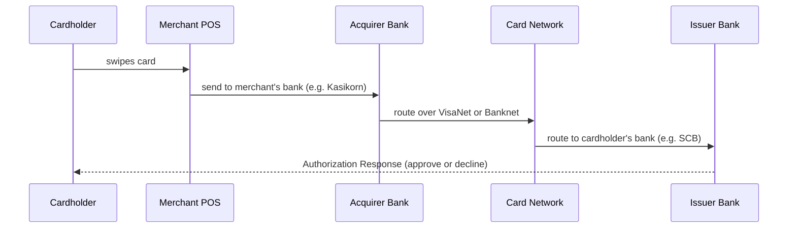
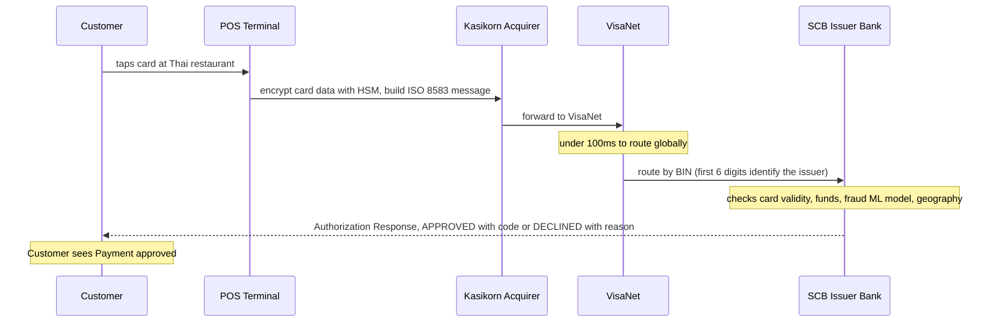
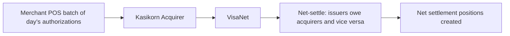
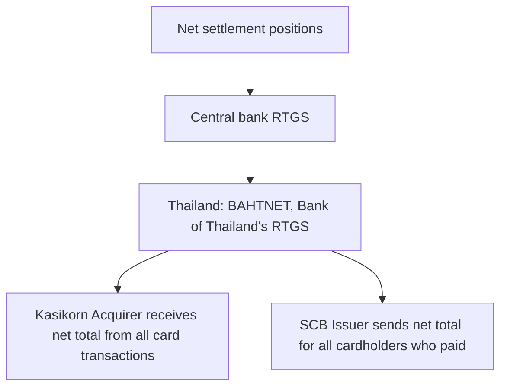
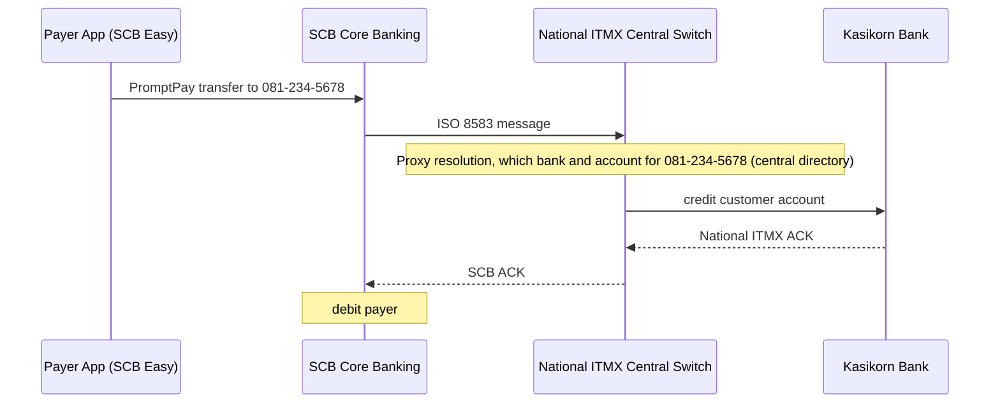

# Payment Networks - Visa, Mastercard, SWIFT, PromptPay

> "A card swipe takes 2 seconds. In those 2 seconds: your bank, Visa's network, the merchant's bank, fraud systems in 3 countries, and a risk engine all communicate - and they all must agree before your coffee is poured." - Payment industry veteran

---

## The Four-Party Model (How Card Payments Work)

How an authorization request flows from the cardholder through to the issuer and back as an approve/decline response.



Roles:

- **Cardholder**: you, with your card
- **Merchant**: the shop accepting payment
- **Acquirer**: merchant's bank that processes card transactions
- **Network**: Visa/Mastercard (routes messages, sets rules)
- **Issuer**: cardholder's bank (decides to approve or decline)

---

## The 3-Step Transaction Lifecycle

### Step 1: Authorization (real-time, 1-2 seconds)

The real-time request/response that decides, in about a second, whether the payment is approved.



**The authorization is NOT the money moving - it's a hold/reservation**

### Step 2: Clearing (batch, end of day)

At end of day the merchant batches the day's authorizations and the network nets out who owes whom.



### Step 3: Settlement (next 1-2 business days)

Where money actually moves: net positions are settled through the central bank's RTGS.



The $0.89 you paid at Starbucks:

- **D+0**: Authorization (instant, no money moves)
- **D+1**: Clearing (net positions calculated)
- **D+2**: Settlement (actual money moves between banks)
- **D+3**: Shows as "Posted" on your statement

---

## VisaNet Architecture (65,000 transactions/second)

```
VisaNet has 2 processing centers:
  - Highlands Ranch, Colorado, USA (primary)
  - McLean, Virginia, USA (backup)
  Both are FULLY active simultaneously (active-active, not active-passive)

  If one center fails: other handles ALL traffic seamlessly
  99.999% availability = 5.26 minutes downtime per year maximum

The Core Processing Layer:
  Tandem NonStop computers (fault-tolerant by design)
  Every component is duplicated
  If any component fails -> system continues without interruption
  These are NOT commodity servers - purpose-built fault-tolerant hardware

Load: 65,000+ transactions per second peak
      Handles 2x normal load during Black Friday, holidays
      Auto-scales capacity provisioned in advance for predicted peaks
```

---

## SWIFT - Cross-Border Payments

SWIFT = Society for Worldwide Interbank Financial Telecommunication. Founded 1973, Belgium. Members: 11,000+ financial institutions in 200+ countries.

SWIFT does NOT move money - it moves MESSAGES:

- "Bank A instructs Bank B to pay Customer X $1000"
- The actual money moves through correspondent banking relationships

SWIFT message types:

- **MT103**: Customer credit transfer (individual payment)
- **MT202**: Bank-to-bank payment
- **MT940**: Statement/balance report

ISO 20022 Migration (2023-2025):

- SWIFT migrating from MT messages to ISO 20022 MX messages
- MX messages: richer data, machine-readable, structured
- Old: MT103 "SWIFT payment /for invoice 12345" (free text, ambiguous)
- New: ISO 20022 pacs.008 with structured creditor reference, purpose code, etc.

A cross-border payment hops bank to bank through SWIFT and correspondent banks, typically T+0 to T+2 business days.


- **Problem**: too slow for modern expectations
- **Solution**: SWIFT gpi (global payments innovation) = same-day for many corridors

---

## PromptPay - Thailand's Real-Time Payment System

- **Launched**: January 2017 by Bank of Thailand (BOT)
- **Operated by**: National ITMX Co., Ltd.
- **Tech partner**: Vocalink (Mastercard subsidiary)
- **Users**: 77 million registered (2023) out of 70 million Thai population
- **Standard**: ISO 20022 internally plus ISO 8583 adapter for bank compatibility

How a PromptPay transfer flows from the payer's app through the central switch to the recipient's bank and back as acknowledgements.



- **Clearing**: 2 cycles per day through BAHTNET (BOT's RTGS)
- **Settlement**: same day (T+0)
- **Transaction time**: under 60 seconds end-to-end
- **Cost**: Free for most retail transfers (<=5,000 THB)
- **QR Code standard**: EMVCo QR (same standard as China's Alipay/WeChat Pay)
- **Cross-border**: PromptPay to PayNow (Singapore) to Alipay (China) QR linkage

---

## ISO 20022 - The Universal Financial Language

```
ISO 20022 is the new global standard for financial messaging.
Replacing: SWIFT MT, ISO 8583 (card), NACHA (US ACH), and many national standards

Why it matters:
  Old messages (ISO 8583, MT103): fixed-length fields, limited data, ambiguous
  ISO 20022: XML/JSON structured, unlimited rich data, machine-readable

Example (old SWIFT MT103):
  :32A:230115USD1000,
  :50K:/123456789
  ACME Corporation
  :59:/987654321
  John Smith
  :70:INVOICE 12345 <- free text! Ambiguous. Hard to process automatically.

Example (new ISO 20022 pacs.008):
  <CdtTrfTxInf>
    <Amt><InstdAmt Ccy="USD">1000.00</InstdAmt></Amt>
    <Dbtr><Nm>ACME Corporation</Nm><Id><OrgId>...</OrgId></Id></Dbtr>
    <Cdtr><Nm>John Smith</Nm><PrvtId><DtAndPlcOfBirth>...</DtAndPlcOfBirth></PrvtId></Cdtr>
    <RmtInf><Strd><CdtrRefInf><Ref>INV-12345</Ref></CdtrRefInf></Strd></RmtInf>
  </CdtTrfTxInf>

Benefits of ISO 20022:
  AML/KYC: rich counterparty data -> better fraud detection
  Sanctions screening: structured name/address -> fewer false positives
  Reconciliation: structured invoice references -> automated matching
  Interoperability: one standard for all markets

Adoption timeline:
  SWIFT CBPR+: Nov 2022 (coexistence) -> Nov 2025 (mandatory)
  PromptPay: ISO 20022 since launch (2017)
  UK Faster Payments: ISO 20022 since 2023
  BAHTNET (Thailand RTGS): ISO 20022 since 2021
```

---

## In Clean Architecture Terms

```
Payment Networks = External systems (Infrastructure / Frameworks & Drivers layer)

Your payment use case:
  ChargeCustomerUseCase.execute()
 -> calls IPaymentGateway.charge()  [interface / port]

IPaymentGateway implementations (adapters):
  VisaDirectPaymentAdapter -> calls Visa API
  MastercardSendAdapter -> calls Mastercard API
  PromptPayAdapter -> calls National ITMX API
  StripeGatewayAdapter -> calls Stripe API (which calls Visa/MC)

The use case never knows WHICH payment network was used.
It only knows: IPaymentGateway.charge(amount, paymentMethod) -> result

ISO 20022 message construction happens in the adapter layer.
Business rule "charge $100 to customer" lives in the use case.
Message formatting "pacs.008 with creditor reference" lives in the adapter.

This is exactly Clean Architecture's purpose:
Swap from Visa Direct to PromptPay:
  Change the adapter only
  Use case code unchanged
  Business rules unchanged
```
