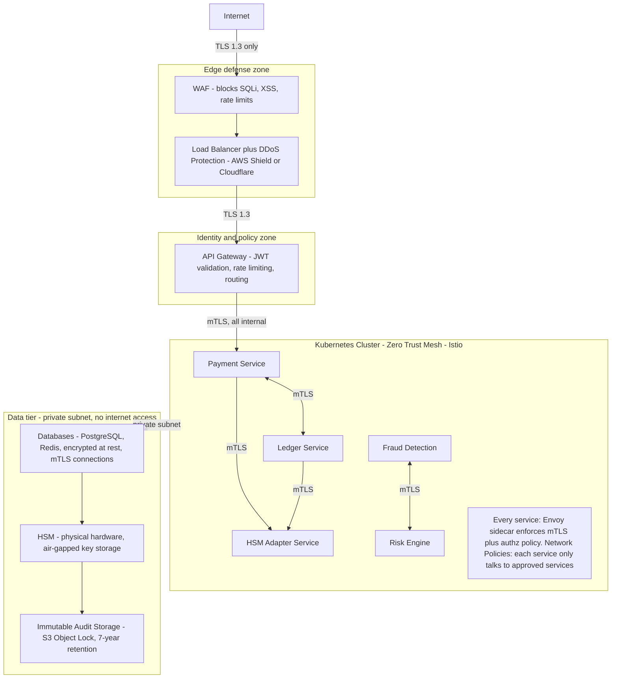

# Zero Trust Network Architecture for Financial Systems

> "In the old model, if you were inside the network, you were trusted. The 2016 Bangladesh Bank SWIFT heist proved this wrong - attackers inside the network sent fraudulent SWIFT messages and stole $81 million. Zero Trust: never trust, always verify - even from inside." - Financial cybersecurity expert

---

## At a Glance

| | |
|---|---|
| **Zero Trust principle** | "Never trust, always verify" - no implicit trust based on network location |
| **mTLS** | Both sides of every connection must authenticate |
| **Microsegmentation** | Each service can only talk to explicitly authorized services |
| **BeyondCorp** | Google's zero trust model (all traffic through identity-aware proxy) |

---

## Why Traditional Perimeter Security Failed in Finance

```
Traditional model (castle-and-moat):
  Outside the network: untrusted (firewall blocks)
  Inside the network: trusted (free to access anything)

The Bangladesh Bank Heist (2016):
  Attackers compromised a Bangladesh Central Bank workstation
  Workstation was "inside the trusted network"
  Used the bank's own SWIFT terminal to send fraudulent messages
  Sent 35 transfer orders to Federal Reserve Bank of New York
  $81 million transferred to accounts in Philippines and Sri Lanka
  Filters only stopped $951M of planned $1B theft (mis-spelling "fandation")

  What Zero Trust would have done:
  Even if attacker controls the workstation:
    - SWIFT terminal needs to authenticate to SWIFT service (mTLS certificate)
    - SWIFT service checks: is this request from an authorized user? (identity verification)
    - Unusual pattern detected: transfers to Philippines (never done before) -> block + alert
    - Risk-based authentication: high-value transfer -> requires additional approval
```

---

## The Five Pillars of Zero Trust for Financial Systems

### Pillar 1: Identity - "Who are you, prove it"

```
Traditional: username + password = trusted
Zero Trust: username + password + MFA + device certificate + risk score = maybe trusted

For financial systems:
  Users: FIDO2 / WebAuthn (hardware security key) + password
  Services: mTLS client certificate (each microservice has its own cert)
  APIs: OAuth2 + JWT with short expiry (15 minutes max)
  Privileged access: just-in-time access, time-limited, fully logged

Implementation:
  Identity Provider: Azure AD / Okta / HashiCorp Vault (for service certs)
  Every request carries: JWT signed by IdP
  Every service validates: JWT signature + claims + expiry
  No service trusts another without verified identity
```

### Pillar 2: Device - "Is your machine trustworthy"

```
Zero Trust requires device verification before granting access:
  Is the device enrolled in MDM (Mobile Device Management)?
  Is the OS patched to the required version?
  Is endpoint protection (antivirus) running and up-to-date?
  Is the device in a known geographic location?

Financial services implementation:
  Developer laptops: must be enrolled in Jamf (macOS) or SCCM (Windows)
  Unmanaged device: blocked from accessing any production systems
  Access granted: only from company-managed devices
  Production access: additionally requires VPN + MFA + time-limited certificate
```

### Pillar 3: Network Microsegmentation

```
Traditional:
  Payment Service -> [internal network] -> Database
 -> Any service inside the network can reach the database

Zero Trust microsegmentation:
  Payment Service -> [policy engine: is this allowed?] -> Database
  Policy: "Only PaymentService can connect to PaymentDB on port 5432"

  Kubernetes Network Policies (example):
  Effect: Even if ledger-service is compromised,
          it cannot connect to payment-database (network policy blocks it)
```

```yaml
# kubernetes-network-policy.yaml
apiVersion: networking.k8s.io/v1
kind: NetworkPolicy
metadata:
  name: payment-db-access
spec:
  podSelector:
    matchLabels:
      app: payment-database
  ingress:
  - from:
    - podSelector:
        matchLabels:
          app: payment-service    # ONLY payment-service can reach payment-db
    ports:
    - port: 5432
```

```yaml
# istio-authorization-policy.yaml
apiVersion: security.istio.io/v1beta1
kind: AuthorizationPolicy
metadata:
  name: payment-service-policy
spec:
  selector:
    matchLabels:
      app: payment-service
  rules:
  - from:
    - source:
        principals: ["cluster.local/ns/default/sa/api-gateway"]
    # ONLY the api-gateway service account can call payment-service
```

### Pillar 4: mTLS - Mutual TLS Between All Services

```
Normal TLS (one-way):
  Client -> (verifies server cert) -> Server
  Server: "I have a valid certificate, trust me"
  Client: "OK, I trust you"
  Problem: Server doesn't know who the CLIENT is

mTLS (mutual TLS):
  Client -> (presents client cert) -> Server
  Server -> (verifies client cert) -> Client
  Server: "Who are you?" Client: "I'm PaymentService, here's my cert"
  Server: "cert is valid and PaymentService is authorized -> proceed"

  Now: even if a malicious service inside the cluster tries to call PaymentService,
       it must have a valid certificate issued by your internal CA.
       No cert -> rejected -> attack stopped.

Istio handles mTLS automatically:
  All sidecar proxies (Envoy) in the mesh:
    - Issue certificates to each service automatically
    - Rotate certificates every 24 hours (no manual rotation)
    - Enforce mTLS between all pods by default
    - Service code doesn't need to implement mTLS - the sidecar handles it
```

```yaml
# PeerAuthentication: enforce strict mTLS across the payment-system namespace
apiVersion: security.istio.io/v1beta1
kind: PeerAuthentication
metadata:
  name: default
  namespace: payment-system
spec:
  mtls:
    mode: STRICT    # REJECT any connection that is not mTLS
```

### Pillar 5: Continuous Verification and Monitoring

```
Zero Trust is not a one-time check - it's continuous:
  Initial auth: user logs in, passes MFA -> granted access
  During session: behavior analysis continues
    - Unusual access pattern? -> step-up authentication required
    - Accessing resources never accessed before? -> alert
    - Multiple simultaneous logins from different geographies? -> block
    - High-value transfer at 3am? -> require additional approval

Risk-based authentication in financial systems:
  Transaction risk score (0-100):
    Score 0-30:   allow (normal pattern)
    Score 31-60:  require additional verification (SMS OTP)
    Score 61-80:  require biometric verification + delay
    Score 81-100: block + alert fraud team

  Risk factors:
    - New device never seen before (+30)
    - Different IP/location than usual (+20)
    - Amount 10x normal transaction (+25)
    - Destination account never transferred to before (+15)
    - Unusual time of day (+10)
    - VPN/Tor detected (+40)
```

---

## Network Architecture for a Payment Microservices System

This shows traffic flowing inward from the internet through each trust zone - edge defense, the identity-aware gateway, the zero-trust service mesh, and the locked-down data tier. Each boundary re-verifies; nothing is trusted by location.



---

## The Real Bangladesh Bank Attack - What Zero Trust Would Have Prevented

```
Attack timeline (February 2016):

Feb 4, 01:30 AM: Attackers (inside network) send SWIFT messages to Fed New York
 -> Zero Trust: SWIFT terminal must authenticate to SWIFT service
 <- Zero Trust check: is this terminal's certificate valid? YES (stolen)
 <- Zero Trust check: is this request from a known authorized user? NO!
 -> BLOCKED by identity verification [OK]

Feb 4, 05:00 AM: First $20M transfer
 -> Zero Trust: risk score calculation
                   - New destination account: +30
                   - Amount: largest single transfer ever: +50
                   - Unusual time (Bangladesh business hours): -10
 -> RISK SCORE: 70 -> STEP-UP AUTHENTICATION REQUIRED [OK]
                   Attacker can't complete step-up -> BLOCKED [OK]

Feb 5: Multiple transfers detected as automated pattern
 -> Behavioral analytics: 35 transfers in 24 hours (never before)
 -> ANOMALY ALERT -> Freeze SWIFT access -> INVESTIGATION [OK]

What actually happened (no zero trust):
  Once attacker was "inside the network": trusted
  SWIFT terminal sent messages: trusted (inside network = trusted)
  No behavioral analytics: not detected until Philippines bank noticed on weekend
  $81M lost, $951M attempted
```

---

## In Clean Architecture Terms

```
Zero Trust = Infrastructure + Cross-cutting concern

Your use cases NEVER implement:
  - mTLS certificate verification
  - JWT validation
  - Network policy enforcement

These live in:
  API Gateway (JWT validation) = Framework & Drivers layer
  Envoy sidecar (mTLS) = Framework & Drivers layer
  Kubernetes NetworkPolicy = Infrastructure layer
  Istio AuthorizationPolicy = Infrastructure layer

Your use cases DO implement:
  Business-level authorization: "can this user view this account?"
  Transaction risk scoring: is this payment suspicious?

  class ViewAccountUseCase {
    execute(userId: string, accountId: string) {
      // Business authorization (in use case layer)
      const account = await this.accounts.findById(accountId);
      if (account.ownerId !== userId) throw new UnauthorizedError();
      // mTLS, JWT validation already done by the time we get here
      // Those are infrastructure concerns handled before this code runs
    }
  }

The Clean Architecture principle:
  Infrastructure security (mTLS, network policies) = Framework layer
  Business security (authorization rules) = Use Case layer
  These must BOTH exist - one is not a substitute for the other
```

---

## Sources
- [Zero Trust Architecture in Payment Systems](https://oceanobe.com/news/zero-trust-architecture-in-payment-systems/1654)
- [mTLS and Zero Trust - Buoyant.io](https://www.buoyant.io/blog/zero-trust-mtls-and-the-service-mesh-explained)
- [Zero Trust with mTLS - DEV Community](https://dev.to/dleedev365/zero-trust-security-mtls-cfa)
- [Putting Zero Trust into Financial Institutions - Cloud Security Alliance](https://cloudsecurityalliance.org/blog/2023/09/27/putting-zero-trust-architecture-into-financial-institutions)
