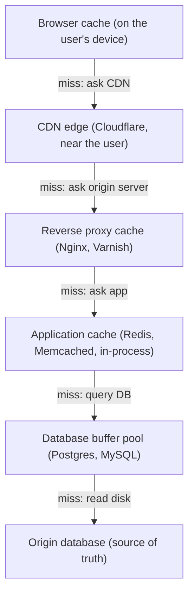
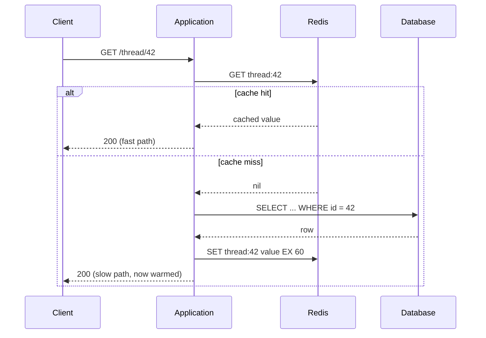
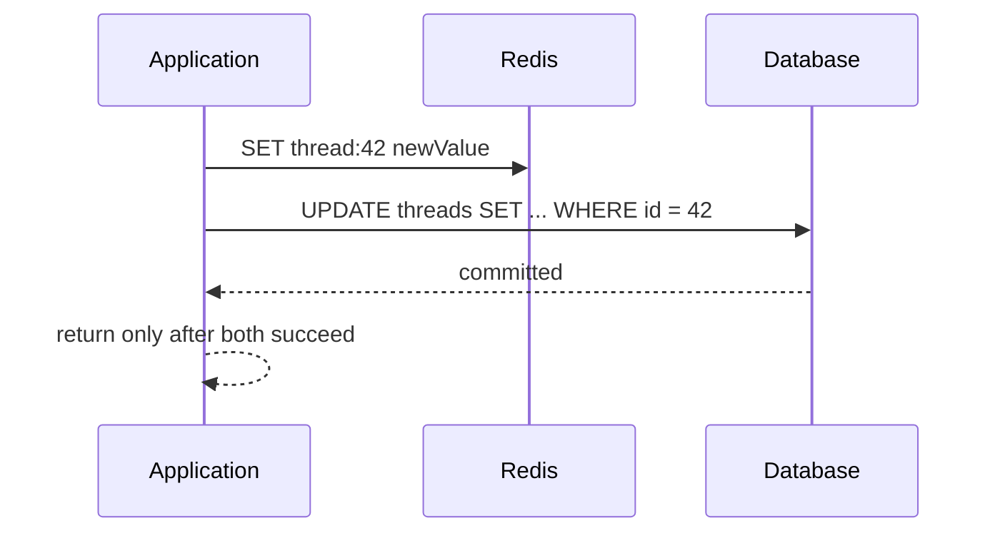
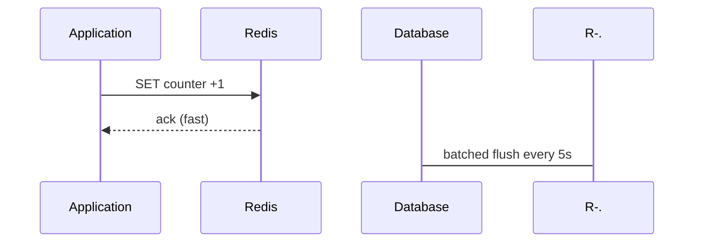
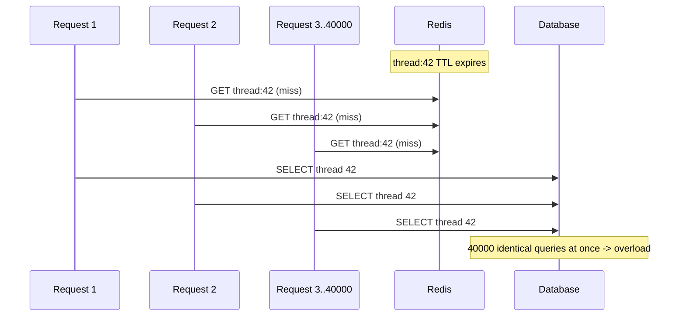

# Caching and CDN - Complete Guide

> "A cache is a bet that the past predicts the future. The bet usually pays off. The two things that ruin you are stale data nobody noticed and a stampede the moment the bet expires." - Staff Performance Engineer

---

## At a Glance

| | |
|---|---|
| **The problem** | The same expensive work (a DB query, a render, a fetch from origin) runs over and over for data that barely changes. |
| **The core idea** | Keep a copy of the answer close to where it is needed, and reuse it until it is no longer worth trusting. |
| **The trap** | Treating "make it fast" as the whole job and forgetting the hard half: deciding when the copy is wrong. |
| **The two hard problems** | Cache invalidation (knowing when to throw the copy away) and the stampede (what happens the instant many copies expire at once). |
| **The mindset** | A cache is an optimization you can always turn off. If correctness depends on it, it is not a cache - it is your database. |

---

## The Story First (Read This Even If You Skip the Rest)

A forum thread on Pantip goes viral. One post, 40,000 people refreshing it in the same ten minutes. Rendering that thread page costs you six database queries (the thread, the posts, each author's profile, the like counts, the user's permissions, the ads) plus some template work. Call it 80ms of server time per render.

Without a cache: 40,000 renders x 80ms = 53 minutes of CPU crammed into ten real minutes. Your database melts, every other page on the site slows down, and the on-call engineer wakes up.

With a cache: you render the thread **once**, store the HTML (or the assembled data) in Redis with a short time-to-live, and serve the next 39,999 requests from memory in under 1ms each. The database sees 6 queries instead of 240,000.

That is the entire pitch for caching. But notice two things hiding in the happy version:

1. When someone edits the post, the stored copy is now **wrong**. How do you know to throw it away? (Invalidation.)
2. The exact millisecond the cached copy expires, all 40,000 requests miss at once and pile onto the database simultaneously. (The stampede.) The cache that was protecting you just became the trigger for the outage.

Most of this page is about those two problems. The "store a copy" part is easy. Knowing when the copy is wrong, and surviving the moment it disappears, is the senior skill.

---

## Why Cache at All

Caching trades a small, bounded risk of staleness for a large, reliable win in latency and load. You reach for it when three things are true:

- **The work is expensive.** A query that joins five tables, a call to a slow third-party API, a heavy render.
- **The result is reused.** The same product, the same thread, the same exchange rate, asked for again and again.
- **A slightly old answer is acceptable.** A product price that is 30 seconds stale is usually fine. A bank balance shown after a withdrawal usually is not.

If any of those is false, do not cache yet. Caching data that is read once is pure overhead. Caching data that must always be exact is a correctness bug waiting to happen.

```
Cost of the work x How often it is reused x Tolerance for staleness
  = how much caching helps
```

---

## Where Caches Live (the Layered Hierarchy)

There is never just one cache. A single request can pass through five of them, each closer to the user than the last. The closer the cache, the faster the hit - and the harder it is to invalidate, because you no longer control it.



| Layer | Lives where | Typical TTL | Who controls invalidation |
|---|---|---|---|
| Browser cache | The user's device | Seconds to days | You, via `Cache-Control` headers - but you cannot reach back and clear it |
| CDN edge | Hundreds of POPs near users | Seconds to forever | You, via cache headers + a purge API |
| Reverse proxy | Your own front line (Nginx/Varnish) | Seconds to minutes | You, directly |
| Application cache | Redis/Memcached, in your network | Seconds to hours | You, directly - the layer you have the most leverage over |
| DB buffer pool | Inside the database | Automatic | The database, not you |

!!! tip "Read the table from the bottom up"
    The closer a cache sits to the user, the bigger the latency win and the weaker your control. You can `DEL` a Redis key in 1ms. You cannot reach into a million browsers. Push aggressive, long-lived caching outward only for data you are confident will not change, or that you can purge.

---

## The Four Read/Write Patterns

How does data get into the cache, and who is responsible for keeping it in sync with the database? There are four classic patterns. The first one - cache-aside - is what you will use 90% of the time.

### Cache-Aside (Lazy Loading)

The application talks to both the cache and the database. On a read, it checks the cache first; on a miss, it loads from the database and populates the cache itself. The cache does not know the database exists.



```typescript
// Cache-aside: the application owns the logic
async function getThread(id: string): Promise<Thread> {
  const key = `thread:${id}`;

  const cached = await redis.get(key);
  if (cached !== null) {
    return JSON.parse(cached); // hit
  }

  // miss: load from the source of truth
  const thread = await db.query('SELECT * FROM threads WHERE id = $1', [id]);

  // populate, with a TTL so a stale copy cannot live forever
  await redis.set(key, JSON.stringify(thread), 'EX', 60);

  return thread;
}
```

!!! note "Why cache-aside is the default"
    It is resilient: if Redis is down, reads still work (slower) because the app falls back to the database. The cache is a true optimization you can lose without losing correctness. The cost is that the first reader after a miss pays the full price - and that you must remember to invalidate on writes yourself.

### Read-Through

Same read shape as cache-aside, but the application talks **only** to the cache. The cache itself knows how to load from the database on a miss. This hides the loading logic behind the cache library or a provider.

```typescript
// Read-through: the cache loads on miss, app never touches the DB on reads
const thread = await cache.get(`thread:${id}`, {
  loader: () => db.query('SELECT * FROM threads WHERE id = $1', [id]),
  ttl: 60,
});
```

The trade-off versus cache-aside: cleaner application code, but now the cache is a hard dependency on the read path. If it cannot load, the read fails.

### Write-Through

On a write, the application writes to the cache **and** the database synchronously, in the same operation, before returning. The cache is never stale because it is updated in lockstep with the source of truth.



Reads are always fresh and always fast. The cost is write latency (you pay for two writes) and a consistency question: if the DB write succeeds but the cache write fails (or vice versa), the two diverge. You handle that by treating the database as authoritative and using a short TTL as a safety net.

### Write-Behind (Write-Back)

The application writes to the cache and returns immediately. The cache flushes to the database asynchronously, in batches, a moment later.



This is the fastest for write-heavy workloads (think like-counters, view-counts) because writes never wait on the database. The danger is stark: if the cache dies before it flushes, those writes are **gone**. Use it only where losing the last few seconds of writes is acceptable - never for money.

=== "Cache-Aside"

    ```text
    Read:  app checks cache, on miss loads DB and fills cache
    Write: app writes DB, then deletes/updates the cache key
    Pros:  resilient (survives cache outage), simple, the default
    Cons:  first reader after a miss is slow; you must invalidate yourself
    Use:   almost everything - product pages, threads, profiles
    ```

=== "Write-Through"

    ```text
    Read:  always a hit (cache kept in sync)
    Write: app writes cache AND DB synchronously before returning
    Pros:  cache never stale; reads always fast
    Cons:  slower writes; caches data that may never be read again
    Use:   read-heavy data that must always be fresh on read
    ```

=== "Write-Behind"

    ```text
    Read:  hit from cache
    Write: app writes cache only, returns; DB flushed async in batches
    Pros:  fastest writes; absorbs write spikes
    Cons:  data loss if cache dies before flush; complex
    Use:   high-volume, loss-tolerant counters and metrics
    ```

---

## Cache Invalidation - The Hard Problem

There is an old joke that there are only two hard things in computer science: cache invalidation, naming things, and off-by-one errors. Invalidation is hard because the cache and the database have no automatic link - when the data changes, *something* has to remember to update or delete the copy, in possibly five different layers.

There are two honest strategies, and you almost always combine them.

### TTL (Time To Live) - Expire on a Timer

Every cached entry carries an expiry. After it passes, the next read misses and reloads fresh. This is the safety net: even if you forget to invalidate explicitly, staleness is bounded by the TTL.

```typescript
await redis.set('thread:42', value, 'EX', 60); // forget about it for at most 60s
```

TTL is simple and robust, but it is a blunt instrument. Set it too long and users see stale data; set it too short and you lose the caching benefit and invite stampedes (see below). Pick the TTL from the data's tolerance for staleness, not from a habit.

### Explicit Invalidation - Delete on Write

When you write the data, you also delete (or overwrite) the cache key. The next reader gets a guaranteed-fresh value.

```typescript
async function updateThread(id: string, patch: Partial<Thread>): Promise<void> {
  await db.query('UPDATE threads SET ... WHERE id = $1', [id]);
  await redis.del(`thread:${id}`); // let the next read repopulate it
}
```

!!! warning "Prefer delete over update on invalidation"
    Deleting the key (and letting the next read lazily reload) is safer than trying to compute and write the new value in place. An in-place update can race with a concurrent read that repopulates the old value after you wrote the new one, leaving you stale forever. Deleting is idempotent and race-tolerant.

The genuinely hard cases are not single keys:

- **Derived/aggregated data.** You changed one post, but it appears in a thread page, a "latest posts" list, a user's profile, and a search index. Which keys does that touch?
- **Layered caches.** You purged Redis, but the CDN and a million browsers still hold the old copy. You can purge the CDN by API; you cannot purge browsers, so they must rely on a short TTL.
- **Naming.** Inconsistent key naming (`thread:42` vs `threads/42` vs `t42`) makes invalidation impossible because you cannot find what to delete. Pick one scheme and never deviate.

| Strategy | When the data is right | Effort | Best for |
|---|---|---|---|
| TTL only | Within the TTL window | Low | Data with a known, acceptable staleness budget |
| Explicit invalidation | Immediately on write | Medium | Data that must reflect writes at once |
| TTL + explicit (combined) | Immediately, with a backstop | Medium | The sensible default for most app caches |
| Event-driven (CDC) | Immediately, even across systems | High | Search indexes, denormalized read models |

---

## Eviction Policies - When the Cache Is Full

TTL decides when an entry is *stale*. Eviction decides what to throw out when the cache runs out of *memory*, regardless of staleness. Redis with `maxmemory` set will start evicting once it is full; the policy decides who goes.

```
LRU (Least Recently Used):
  Evict the key that has not been read for the longest time.
  Bet: recently used things will be used again soon (temporal locality).
  Default choice. Works well for most workloads.

LFU (Least Frequently Used):
  Evict the key with the fewest accesses overall.
  Bet: popular things stay popular regardless of recency.
  Better when a small set of "hot" keys dominates and you do not want a
  one-off scan to evict them.

FIFO (First In First Out):
  Evict the oldest-inserted key. Ignores usage. Rarely the right choice.

TTL-based (volatile-*):
  Only evict keys that have a TTL set; never evict persistent keys.
```

!!! tip "LRU is the safe default, LFU for skewed traffic"
    On Redis, `allkeys-lru` is a fine starting point. Switch to `allkeys-lfu` when a small number of very hot keys (the viral thread, the homepage) keep getting evicted by a flood of one-time reads (a crawler walking every page). LFU protects the hot set; LRU does not.

---

## Redis vs Memcached

Both are in-memory key-value stores that you put in front of a database. The choice is usually Redis now, but it is worth knowing why.

=== "Redis"

    ```text
    Data types:   strings, hashes, lists, sets, sorted sets, streams, bitmaps
    Persistence:  optional (RDB snapshots, AOF log) - can survive restart
    Replication:  built-in primary/replica, Sentinel, Cluster mode
    Features:     pub/sub, Lua scripting, atomic ops, TTL per key, transactions
    Threading:    mostly single-threaded core (simple, predictable)
    Use when:     you want more than a flat cache - rate limiting, queues,
                  leaderboards, locks, sessions, request coalescing
    ```

=== "Memcached"

    ```text
    Data types:   strings/blobs only (you serialize everything yourself)
    Persistence:  none - purely volatile, gone on restart
    Replication:  none built-in (client shards across nodes)
    Features:     get/set/delete, TTL, that is largely it
    Threading:    multi-threaded (can use many cores on one box)
    Use when:     you want a dead-simple, multi-threaded blob cache and
                  nothing more; very large, very simple cache fleets
    ```

| Decision factor | Redis | Memcached |
|---|---|---|
| Rich data structures | Yes | No |
| Persistence / survives restart | Optional | No |
| Built-in replication / HA | Yes | No |
| Multi-threaded throughput on one node | Limited | Strong |
| Locking, pub/sub, scripting (for stampede control) | Yes | No |
| Operational simplicity for a pure blob cache | Good | Excellent |

The practical answer: **default to Redis.** You will eventually want one of its extra features (atomic locks for stampede control, TTL precision, pub/sub for invalidation, sorted sets for leaderboards), and you do not want to run two systems. Reach for Memcached only when you genuinely need nothing but a large, multi-threaded blob cache.

---

## CDN Edge Caching

A Content Delivery Network is a cache layer made of hundreds of points-of-presence (POPs) physically near your users. When a user in Bangkok requests an asset, a nearby edge server answers in single-digit milliseconds instead of crossing an ocean to your origin.

CDNs are obvious for static assets (images, CSS, JS, video). The senior move is caching **dynamic** responses too - whole HTML pages, JSON API responses - for short windows, so the origin barely runs.

```
The contract is the response headers. The origin tells the CDN what to do:

Cache-Control: public, max-age=60, s-maxage=300
  public    -> any cache may store it (including the CDN)
  max-age   -> browser keeps it 60s
  s-maxage  -> shared caches (the CDN) keep it 300s

Cache-Control: private, no-store
  -> never cache (e.g. a logged-in user's account page)

ETag: "abc123"
  -> a fingerprint; the browser revalidates with If-None-Match,
     the origin replies 304 Not Modified with no body if unchanged
```

!!! warning "Never cache personalized responses on a shared cache"
    `Cache-Control: public` on a page that contains "Welcome back, Somchai" will serve Somchai's page to the next user. Personalized or authenticated responses must be `private` or `no-store`. Cache the shared shell; load the personal bits with a separate uncached call.

To invalidate the CDN, you have three tools: let the TTL expire, call the **purge API** to evict specific URLs immediately, or use **cache-busting URLs** (`app.a1b2c3.js`) so a new deploy is simply a new URL that was never cached.

---

## Cache Stampede / Thundering Herd

This is the failure that turns your cache from a shield into a weapon. A single hot key expires. At that instant, every concurrent request misses, and they **all** rush the database at once to recompute the same value. The database, sized for the cached load, falls over. Ironically, the more popular the key, the worse the stampede.



There are three defenses, often combined.

### 1. Locking (single-flight)

Only the first request that misses is allowed to recompute. It takes a short-lived lock; everyone else waits briefly and then reads the value the winner just wrote.

```typescript
async function getThreadSingleFlight(id: string): Promise<Thread> {
  const key = `thread:${id}`;
  const cached = await redis.get(key);
  if (cached !== null) return JSON.parse(cached);

  // Only one request wins the lock; NX = set if not exists
  const lockKey = `lock:${key}`;
  const gotLock = await redis.set(lockKey, '1', 'NX', 'PX', 5000);

  if (gotLock === null) {
    // someone else is computing; wait a beat then read the fresh value
    await sleep(50);
    return getThreadSingleFlight(id);
  }

  try {
    const thread = await db.query('SELECT * FROM threads WHERE id = $1', [id]);
    await redis.set(key, JSON.stringify(thread), 'EX', 60);
    return thread;
  } finally {
    await redis.del(lockKey);
  }
}
```

### 2. Request Coalescing

Within a single application instance, collapse concurrent calls for the same key into **one** in-flight promise. The first caller computes; the rest await the same result. This kills the stampede inside one process for free, before it even reaches Redis.

```typescript
const inFlight = new Map<string, Promise<Thread>>();

function getThreadCoalesced(id: string): Promise<Thread> {
  if (inFlight.has(id)) return inFlight.get(id)!; // join the existing fetch

  const p = loadAndCache(id).finally(() => inFlight.delete(id));
  inFlight.set(id, p);
  return p;
}
```

### 3. Stale-While-Revalidate

Serve the stale value immediately while refreshing it in the background. No request ever blocks on a recompute, so there is no herd. The cost is that for a brief window users see slightly old data - usually a fine trade.

```typescript
// Keep two horizons: "fresh until" and "usable until"
async function getThreadSWR(id: string): Promise<Thread> {
  const entry = await readEntry(id); // { value, freshUntil }

  if (entry && Date.now() < entry.freshUntil) {
    return entry.value; // fresh, return as-is
  }
  if (entry) {
    refreshInBackground(id); // stale but usable: serve now, refresh quietly
    return entry.value;
  }
  return loadAndCache(id); // cold: must compute
}
```

This is also a native HTTP header for CDNs and browsers:

```
Cache-Control: max-age=60, stale-while-revalidate=300
  -> fresh for 60s; for the next 300s serve stale instantly and revalidate in the background
```

!!! tip "Also: add jitter to your TTLs"
    If you warm 10,000 keys in a loop with `EX 60`, all 10,000 expire in the same second and stampede together. Set `EX 60 + random(0..15)` so expirations spread out. A little randomness turns one giant herd into a harmless trickle.

---

## Consistency Trade-offs

Every cache is a deliberate choice to be eventually consistent on the read path. Be honest about where that is and is not acceptable.

```
Strong consistency needed (do NOT cache, or write-through + invalidate):
  - Account balances after a transaction
  - Inventory at checkout ("is this seat still available?")
  - Permissions and authorization decisions
  - Anything where a stale read causes money loss or a security hole

Eventual consistency fine (cache freely with a TTL):
  - Product descriptions, thread bodies, user profiles
  - View counts, like counts (approximate is fine)
  - Search results, recommendations, "trending" lists
  - Public, read-mostly content
```

!!! warning "The classic cache bug: cache then write"
    If you read into the cache and then write to the DB without invalidating, the cache serves the old value until its TTL. Worse, a concurrent read can repopulate the cache with the old value *after* your write. Always invalidate (delete the key) as part of the write, and keep a TTL as the backstop for the cases you miss.

---

## Common Mistakes (and the Fix)

| Mistake | Why it hurts | Fix |
|---|---|---|
| No TTL on cache entries | One missed invalidation = permanently stale data | Always set a TTL as a backstop, even with explicit invalidation |
| Caching personalized data on a shared/CDN cache | One user sees another user's data | Mark personalized responses `private`/`no-store`; cache only the shared shell |
| Updating the cache in place on writes | Races with concurrent reads, leaves stale values | Delete the key and let the next read repopulate |
| Identical TTLs on bulk-warmed keys | Everything expires at once -> stampede | Add random jitter to each TTL |
| Treating the cache as the source of truth | Cache outage becomes a correctness/data-loss event | Database is authoritative; the cache must be losable |
| Inconsistent key naming | You cannot find keys to invalidate | One documented key scheme, applied everywhere |
| Caching data read only once | Pure overhead, zero hit rate | Cache only what is expensive AND reused |

---

## In Clean Architecture Terms

Caching is an **infrastructure** concern. Your business rules should never know a cache exists.

- The **use case layer** depends on a port like `IThreadReader` with a `findById` method. It asks for a thread and does not care where it comes from.
- The **infrastructure layer** provides a `CachedThreadRepository` adapter that wraps the real `PostgresThreadRepository`. The wrapper does the cache-aside dance (check Redis, fall back to the inner repository, populate). This is the decorator pattern.
- Adding, removing, or changing the cache (TTL, Redis vs Memcached, adding stampede protection) then touches **only** the infrastructure layer. The use case code is unchanged and untested-against-cache, because as far as it knows there is no cache.

That is the payoff: caching - a pure performance optimization - stays out of your domain logic, and you can switch it off entirely (just return the inner repository) without rewriting a single business rule.

---

## Checklist

- [ ] You cache only data that is expensive to produce AND reused AND tolerant of staleness.
- [ ] Every cache entry has a TTL, even when you also invalidate explicitly.
- [ ] Writes invalidate by deleting the key, not updating it in place.
- [ ] TTLs carry random jitter so bulk-warmed keys do not expire together.
- [ ] Hot keys are protected from stampede via locking, coalescing, or stale-while-revalidate.
- [ ] The eviction policy matches the traffic shape (LRU default, LFU for hot-key-skewed loads).
- [ ] Personalized responses are never cached on shared or CDN layers.
- [ ] The database remains the source of truth; the app works correctly with the cache turned off.
- [ ] Cache logic lives in an infrastructure-layer adapter, not in use cases.
- [ ] You have a CDN purge plan (API purge or cache-busting URLs) for content you push to the edge.

---

## Sources
- [AWS: Caching Strategies and Best Practices (cache-aside, write-through)](https://aws.amazon.com/caching/best-practices/)
- [Redis: Eviction Policies (LRU, LFU, maxmemory)](https://redis.io/docs/latest/develop/reference/eviction/)
- [Cloudflare: How the Cache Works and Cache-Control](https://developers.cloudflare.com/cache/concepts/default-cache-behavior/)
- [MDN: HTTP Cache-Control and stale-while-revalidate](https://developer.mozilla.org/en-US/docs/Web/HTTP/Headers/Cache-Control)
- [Memcached vs Redis: AWS ElastiCache Comparison](https://docs.aws.amazon.com/AmazonElastiCache/latest/dg/SelectEngine.html)
- [Facebook: Scaling Memcache at Facebook (the stampede/leases paper)](https://www.usenix.org/system/files/conference/nsdi13/nsdi13-final170_update.pdf)
