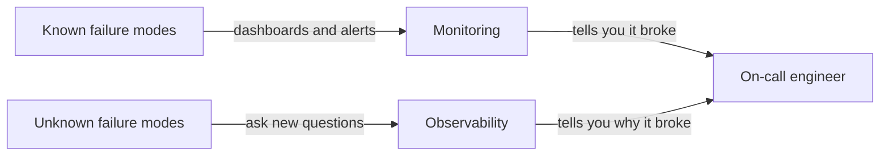
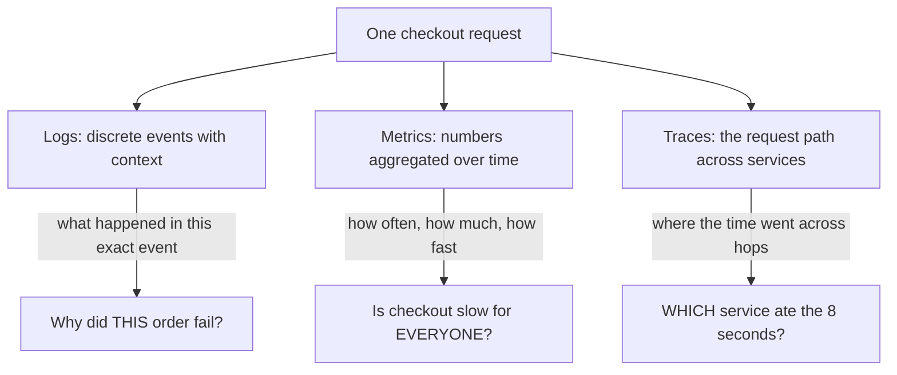
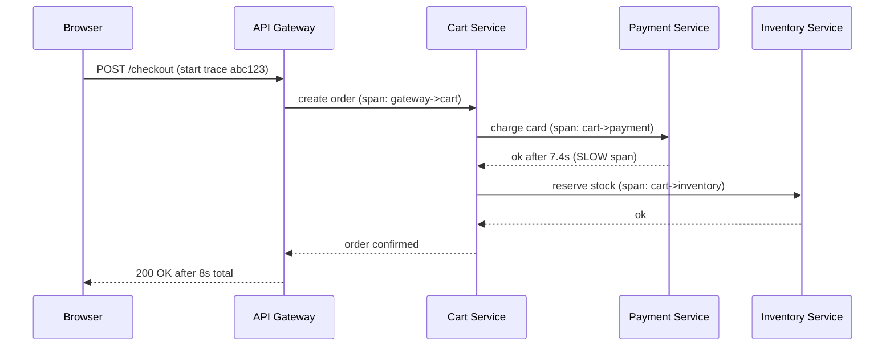
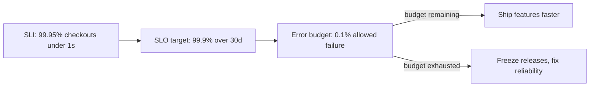

# Observability

> "Monitoring tells you the system is sick. Observability lets you ask why - even for a question you never thought to ask before the incident started."
> - Staff SRE

---

## At a Glance

| | |
|---|---|
| **The problem** | A request got slow in production and you have no idea which of your 6 services caused it. |
| **The core idea** | Emit logs, metrics, and traces so you can ask new questions about the system without shipping new code. |
| **The trap** | Logging everything as plain strings, alerting on CPU instead of user pain, and treating dashboards as observability. |
| **Monitoring vs observability** | Monitoring = known questions on known dashboards. Observability = unknown questions answered from rich telemetry. |
| **The glue** | A correlation ID (and trace ID) that ties one user request across every log line and every service hop. |

---

## The Story First (Read This Even If You Skip the Rest)

It is 9:14 PM. Checkout is "slow." Support is forwarding angry messages: orders take 8 seconds to confirm, sometimes they time out. Nothing is *down* - your uptime check is green, CPU is fine, no service is throwing 500s in bulk. The monitoring dashboard you built six months ago shows nothing useful because nobody predicted *this* failure.

You open your logs. Thousands of lines like `processing order` and `done` scroll by with no order ID, no timing, no way to follow one customer's request through the system. You have data, but you cannot ask it a question.

This is the difference between **monitoring** (you watch the things you decided to watch in advance) and **observability** (you can interrogate the system about things you never anticipated). The fix is not "more dashboards." It is emitting telemetry rich enough - logs, metrics, and traces, all stitched together by an ID - that you can follow a single slow checkout from the browser, through the API gateway, into the cart service, the payment service, and the inventory database, and see exactly where the 8 seconds went.

By the end of this page you will be able to take that 9:14 PM page and answer "why" in minutes, not hours.

---

## Monitoring vs Observability

These words get used interchangeably. They are not the same thing.

- **Monitoring** answers *known* questions: "Is the error rate above 1%?" "Is latency over 500ms?" You define the question, build a dashboard or alert, and watch it. Monitoring is necessary - it is how you find out something is wrong.
- **Observability** is a *property of the system*: can you understand its internal state from the outside, well enough to answer questions you did not pre-bake? When a brand-new failure mode appears, monitoring tells you *that* it is broken; observability tells you *why*.

!!! note "The cheap mental model"
    Monitoring is the smoke alarm. Observability is being able to walk through the house and find which wire shorted. You want both. A smoke alarm with no way to inspect the house is a recipe for panic.



---

## The Three Pillars: Logs, Metrics, Traces

Observability is usually built from three kinds of telemetry. Each answers a different shape of question. You reach for a different one depending on what you are trying to learn.



| Pillar | Answers | Cardinality / cost | Reach for it when |
|---|---|---|---|
| **Logs** | "What exactly happened in this one event?" | High detail, can get expensive at volume | You need the specifics of a single request or error. |
| **Metrics** | "What is the rate / count / distribution over time?" | Cheap, aggregated, great for alerting | You need to know if a problem is widespread and trending. |
| **Traces** | "Where did one request spend its time across services?" | Medium, usually sampled | You need to find which hop in a distributed call is slow. |

The power comes from using them *together*. Metrics tell you checkout p99 latency jumped. Traces tell you the payment service is the slow hop. Logs from that service tell you it was a slow database query against an un-indexed column. We will walk that exact path below.

---

## Structured Logging and Log Levels

The single biggest upgrade most teams can make is moving from string logs to **structured logs** - logs emitted as key/value pairs (usually JSON) instead of prose.

=== "Unstructured (avoid)"

    ```typescript
    // You cannot query this. You cannot filter by orderId.
    // You cannot tie it to a trace. It is just text.
    console.log("processing order for user, took a while");
    console.log("done");
    ```

=== "Structured (do this)"

    ```typescript
    import { logger } from "./logger"; // pino, winston, etc.

    logger.info({
      event: "checkout.completed",
      orderId: order.id,
      userId: user.id,
      amountThb: order.totalThb,
      durationMs: Date.now() - startedAt,
      correlationId: ctx.correlationId, // ties logs together
      traceId: ctx.traceId,             // ties logs to the trace
    }, "checkout completed");
    ```

The structured version is *queryable*: in Loki or any log backend you can ask "show me all `checkout.completed` events where `durationMs > 5000` for the last hour" without grep gymnastics.

**Log levels** let you control volume and signal. Use them deliberately:

| Level | Meaning | Example |
|---|---|---|
| `ERROR` | Something failed and a human or retry must handle it | Payment gateway returned 500 |
| `WARN` | Suspicious but handled; watch for trends | Retry succeeded on 2nd attempt |
| `INFO` | Normal business events worth recording | `checkout.completed`, `user.registered` |
| `DEBUG` | Developer detail, usually off in production | Full request payload, SQL text |

!!! warning "Do not log secrets or PHI"
    In fintech and health insurance, logging a card number, a national ID, or a diagnosis is a compliance incident. Redact before logging. Structured logging makes redaction easier because you control each field - never log the whole request object blindly.

!!! tip "Log at the boundaries"
    Log when a request enters and leaves a service, and on every external call (DB, payment gateway, third party). Those boundary logs plus a correlation ID are 80% of what you need at 9:14 PM.

---

## Metrics: Counters, Gauges, Histograms

Metrics are cheap numbers sampled over time. Three core types cover almost everything:

- **Counter** - only ever goes up (or resets to zero on restart). Count of things that happened. Example: `checkout_requests_total`. You graph the *rate* of a counter (`rate(checkout_requests_total[5m])`), not the raw value.
- **Gauge** - goes up and down; a snapshot of "right now." Example: `queue_depth`, `active_connections`, `memory_bytes`.
- **Histogram** - buckets observations to let you compute distributions and percentiles. Example: `http_request_duration_seconds`. This is how you get p50, p95, p99 latency. Averages lie; percentiles tell the truth about tail latency.

```typescript
import { Counter, Gauge, Histogram } from "prom-client";

const checkoutTotal = new Counter({
  name: "checkout_requests_total",
  help: "Total checkout requests",
  labelNames: ["status"], // "ok" | "error"
});

const inFlight = new Gauge({
  name: "checkout_in_flight",
  help: "Checkouts currently being processed",
});

const checkoutDuration = new Histogram({
  name: "checkout_duration_seconds",
  help: "Checkout latency",
  buckets: [0.1, 0.3, 0.5, 1, 2, 5, 8, 13],
});
```

!!! warning "Label cardinality is a footgun"
    Do not put `userId` or `orderId` as a metric label. Each unique label value is a new time series; high-cardinality labels (millions of users) will melt your metrics backend. Identifiers belong in logs and traces, not metric labels.

### RED and USE: two methods so you measure the right things

You do not need a thousand metrics. Two well-known frameworks tell you which handful matter.

| Method | For | The three signals |
|---|---|---|
| **RED** | Request-driven services (your APIs) | **R**ate (requests/sec), **E**rrors (failed/sec), **D**uration (latency distribution) |
| **USE** | Resources (CPU, disk, queue, connection pool) | **U**tilization (% busy), **S**aturation (queued work), **E**rrors (error count) |

For checkout, RED gives you the user-facing health (how many checkouts, how many failing, how slow). USE on the database connection pool tells you whether the pool is saturated and requests are queuing - which is often the hidden cause of the slowness RED reveals.

---

## Distributed Tracing: Spans, IDs, and Context Propagation

A single checkout touches the API gateway, cart, payment, and inventory services. Logs alone cannot show you the *shape* of that journey or where the time went. **Distributed tracing** can.

- A **trace** represents one request end to end. It has a single **trace ID**.
- A **span** is one unit of work within that trace - one service handling the request, or one database call. Each span has its own **span ID** and records a start time, a duration, and a parent span ID.
- **Context propagation** is how the trace ID and parent span ID travel from one service to the next - usually via HTTP headers (the W3C `traceparent` header). If you do not propagate, each service starts its own trace and you get disconnected fragments instead of one picture.



Render that trace as a waterfall and the slow span is obvious: the `cart->payment` span is 7.4 seconds wide while every other span is tens of milliseconds. You now know *which service* to investigate, before you have read a single log line.

### OpenTelemetry: the vendor-neutral standard

**OpenTelemetry (OTel)** is the open standard for generating and exporting traces, metrics, and logs. You instrument your code once against the OTel API, then export to whatever backend you like (Jaeger, Tempo, etc.) without rewriting instrumentation.

```typescript
import { trace } from "@opentelemetry/api";

const tracer = trace.getTracer("payment-service");

async function chargeCard(order: Order) {
  // A child span is created and the trace context is propagated automatically
  // when the incoming request carried a W3C traceparent header.
  return tracer.startActiveSpan("charge_card", async (span) => {
    span.setAttribute("order.id", order.id);
    span.setAttribute("amount.thb", order.totalThb);
    try {
      const result = await gateway.charge(order);
      span.setStatus({ code: 1 }); // OK
      return result;
    } catch (err) {
      span.recordException(err as Error);
      span.setStatus({ code: 2 }); // ERROR
      throw err;
    } finally {
      span.end();
    }
  });
}
```

!!! tip "Sample, do not store everything"
    Tracing every request at full volume is expensive. Use tail-based sampling: keep 100% of slow or errored traces and a small percentage of the fast/healthy ones. You almost never need the millionth identical happy-path trace.

---

## Correlation IDs: Tying It All Together

The three pillars are only powerful when you can pivot between them for *the same request*. The glue is a single shared ID.

- Generate a **correlation ID** at the edge (API gateway) if the client did not send one.
- Put it on the request context, log it on every line, and propagate it downstream alongside the trace ID.
- Now: a log line shows an error -> copy its `traceId` -> open that exact trace in Jaeger -> see the slow span -> jump to that service's logs filtered by the same `correlationId`. Three pillars, one thread.

```typescript
// Express middleware at the gateway
app.use((req, res, next) => {
  const correlationId = req.header("x-correlation-id") ?? crypto.randomUUID();
  res.setHeader("x-correlation-id", correlationId);
  // attach to async-local context so every log + span downstream sees it
  context.run({ correlationId }, next);
});
```

!!! note "This is the move that pays off at 9:14 PM"
    Without a correlation ID you grep logs by timestamp and guess. With one, you follow a single request across six services deterministically. It is a few lines of middleware for an enormous incident-time payoff.

---

## SLI, SLO, SLA, and Error Budgets

Observability data is the *input* to reliability targets. Three acronyms, layered:

- **SLI (Service Level Indicator)** - a *measurement* of behaviour. "Percentage of checkout requests served in under 1 second" or "percentage of checkout requests that returned 2xx." Computed from your metrics.
- **SLO (Service Level Objective)** - an internal *target* for an SLI. "99.9% of checkouts succeed in under 1 second, measured over 30 days." This is the line you hold yourselves to.
- **SLA (Service Level Agreement)** - a *contract* with customers, usually looser than the SLO and with financial penalties. "99.5% uptime or we refund X." The SLO is stricter so you catch trouble before you breach the SLA.

An **error budget** is the inverse of an SLO. If your SLO is 99.9% success, your error budget is 0.1% - the allowed amount of failure over the window. It turns reliability into a number you can *spend*.



!!! tip "Error budgets end the dev-vs-ops fight"
    When budget remains, ship boldly. When it is spent, the same data says "stop shipping, stabilize." It replaces opinion ("it feels risky") with a shared number both teams agreed on in advance.

---

## Alerting on Symptoms, Not Causes

A bad alerting strategy is worse than none - it trains people to ignore the pager.

- **Alert on symptoms (user pain), not causes.** Page on "checkout success rate dropped below 99% / p99 latency over 2s" - things a user feels. Do *not* page on "CPU is 85%." High CPU might be totally fine; a page should mean a human needs to act *now* because customers are hurting.
- **Causes go on dashboards, not pagers.** CPU, memory, queue depth, cache hit rate - these help you *diagnose* once a symptom alert fires. They are diagnostic context, not wake-up calls.
- **Burn-rate alerts** are the mature version: alert when you are spending your error budget too fast (e.g. consuming a month's budget in an hour), which catches both fast outages and slow bleeds.

!!! warning "Alert fatigue is a real outage cause"
    If the pager cries wolf, on-call mutes it, and the night it matters the real alert gets ignored. Every alert must be actionable and tied to user impact. If an alert fires and the answer is "yeah that's normal, ignore it," delete or fix that alert today.

---

## Putting It Together: Solving the 9:14 PM Slow Checkout

Here is the full investigation, using each pillar in turn:

1. **Metrics (RED) raise the flag.** A burn-rate alert fires: checkout p99 latency is 8s, way over the 2s SLO; error budget is draining fast. You know the problem is real and widespread, not one unlucky user.
2. **Traces localize it.** You open a slow trace in Jaeger/Tempo. The waterfall shows the `cart->payment` span is 7.4s wide; everything else is fast. The payment service is the culprit.
3. **Logs explain it.** You filter the payment service's logs by that trace's `correlationId`. A boundary log shows `db.query durationMs: 7300` on a lookup against `transactions` by `card_fingerprint`.
4. **USE confirms the mechanism.** The DB connection pool gauge is pinned at max (saturation), and the slow query has no index on `card_fingerprint` - so queries serialize and queue.
5. **Fix and verify.** Add the index, watch the latency histogram drop back under SLO, watch the error budget stop draining. Done by 9:35 PM instead of midnight.

That is observability: not one magic tool, but logs + metrics + traces, tied by a correlation/trace ID, letting you ask and answer a question nobody pre-built a dashboard for.

---

## Common Mistakes (and the Fix)

| Mistake | Why it hurts | Fix |
|---|---|---|
| String logs (`console.log("done")`) | Not queryable; useless at incident time | Structured JSON logs with `event`, IDs, `durationMs` |
| `userId`/`orderId` as metric labels | Cardinality explosion melts the metrics store | Keep IDs in logs/traces; metric labels stay low-cardinality |
| Alerting on CPU/memory | Pages for non-problems; trains people to ignore alerts | Alert on user-facing symptoms (SLO/burn rate); CPU stays on dashboards |
| No correlation/trace ID | Cannot follow one request across services | Generate at the edge, propagate everywhere, log on every line |
| Averaging latency | Averages hide the slow tail users actually feel | Use histograms and p95/p99 percentiles |
| Tracing 100% of traffic | Huge cost, mostly identical happy paths | Tail-based sampling: keep all slow/errored, sample the rest |
| Logging secrets/PHI | Compliance breach (PCI, health data) | Redact fields before logging; never dump whole request objects |

---

## In Clean Architecture Terms

Observability lives almost entirely in the **infrastructure / frameworks-and-drivers layer**, and that is by design:

- **Entities and use cases** should not import a logging or tracing SDK. A use case like `PlaceOrderUseCase` expresses business intent; it should not know whether telemetry goes to Loki or Tempo.
- Define **ports** in the inner layers (e.g. an `ILogger` or a domain-event interface) and implement them with adapters in infrastructure (a Pino/OTel-backed logger). The use case depends on the abstraction, not the vendor.
- **Cross-cutting concerns** - correlation IDs, trace context propagation, request/response logging - belong in **middleware and decorators at the boundary**, not sprinkled through business logic. This keeps the domain pure and lets you swap OpenTelemetry backends without touching a single entity.

The result mirrors the service-mesh idea: the most valuable telemetry is gathered at the edges and infrastructure, leaving your core business rules clean and unaware of how they are being observed.

---

## Checklist

- [ ] All logs are structured (JSON) with `event`, `correlationId`, `traceId`, and timing fields
- [ ] Log levels (`ERROR`/`WARN`/`INFO`/`DEBUG`) are used deliberately; `DEBUG` is off in prod
- [ ] No secrets, card numbers, national IDs, or health data are ever logged
- [ ] RED metrics exist for every request-driven service; USE metrics for key resources (DB pool, queues)
- [ ] Latency is tracked as a histogram and alerted on p95/p99, never on averages
- [ ] Metric labels are low-cardinality (no per-user/per-order IDs as labels)
- [ ] A correlation ID is generated at the edge and propagated to every downstream service
- [ ] Distributed tracing is instrumented via OpenTelemetry with W3C context propagation
- [ ] Traces use tail-based sampling (keep all slow/errored traces)
- [ ] SLIs and SLOs are defined for user-facing journeys (e.g. checkout), with an error budget
- [ ] Alerts fire on user-facing symptoms / burn rate, not on raw CPU or memory
- [ ] Every alert is actionable; noisy non-actionable alerts have been deleted or fixed

---

## Sources

- [Google SRE Book - Monitoring Distributed Systems](https://sre.google/sre-book/monitoring-distributed-systems/)
- [Google SRE Workbook - Implementing SLOs](https://sre.google/workbook/implementing-slos/)
- [OpenTelemetry Documentation](https://opentelemetry.io/docs/)
- [Prometheus - Metric Types](https://prometheus.io/docs/concepts/metric_types/)
- [Grafana - The RED method and observability concepts](https://grafana.com/blog/2018/08/02/the-red-method-how-to-instrument-your-services/)
- [Brendan Gregg - The USE Method](https://www.brendangregg.com/usemethod.html)
