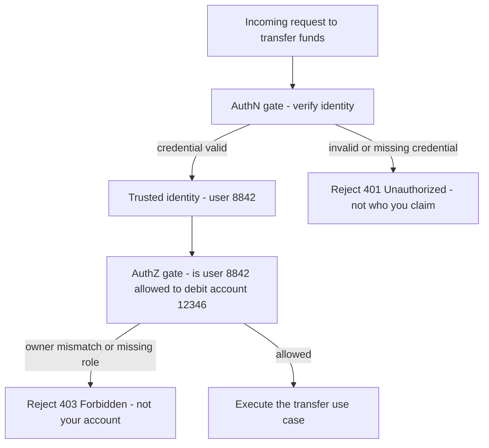
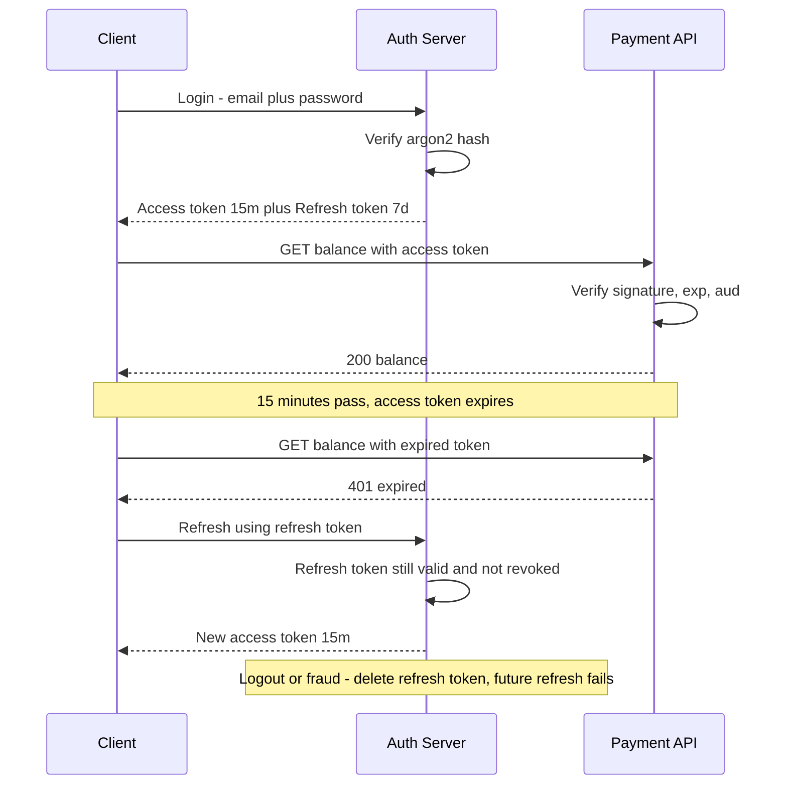
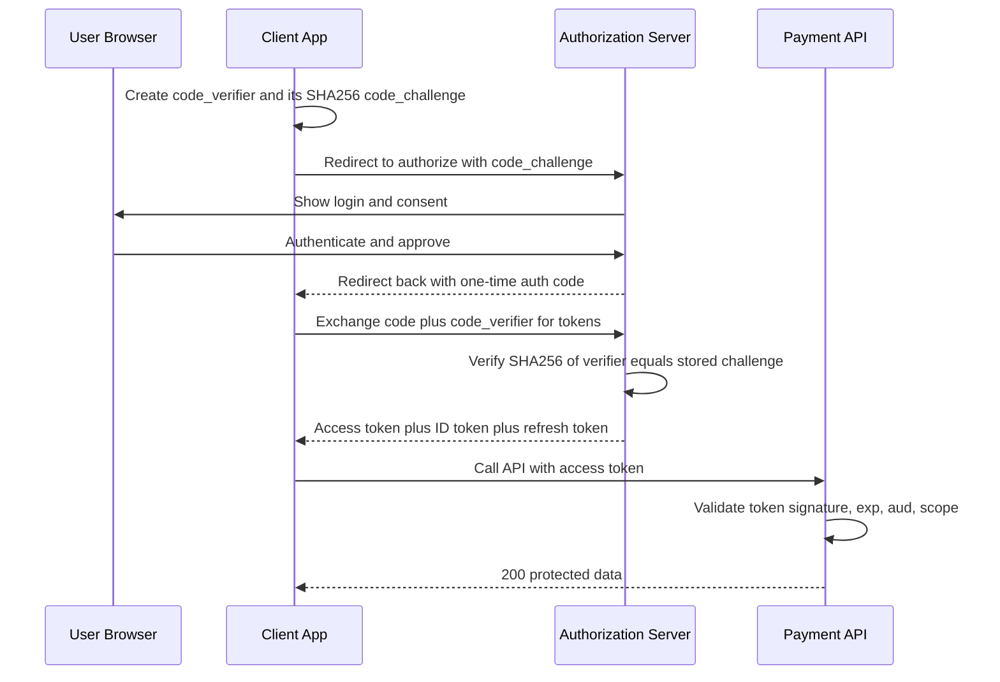
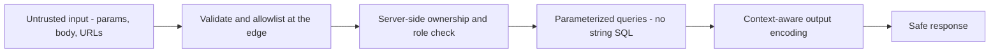
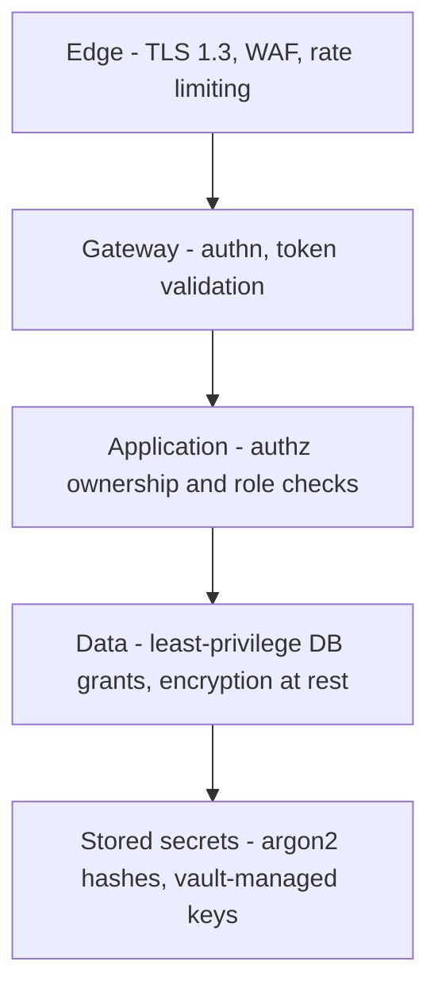

# Application Security - AuthN, AuthZ, and the OWASP Basics

> "Most breaches are not clever. Someone shipped a password in plain text, trusted a JWT they never verified, or let a user change `accountId` in the URL. Security is mostly doing the boring things, every single time." - Staff Security Engineer

---

## At a Glance

| | |
|---|---|
| **The problem** | A payment API leaks money and data when it cannot prove WHO you are and WHAT you are allowed to do |
| **The core idea** | Authentication answers "who are you", authorization answers "are you allowed" - they are two separate gates |
| **The trap** | Checking the user is logged in (authn) and assuming that means they can touch this account (authz). It does not. |
| **Hashing** | Passwords are hashed with bcrypt or argon2, never stored or compared in plain text, never MD5 or SHA-256 alone |
| **Tokens** | A signed JWT proves identity, but you cannot un-issue it - plan for short expiry and a revocation strategy up front |

---

## The Story First (Read This Even If You Skip the Rest)

A fintech startup ships a clean account API. `GET /accounts/12345/balance` returns a balance. Login works, sessions work, the demo is smooth, the round closes.

Three weeks after launch, a user notices the URL. They are account `12345`. Out of curiosity they try `GET /accounts/12346/balance`. It returns someone else's balance. They try `12347`. Another. Within an hour a script is walking every account number and scraping every balance in the company.

Nothing was "hacked". TLS was fine. The login was fine. The password hashing was fine. The bug was simpler and far more common: the endpoint checked that you were *logged in* (authentication) but never checked that account `12346` *belonged to you* (authorization). This single class of bug - broken access control - is the number one item on the OWASP Top 10.

This page teaches the two gates every request must pass, how to store credentials so a database leak is not a catastrophe, how sessions and tokens actually work, and the handful of OWASP attacks you will meet in any real payment or account system - with the concrete fix for each.

---

## AuthN vs AuthZ - The Two Gates

These two words look alike and get mixed up constantly. They are different jobs at different times.

- **Authentication (authn):** "Who are you?" You prove your identity - password, passkey, token. Output: a trusted identity.
- **Authorization (authz):** "Are you allowed to do this, to this resource, right now?" Output: allow or deny.

Authentication happens once (at login, or once per request when validating a token). Authorization happens on **every single action**, because the answer depends on the resource being touched.



!!! note "401 vs 403"
    `401 Unauthorized` means authentication failed - we do not know who you are. `403 Forbidden` means authentication succeeded but authorization failed - we know who you are, and you still cannot do this. The HTTP names are historically swapped, which is exactly why people confuse the two concepts.

---

## Password Hashing - bcrypt and argon2, Never Plain or MD5

If you store passwords, assume your database will leak someday. Your job is to make the leaked file useless.

**The rules:**

1. Never store the password. Store a hash.
2. Never use a fast hash (MD5, SHA-1, SHA-256) on its own. They were built to be fast, which is exactly what an attacker with a GPU wants - billions of guesses per second.
3. Use a slow, salted password hash designed for the job: **argon2id** (first choice today) or **bcrypt** (battle-tested, fine). These bake in a per-password salt and a tunable cost factor.

=== "bcrypt (Node)"

    ```typescript
    import bcrypt from "bcrypt";

    // On signup - cost factor 12 is a sane 2026 default
    const hash = await bcrypt.hash(plainPassword, 12);
    await users.save({ email, passwordHash: hash });

    // On login - compare in constant time, never with ===
    const ok = await bcrypt.compare(submittedPassword, user.passwordHash);
    if (!ok) throw new InvalidCredentialsError();
    ```

=== "argon2 (Node)"

    ```typescript
    import argon2 from "argon2";

    // argon2id resists both GPU and side-channel attacks
    const hash = await argon2.hash(plainPassword, {
      type: argon2.argon2id,
      memoryCost: 19456, // ~19 MB, OWASP minimum
      timeCost: 2,
      parallelism: 1,
    });

    const ok = await argon2.verify(user.passwordHash, submittedPassword);
    ```

!!! warning "MD5 and SHA-256 are not password hashes"
    `md5(password)` or `sha256(password + salt)` is broken for passwords. Rainbow tables and GPUs crack them in seconds. The salt only stops precomputation - it does nothing about raw speed. The slowness of bcrypt and argon2 is the whole point.

!!! tip "Salt is automatic, pepper is optional"
    bcrypt and argon2 generate and embed a random salt for you - you do not manage it separately. For extra defense you can add a "pepper" (a secret constant stored in your vault, not the database) so a database-only leak is not enough to start cracking. Compare hashes in constant time, which the library's `compare`/`verify` already does.

---

## Sessions vs Tokens

After login, the server needs to remember you across requests. Two main models:

| | Server-side session | Token (JWT) |
|---|---|---|
| Where state lives | Server (session store / Redis) | Inside the token itself, held by the client |
| What the client holds | An opaque session id (a cookie) | A signed, readable token |
| Revocation | Easy - delete the session row | Hard - the token is valid until it expires |
| Scaling | Needs a shared session store | Stateless - any server can verify |
| Best for | Classic web apps, one trust domain | APIs, microservices, mobile, third parties |

The deep tradeoff: **sessions are easy to revoke but need shared state; tokens are stateless but hard to revoke.** Most fintech systems use tokens for the API and accept the revocation cost by keeping access tokens short-lived (more below).

---

## JWT - Structure, Signing, and the Revocation Problem

A JSON Web Token is three base64url parts joined by dots: `header.payload.signature`.

```
eyJhbGciOiJSUzI1NiJ9 . eyJzdWIiOiI4ODQyIiwiZXhwIjoxNzUwMH0 . MEUCIQ...signature
   header (alg)            payload (claims)                     signature
```

- **Header:** the signing algorithm, e.g. `RS256`.
- **Payload (claims):** `sub` (subject / user id), `exp` (expiry), `iat` (issued at), `iss` (issuer), `aud` (audience), plus your own claims like `roles`.
- **Signature:** proves the token was issued by you and was not tampered with. With `RS256` you sign with a private key and verify with a public key.

The payload is **signed, not encrypted**. Anyone holding the token can read it.

```typescript
import jwt from "jsonwebtoken";

// Issue an access token - short lived, signed with the private key
const token = jwt.sign(
  { sub: user.id, roles: ["account_holder"] },
  PRIVATE_KEY,
  { algorithm: "RS256", expiresIn: "15m", issuer: "pay.example.com", audience: "pay-api" }
);

// Verify on every request - ALWAYS specify the allowed algorithm
const claims = jwt.verify(token, PUBLIC_KEY, {
  algorithms: ["RS256"], // pin it - never trust the token's own alg field
  issuer: "pay.example.com",
  audience: "pay-api",
});
```

!!! warning "What NOT to put in a JWT"
    Because the payload is readable by anyone holding the token, never put secrets in it: no passwords, no card numbers (PAN), no national ID, no account balances. Keep it to a user id, roles, and standard claims. Treat the contents as public.

!!! danger "The alg=none and algorithm-confusion attacks"
    Old libraries would honor `alg: none` (no signature) or let an attacker swap `RS256` for `HS256` and sign with the public key. Always pin the expected algorithm in your verify call. Never let the token decide how it is verified.

### The revocation problem

A session can be killed instantly - delete the row. A signed JWT is valid until `exp`, even if the user logs out or you fire an employee. There is no built-in "delete". You manage this with a two-token pattern:

- **Access token:** short-lived (5-15 min), sent on every API call. Worst case, a stolen one is useless within minutes.
- **Refresh token:** long-lived (days), stored securely, used only to mint new access tokens at the auth server. To revoke, delete or block the refresh token in a server-side store. For high-risk actions (a large transfer), also keep a small denylist of revoked access-token ids (`jti`) checked at the gateway.



---

## OAuth2 and OpenID Connect

People conflate these. Keep them straight:

- **OAuth2** is an **authorization** framework: it lets an app get *delegated access* to an API on a user's behalf, without the user handing over their password. It produces an **access token**.
- **OpenID Connect (OIDC)** is a thin **authentication** layer on top of OAuth2. It adds an **ID token** (a JWT) that tells your app *who the user is*. "Log in with Google" is OIDC.

Rule of thumb: OAuth2 = "can this app call that API for me". OIDC = "who is this person".

### The actors

- **Resource Owner:** the human (your customer).
- **Client:** your app (the mobile app or SPA).
- **Authorization Server:** issues tokens (Auth0, Okta, Cognito, or your own).
- **Resource Server:** the API holding the protected data (your payment API).

### Authorization Code flow with PKCE

This is the flow you should use for web and mobile apps in 2026. PKCE ("pixie", Proof Key for Code Exchange) stops an attacker who intercepts the authorization code from redeeming it, because only the original client knows the secret `code_verifier`.



!!! tip "Do not roll your own"
    Authentication is the wrong place to be creative. Use a vetted identity provider (Auth0, Okta, AWS Cognito, Keycloak) or a well-maintained library. They handle PKCE, key rotation, token introspection, and the dozens of edge cases that turn into CVEs.

---

## RBAC vs ABAC - Modeling Authorization

Once you know who the user is, how do you decide what they can do?

**RBAC (Role-Based Access Control):** permissions attach to roles, users get roles. Simple and auditable.

```
Role: account_holder  -> can view own accounts, create transfers <= 50k
Role: support_agent   -> can view any account read-only, cannot move money
Role: compliance      -> can freeze accounts, view audit logs
```

**ABAC (Attribute-Based Access Control):** decisions are computed from attributes of the user, the resource, the action, and the context. More expressive, more complex.

```
ALLOW transfer IF
  user.id == account.owner_id           (ownership)
  AND amount <= user.daily_limit         (resource policy)
  AND request.country == account.country (context)
  AND time.now in business_hours_or_low_risk
```

| | RBAC | ABAC |
|---|---|---|
| Decision basis | Role membership | Attributes and policy rules |
| Simplicity | High | Lower |
| Granularity | Coarse | Fine-grained, contextual |
| Best for | Most apps, clear job functions | Risk-based limits, regulatory, multi-tenant |

In practice, fintech systems start with RBAC for coarse access ("is this a support agent?") and layer ABAC for the money-sensitive rules ("does this user own this account, and is this within their daily limit?"). The ownership check from our story is ABAC, and it is the one people forget.

---

## OWASP Top 10 - The Highlights, With Fixes

You do not need all ten memorized. You need to recognize these six in your own code.

### 1. Broken Access Control (the number one risk)

The story bug. Also called IDOR - Insecure Direct Object Reference. The fix is to always check ownership/role on the server against the authenticated identity, never trust an id from the client.

```typescript
// BROKEN - returns any account to any logged-in user
app.get("/accounts/:id/balance", authn, async (req, res) => {
  const acct = await accounts.findById(req.params.id);
  res.json({ balance: acct.balance });
});

// FIXED - verify the account belongs to the caller
app.get("/accounts/:id/balance", authn, async (req, res) => {
  const acct = await accounts.findById(req.params.id);
  if (!acct || acct.ownerId !== req.user.sub) return res.sendStatus(403);
  res.json({ balance: acct.balance });
});
```

### 2. Injection / SQL Injection

Untrusted input changes the meaning of a query or command.

```typescript
// BROKEN - attacker sends id = "1 OR 1=1; DROP TABLE accounts;--"
db.query(`SELECT * FROM accounts WHERE id = ${req.params.id}`);

// FIXED - parameterized query; the driver never treats input as SQL
db.query("SELECT * FROM accounts WHERE id = $1", [req.params.id]);
```

Fix: parameterized queries / prepared statements everywhere. Never build SQL by string concatenation. The same idea applies to shell commands and NoSQL queries.

### 3. Cross-Site Scripting (XSS)

Attacker-supplied content runs as script in another user's browser - e.g. a malicious "memo" field on a transfer that steals session cookies when an admin views it.

Fix: escape/encode output by context (HTML, attribute, JS), use a templating engine that auto-escapes, set a strict `Content-Security-Policy`, and never `innerHTML` untrusted data. Treat all user input as hostile on the way out, not just on the way in.

### 4. Cross-Site Request Forgery (CSRF)

A user logged into your bank visits a malicious page that silently submits `POST /transfer` using the user's cookie.

Fix: use the `SameSite=Strict` (or `Lax`) cookie attribute, require an anti-CSRF token on state-changing requests, and prefer the `Authorization: Bearer` header over cookies for APIs (headers are not auto-sent cross-site, so token-based APIs are largely immune).

### 5. Server-Side Request Forgery (SSRF)

You let the user supply a URL (a webhook, an avatar fetch) and your server fetches it - so the attacker points it at `http://169.254.169.254/` (the cloud metadata endpoint) to steal credentials, or at internal services.

Fix: allowlist the destinations you will fetch, resolve and validate the IP (block private/link-local ranges), disable redirects to internal hosts, and put outbound fetches behind a locked-down egress proxy.

### 6. Security Misconfiguration

Default admin passwords, verbose stack traces in production, an S3 bucket left public, debug mode on, unused ports open.

Fix: harden by default, ship the same config to staging and prod, turn off debug/verbose errors in production, scan images and infra (CIS benchmarks), and review what is exposed.



---

## Secrets Management

Credentials, signing keys, and database passwords are not configuration - they are secrets, and they leak constantly through the channels below.

!!! danger "Where secrets must never live"
    Not in source code. Not in git history (rotate immediately if committed - the history is forever). Not baked into a Docker image (`docker history` reveals build args and layers). Not in client-side code. Not in plain `.env` files committed to the repo.

**Do this instead:**

- Store secrets in a dedicated **vault**: HashiCorp Vault, AWS Secrets Manager, GCP Secret Manager, or Azure Key Vault.
- Inject them at runtime as environment variables or mounted files - the app reads them at startup, they are never written to disk in the repo.
- **Rotate** regularly and automatically. The signing key for your JWTs should be rotatable without a redeploy (publish keys via JWKS so verifiers pick up new keys).
- Use **short-lived, dynamically generated** credentials where the vault supports it (e.g. database creds that expire in an hour) so a leaked credential has a tiny blast radius.
- Scan commits with a pre-commit hook (gitleaks, trufflehog) so a secret never reaches the remote in the first place.

---

## Defense in Depth

No single control is enough. Assume each layer will fail and put another behind it. If TLS terminates, the JWT signature still protects you. If the token is stolen, the short expiry limits the damage. If access control is bypassed, the database user has least-privilege grants. If the database leaks, argon2 makes the passwords near-useless.



Each layer assumes the one in front of it has already failed. That mindset - not one perfect wall, but many imperfect ones - is what survives a real attack.

---

## Common Mistakes (and the Fix)

| Mistake | Why it hurts | Fix |
|---|---|---|
| Checking login but not ownership | Any user reads any account (IDOR) | Server-side check: resource.ownerId == caller.sub on every request |
| Storing passwords with MD5/SHA-256 | GPUs crack the dump in minutes | argon2id or bcrypt with a real cost factor |
| Putting card numbers or PII in a JWT | Payload is readable by anyone holding it | Keep claims to user id, roles, standard fields |
| Not pinning the JWT algorithm | alg=none and RS256/HS256 confusion forge tokens | Pass algorithms: ["RS256"] to verify |
| Long-lived access tokens, no refresh plan | A stolen token works for days; cannot revoke | 15-min access token plus revocable refresh token |
| Building SQL with string concatenation | SQL injection, full database compromise | Parameterized queries / prepared statements |
| Secrets in .env committed to git | History is forever; anyone with the repo has the keys | Vault + runtime injection + secret scanning |
| Trusting a user-supplied URL to fetch | SSRF reaches cloud metadata and internal services | Allowlist hosts, block private IP ranges, no internal redirects |

---

## In Clean Architecture Terms

Security spans the layers - it is not one box.

- **Framework and Drivers layer:** TLS termination, WAF, rate limiting, JWT signature verification, OAuth2/OIDC token exchange. Your business code never parses a JWT by hand.
- **Interface Adapters layer:** controllers turn a verified token into a trusted identity object and attach it to the request. Output encoding for the response also lives here.
- **Use Case layer:** business authorization. "Can user 8842 debit account 12346?" and "is this transfer within the daily limit?" are use-case decisions - they depend on domain rules, not on HTTP.
- **Entities layer:** invariants that protect the domain itself, e.g. an account balance cannot go negative.

The split that matters: infrastructure verifies *who you are* (authn), the use case decides *what you may do* (authz). Putting the ownership check in middleware is tempting but wrong - it belongs in the use case, where the domain rules live and where it can be unit-tested without HTTP.

---

## Checklist

- [ ] Passwords hashed with argon2id or bcrypt - never plain, MD5, or bare SHA-256
- [ ] Every resource endpoint checks ownership/role against the authenticated identity, server-side
- [ ] JWTs are signed (RS256), short-lived, with the algorithm pinned on verify
- [ ] No secrets, PII, or card data inside JWT payloads
- [ ] Refresh-token rotation in place; logout and fraud can revoke access
- [ ] All database access uses parameterized queries
- [ ] Output is context-encoded; a strict Content-Security-Policy is set
- [ ] State-changing requests are CSRF-protected (SameSite cookies or bearer tokens)
- [ ] User-supplied URLs are allowlisted and private IP ranges blocked (SSRF)
- [ ] Production runs with debug off, verbose errors off, hardened defaults
- [ ] Secrets live in a vault, injected at runtime, rotated automatically
- [ ] A secret scanner runs in pre-commit and CI
- [ ] Defense in depth: each layer assumes the one in front of it failed

---

## Sources
- [OWASP Top 10](https://owasp.org/www-project-top-ten/)
- [OWASP Cheat Sheet Series - Password Storage and Authentication](https://cheatsheetseries.owasp.org/)
- [RFC 7519 - JSON Web Token (JWT)](https://datatracker.ietf.org/doc/html/rfc7519)
- [OAuth 2.0 Authorization Framework and PKCE (RFC 7636)](https://datatracker.ietf.org/doc/html/rfc7636)
- [OpenID Connect Core Specification](https://openid.net/specs/openid-connect-core-1_0.html)
- [Auth0 Docs - Tokens and Authorization Code Flow with PKCE](https://auth0.com/docs/get-started/authentication-and-authorization-flow/authorization-code-flow-with-pkce)
