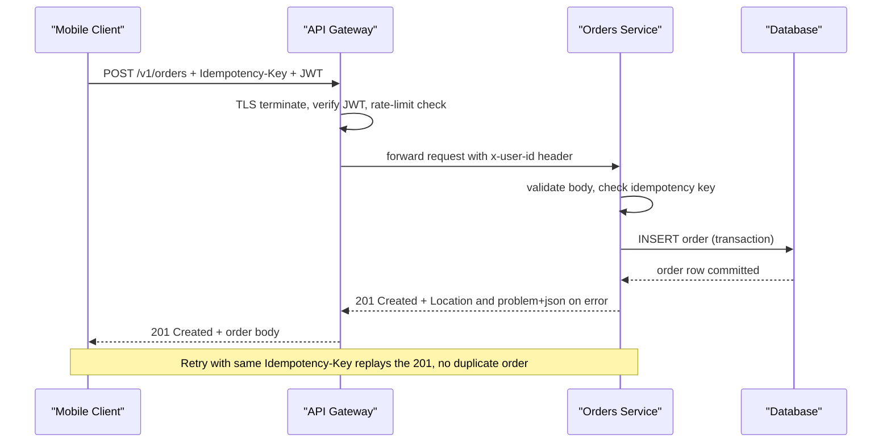
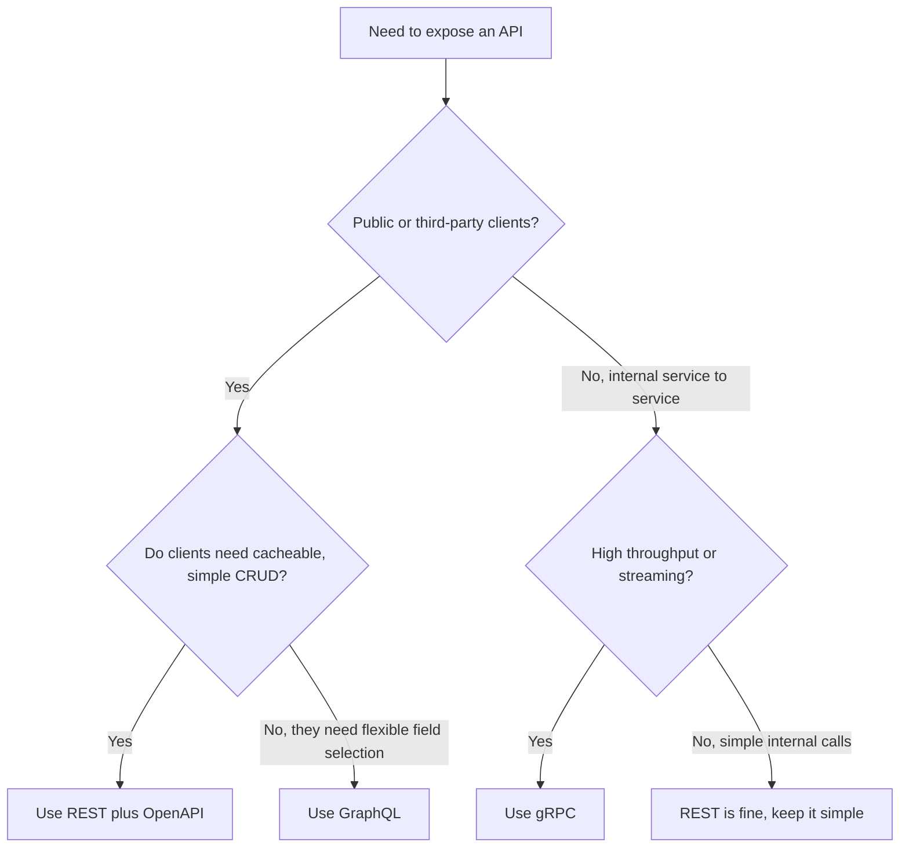
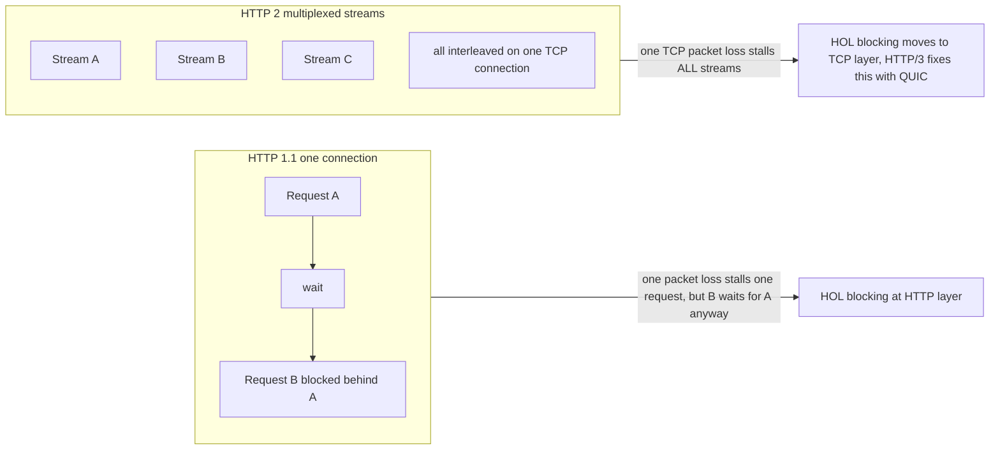

# API Design and Protocols

> "An API is a promise you make to every developer who will ever call you - including yourself in six months. The protocol underneath is just how loudly you keep that promise." - Staff Platform Engineer

---

## At a Glance

| | |
|---|---|
| **The problem** | Clients and servers must agree on a contract that survives change, retries, scale, and bad networks |
| **The core idea** | Model resources, use HTTP correctly, version deliberately, and pick the protocol that fits the traffic shape |
| **The trap** | Treating REST as "RPC over JSON" - using POST for everything, returning 200 with `{"error": ...}`, and exposing your database tables as URLs |
| **REST vs GraphQL vs gRPC** | Public + cacheable -> REST; flexible client-shaped reads -> GraphQL; internal high-throughput -> gRPC |
| **Realtime** | Polling for simple, SSE for server-to-client streams, WebSockets for bidirectional |

---

## The Story First (Read This Even If You Skip the Rest)

You are building the Orders API for an online shop. Day one, it is simple: a mobile app creates an order, the app polls for status. You ship `POST /createOrder` and `POST /getOrder`, both returning `200 OK` with a JSON body that has an `error` field when something goes wrong. It works in the demo.

Three months later it is on fire.

A customer taps "Pay" twice on a flaky 3G connection. Your server creates **two** orders and charges the card twice, because the retry looked like a brand-new request. Support is angry. Meanwhile the mobile team asks for "just the order total and status" but your endpoint returns the full order with 40 fields and every line item, so the app is slow on cheap phones. Then the web team wants to show 10,000 orders in an admin table; your endpoint returns all of them in one 12 MB response and the browser hangs. Finally, a partner integration breaks because you "fixed" a field name and never versioned anything.

None of these are exotic problems. They are the **default outcome** of not designing the API and not understanding the protocol underneath. This page teaches you to avoid every one of them: idempotency keys for the double-charge, cursor pagination for the giant table, the right protocol and shape for the slow phone, status codes and versioning so partners do not break. We will design that Orders API properly, from zero.

---

## REST From Zero: Resources, Not Actions

REST (Representational State Transfer) has one mental shift that fixes 80% of bad APIs: **you expose nouns (resources), not verbs (actions).** The verb is the HTTP method. The noun is the URL.

```
[X] RPC-flavoured (what juniors write first):
  POST /createOrder
  POST /getOrder
  POST /cancelOrder
  POST /listOrdersForUser

[OK] Resource-oriented (REST):
  POST   /orders                 -> create an order
  GET    /orders/{id}            -> read one order
  GET    /orders                 -> list orders (with filters)
  DELETE /orders/{id}            -> cancel/remove an order
  PATCH  /orders/{id}            -> partially update an order
```

Good URL design rules of thumb:

- **Plural nouns for collections:** `/orders`, not `/order`, not `/getOrders`.
- **Hierarchy shows ownership:** `/orders/{orderId}/items/{itemId}` - an item lives under an order.
- **No verbs in the path.** The HTTP method is the verb. Exception: genuine actions that are not CRUD (see the note below).
- **Keep IDs opaque.** A client should not parse `/orders/2024-shard3-00417`; it is just a string.
- **Lower-case, hyphenated, no file extensions:** `/shipping-addresses`, not `/ShippingAddresses.json`.

!!! tip "When an action is not a resource"
    Sometimes you have a real action that does not map to create/read/update/delete - for example "submit this order for payment." Two clean options: model it as a sub-resource state change (`PATCH /orders/{id}` with `{"status": "submitted"}`), or as a controller-style sub-resource (`POST /orders/{id}/submit`). The second is pragmatic and widely accepted; just keep it rare and obvious. Do not turn your whole API into `/doThing` calls.

---

## HTTP Methods and Idempotency

Idempotency means: **calling it once and calling it five times leave the server in the same state.** This is the single most important property for surviving a bad network, because clients retry.

| Method | Purpose | Safe (no change) | Idempotent | Cacheable |
|---|---|---|---|---|
| `GET` | Read a resource | Yes | Yes | Yes |
| `HEAD` | Read headers only | Yes | Yes | Yes |
| `POST` | Create / non-idempotent action | No | No | Rarely |
| `PUT` | Replace a resource wholesale | No | Yes | No |
| `PATCH` | Partially update a resource | No | No (usually) | No |
| `DELETE` | Remove a resource | No | Yes | No |

The non-obvious ones:

- **`PUT` is idempotent** because you send the full desired state. `PUT /orders/42` with the same body twice = same result. `POST /orders` twice = two orders. That is why creates use POST.
- **`DELETE` is idempotent** in effect: deleting an already-deleted order should still return success-ish (often `204` or `404`), not blow up on the second call.
- **`PATCH` is usually not idempotent** - `{"op": "increment", "qty": 1}` applied twice changes state twice. Design your PATCH bodies to be declarative (set values) rather than relative (increment) when you can.

```typescript
// Idempotent PUT - sends the whole desired state
async function setShippingAddress(orderId: string, address: Address) {
  return http.put(`/orders/${orderId}/shipping-address`, address);
  // Calling this 3 times in a row = same final address. Safe to retry.
}

// Non-idempotent POST - creates something new each time
async function placeOrder(cart: Cart) {
  return http.post(`/orders`, cart);
  // Calling this 3 times = THREE orders. Dangerous to blind-retry.
  // We fix this below with an idempotency key.
}
```

---

## Status Codes Done Right

Return the status code that tells the truth. The body is for details; the status is for machines (proxies, retries, monitoring).

```
2xx - it worked
  200 OK              GET/PATCH/PUT succeeded, body returned
  201 Created         POST created a resource (include a Location header)
  202 Accepted        accepted for async processing (not done yet)
  204 No Content      succeeded, nothing to return (common for DELETE)

3xx - go somewhere else
  301 Moved Permanently / 304 Not Modified (caching, conditional GET)

4xx - the CLIENT made a mistake (do not retry unchanged)
  400 Bad Request     malformed body / failed validation
  401 Unauthorized    not authenticated (no/invalid credentials)
  403 Forbidden       authenticated, but not allowed
  404 Not Found       resource does not exist
  409 Conflict        state conflict (e.g. order already cancelled)
  422 Unprocessable   syntactically valid but semantically wrong
  429 Too Many Reqs   rate limited (include Retry-After)

5xx - the SERVER made a mistake (retry MAY help)
  500 Internal        unexpected server error
  502/503/504         upstream down / overloaded / timed out
```

!!! warning "The 200-with-error-body anti-pattern"
    Returning `200 OK` with `{"success": false, "error": "not found"}` is the most common API sin. It lies to every caching proxy, load balancer, retry library, and monitoring dashboard between you and the client - they all think it succeeded. Your error rate dashboard shows 0%. Use real status codes. The body explains; the status decides.

The 401 vs 403 distinction trips everyone up: **401 = "I do not know who you are"** (fix your credentials), **403 = "I know who you are and you still cannot do this"** (no amount of re-auth helps).

---

## Consistent Error Responses (problem+json)

Pick one error shape and use it everywhere. The IETF standard is **`application/problem+json`** (RFC 9457, formerly RFC 7807). It is boring on purpose, which is exactly what you want when a 3am pager parses it.

```http
HTTP/1.1 409 Conflict
Content-Type: application/problem+json

{
  "type": "https://api.shop.com/problems/order-already-cancelled",
  "title": "Order already cancelled",
  "status": 409,
  "detail": "Order ord_8f3a cannot be cancelled because it is already in state 'cancelled'.",
  "instance": "/orders/ord_8f3a",
  "orderId": "ord_8f3a",
  "currentState": "cancelled"
}
```

- `type` is a stable URI identifying the error class - clients branch on this, not on the human text.
- `title` is a short human summary; `detail` is the specific instance.
- `status` mirrors the HTTP status (handy when logs lose the header).
- You may add custom fields (`orderId`, `currentState`) - just keep them stable.

The win: every client writes **one** error parser, and your error catalogue becomes documentation.

---

## Idempotency Keys: Safe Retries for POST

Back to the double-charge from the story. POST is not idempotent, but you can make a specific create operation idempotent by letting the client supply an **idempotency key** - a unique token (usually a UUID) the client generates once and reuses on every retry of the *same logical request*.

```http
POST /orders
Idempotency-Key: 8f14e45f-ceea-467e-9f3a-1b2c3d4e5f60
Content-Type: application/json

{ "items": [...], "total": 9900 }
```

The server logic:

```typescript
async function placeOrder(req: Request) {
  const key = req.header("Idempotency-Key");
  if (!key) return problem(400, "missing-idempotency-key");

  // 1. Have we seen this key before?
  const existing = await idempotencyStore.get(key);
  if (existing) {
    // Same key -> return the SAME stored response. No new order, no new charge.
    return existing.response;       // replays 201 + original body
  }

  // 2. First time: do the work, then store the result against the key.
  const order = await orders.create(req.body);
  const response = created(order); // 201 Created
  await idempotencyStore.put(key, { response, ttlHours: 24 });
  return response;
}
```

!!! note "Keys are per-request, not per-session"
    The client generates a fresh key when it *starts* an operation and reuses that same key for every automatic retry of that operation. Tapping "Pay" again deliberately is a new operation -> new key. Stripe popularised this pattern; it is now the standard way to make payments and order creation safe to retry over flaky networks.

---

## Pagination, Filtering, Versioning

### Pagination: offset vs cursor

The admin table from the story needs pagination. Two approaches:

=== "Offset (page/limit)"

    ```http
    GET /orders?limit=50&offset=100
    ```
    - Simple, supports "jump to page 7".
    - Breaks at scale: `OFFSET 1000000` makes the database scan and throw away a million rows.
    - **Drifts:** if rows are inserted while you page, you see duplicates or skips.
    - Fine for small, mostly-static datasets and admin tools.

=== "Cursor (keyset)"

    ```http
    GET /orders?limit=50&after=eyJpZCI6IjQxNyJ9
    ```
    - The cursor encodes "where you stopped" (e.g. the last id/timestamp).
    - **Stable and fast:** query is `WHERE (created_at, id) < (...) ORDER BY ... LIMIT 50` - uses an index, no scanning.
    - Cannot jump to an arbitrary page (and that is usually fine).
    - The default choice for large or live datasets - feeds, logs, big tables.

```json
// A cursor-paginated response. Clients follow next_cursor; they never build URLs by hand.
{
  "data": [ /* ...50 orders... */ ],
  "page": { "limit": 50, "next_cursor": "eyJpZCI6IjQ2NyJ9", "has_more": true }
}
```

### Filtering and sorting

Use query parameters; keep them predictable and documented:

```
GET /orders?status=paid&created_after=2026-01-01&sort=-created_at&limit=50
```

- `status=paid` - exact match filter.
- `created_after=...` - range filter (be explicit: `_after`, `_before`).
- `sort=-created_at` - leading `-` means descending. Whitelist sortable fields.
- Never let a client filter on a non-indexed column without a cap - it is a denial-of-service waiting to happen.

### Versioning strategies

You will need to change the contract someday. Decide how before you ship v1.

| Strategy | Example | Pros | Cons |
|---|---|---|---|
| **URI version** | `/v1/orders` | Obvious, easy to route and cache | "Version" bleeds into resource identity; clients hardcode it |
| **Header version** | `Accept: application/vnd.shop.v2+json` | URLs stay clean, content-negotiated | Harder to test in a browser, easy to forget |
| **Query param** | `/orders?version=2` | Trivial to add | Easy to drop, messy caching |

!!! tip "Version the breaking changes, not every change"
    Adding a new optional field is **not** breaking - do it freely without a version bump. Removing a field, renaming one, or changing a type **is** breaking. Reserve a new version for breaking changes, communicate a deprecation window, and run old and new in parallel (your API gateway can route `/v1` and `/v2` to different handlers - see the API Gateway page). Most teams pick URI versioning for its operational simplicity.

---

## A REST Request, End to End

Here is the happy path for placing an order, including the layers a request actually passes through in production.



---

## Protocols: REST vs GraphQL vs gRPC

Same Orders API, three protocol shapes. They are not competitors so much as different tools.

- **REST/JSON over HTTP** - resources and methods, human-readable, cacheable by URL, universal. The slow-phone problem (over-fetching 40 fields) is REST's weak spot.
- **GraphQL** - one endpoint, the client sends a query describing exactly the fields it wants. Solves over-fetching and under-fetching; great when many different clients need different shapes of the same data. Cost: caching is harder (everything is a POST to `/graphql`), and a careless query can be expensive (you need query-depth/complexity limits).
- **gRPC** - binary Protocol Buffers over HTTP/2, contract-first via `.proto` files, strongly typed, very fast, supports streaming. Ideal for internal service-to-service calls. Weak in the browser (needs a proxy) and not human-readable.

```protobuf
// gRPC: the contract IS the .proto file. Codegen produces typed clients/servers.
service Orders {
  rpc GetOrder (GetOrderRequest) returns (Order);
  rpc PlaceOrder (PlaceOrderRequest) returns (Order);
}
```

```graphql
# GraphQL: the client asks for exactly the two fields the slow phone needs.
query { order(id: "ord_8f3a") { total status } }
```

| Dimension | REST | GraphQL | gRPC |
|---|---|---|---|
| **Payload** | JSON (text) | JSON (text) | Protobuf (binary) |
| **Transport** | HTTP/1.1 or 2 | HTTP (usually POST) | HTTP/2 |
| **Shape control** | Fixed per endpoint | Client picks fields | Fixed per method |
| **Caching** | Easy (HTTP/URL) | Hard | Hard |
| **Browser-native** | Yes | Yes | No (needs grpc-web) |
| **Streaming** | SSE/WebSocket bolt-on | Subscriptions | First-class |
| **Best for** | Public APIs, CRUD, caching | Aggregating data for varied clients | Internal high-throughput microservices |
| **Typing** | Loose (add OpenAPI) | Schema-typed | Strongly typed (.proto) |



---

## HTTP/1.1 vs HTTP/2 vs HTTP/3 (Practical)

The protocol version under your API changes its performance more than most code you will write.

- **HTTP/1.1** - one request at a time per TCP connection. Browsers open ~6 parallel connections per host to fake concurrency. If request #1 is slow, requests behind it on that connection wait. This is **head-of-line (HOL) blocking** at the HTTP layer.
- **HTTP/2** - **multiplexing**: many requests share one TCP connection as independent "streams," interleaved on the wire. Plus header compression (HPACK) and server push. Fixes HTTP-layer HOL blocking - but a single lost TCP packet stalls *all* streams, because TCP delivers in order. That is **TCP-layer HOL blocking**.
- **HTTP/3** - runs over **QUIC** (built on UDP) instead of TCP. Streams are independent at the transport layer, so one lost packet only stalls its own stream. Also folds the TLS handshake into the connection setup, so connecting is faster, and it survives network changes (wifi -> cellular) without a full reconnect. Big win on lossy mobile networks - exactly the slow-3G case from the story.



!!! note "What you actually do about it"
    You rarely hand-pick the version - your load balancer or CDN negotiates the best one both sides support (via ALPN during the TLS handshake). The practical action: terminate HTTP/2 and HTTP/3 at your edge/gateway, keep connections reusable (no connection-per-request), and stop sharding assets across many hostnames (an HTTP/1.1 trick that hurts HTTP/2).

---

## TLS Handshake Basics

Every `https://` call starts with a handshake that does two jobs: prove the server is who it claims to be, and agree on a shared secret to encrypt the rest.

```
1. ClientHello   -> client lists TLS versions, cipher suites, ALPN (h2/h3?), SNI (which host)
2. ServerHello   <- server picks version + cipher, sends its certificate (chain to a trusted CA)
3. Key exchange  -> both derive a shared session key (ECDHE - gives forward secrecy)
4. Finished      <> handshake verified, symmetric encryption begins for all app data
```

- The **certificate** is signed by a Certificate Authority your client already trusts; that chain of trust is what stops impersonation.
- **TLS 1.3** cut the handshake to one round trip (1-RTT), with 0-RTT resumption for repeat visits - noticeably faster than TLS 1.2.
- **ALPN** inside the handshake is how client and server agree to speak HTTP/2 or HTTP/3 before any request is sent.
- **Forward secrecy** (ephemeral keys) means stealing the server's private key later does not decrypt past traffic.

!!! warning "Terminate TLS, do not reinvent it"
    Let your gateway, load balancer, or CDN terminate TLS with managed, auto-renewed certificates. Do not roll your own crypto and do not let certs expire silently - an expired cert is a self-inflicted outage. Monitor expiry and renew automatically.

---

## Realtime: Polling vs SSE vs WebSockets

The mobile app wants live order status. Three ways to get updates to a client:

| Approach | Direction | Transport | Best for | Cost |
|---|---|---|---|---|
| **Short polling** | Client asks repeatedly | Normal HTTP | Simple, low-frequency updates | Wasted requests when nothing changed |
| **Long polling** | Client holds request open | Normal HTTP | Legacy-friendly near-realtime | Holds connections, awkward at scale |
| **SSE** | Server -> client only | HTTP (text stream) | Live feeds, notifications, status | One-way; limited binary support |
| **WebSocket** | Both directions | Upgraded TCP | Chat, multiplayer, live collaboration | Stateful connections, harder to scale/route |

Rule of thumb: **need server-to-client only?** Use Server-Sent Events - it is just an HTTP response that never ends, auto-reconnects, and works through proxies. **Need true two-way?** Use WebSockets. **Updates rare and latency relaxed?** Plain polling is honestly fine; do not add a stateful connection you have to operate for nothing.

```typescript
// SSE: order status pushed to the client over one long-lived HTTP response.
const events = new EventSource("/orders/ord_8f3a/events");
events.onmessage = (e) => updateUI(JSON.parse(e.data)); // "paid", "shipped"...
// Browser auto-reconnects if the connection drops. No WebSocket needed.
```

---

## Rate Limiting and API Keys

Rate limiting protects you from the one bad client in the story who hammers an endpoint. API keys identify *who* is calling so you can limit and bill per client.

- **Algorithm:** the **token bucket** is the common choice - each client has a bucket that refills at a steady rate; each request spends a token; empty bucket = `429`.
- **Tell the client the rules** with headers so well-behaved clients self-throttle:

```http
HTTP/1.1 429 Too Many Requests
Retry-After: 30
RateLimit-Limit: 100
RateLimit-Remaining: 0
RateLimit-Reset: 30
```

- **API keys vs tokens:** API keys identify a *project/integration* (long-lived, often for server-to-server); OAuth/JWT access tokens identify a *user* and are short-lived. Send keys in a header (`Authorization` or `X-API-Key`), never in the URL (URLs leak into logs, proxies, browser history).
- **Always rate-limit at the edge** (gateway/CDN), before requests hit your service, and limit per-key/per-IP, not globally.

!!! warning "Secrets in URLs are secrets in logs"
    An API key in `?api_key=...` ends up in access logs, CDN logs, and `Referer` headers sent to third parties. Put credentials in headers, scope keys to least privilege, rotate them, and revoke on leak.

---

## OpenAPI and Contract-First

An **OpenAPI** document is a machine-readable description of your REST API - paths, methods, schemas, responses. "Contract-first" means you write that spec *before* the code, agree on it across teams, then generate from it.

```yaml
# openapi.yaml (excerpt) - the contract both frontend and backend build against
paths:
  /orders/{orderId}:
    get:
      summary: Get an order
      parameters:
        - name: orderId
          in: path
          required: true
          schema: { type: string }
      responses:
        "200":
          description: The order
          content:
            application/json:
              schema: { $ref: "#/components/schemas/Order" }
        "404":
          description: Not found
          content:
            application/problem+json:
              schema: { $ref: "#/components/schemas/Problem" }
```

Why it pays off:

- **Generate** server stubs, typed clients, and interactive docs (Swagger UI) from one source of truth.
- **Mock** the API from the spec so frontend can build before backend is done.
- **Validate** requests/responses against the schema in CI - the contract cannot silently drift.
- gRPC gets this for free via `.proto`; GraphQL via its schema. REST needs OpenAPI to catch up - so use it.

---

## Common Mistakes (and the Fix)

| Mistake | Why it hurts | Fix |
|---|---|---|
| `200 OK` with `{"error": ...}` | Proxies, retries, and dashboards think it succeeded | Return real status codes (4xx/5xx); body explains |
| Verbs in URLs (`/createOrder`) | Breaks REST conventions, multiplies endpoints | Nouns + HTTP methods (`POST /orders`) |
| Blind-retrying POST | Double orders, double charges | Idempotency-Key header, store + replay response |
| Offset pagination on huge tables | Slow scans, duplicates when data shifts | Cursor/keyset pagination |
| No versioning until it is too late | One breaking change shatters every client | Version from v1; only bump on breaking changes |
| API key in the query string | Leaks into logs, history, Referer headers | Put credentials in headers; rotate and scope |
| WebSocket for one-way updates | Stateful connection you must operate for no reason | Use SSE for server-to-client only |
| Different error shape per endpoint | Every client writes a custom parser | Standardise on problem+json everywhere |

---

## In Clean Architecture Terms

API design lives almost entirely in the **outer layers** - and that is the point.

- **Interface Adapters (inbound):** controllers/handlers translate HTTP requests into use-case inputs and use-case outputs back into status codes + JSON. Status codes, problem+json, pagination params, and idempotency-key checks all live here.
- **Frameworks & Drivers:** the protocol itself (HTTP/2, TLS, gRPC, WebSocket), the gateway, rate limiting, and the API key store are infrastructure. They can be swapped without touching business rules.
- **Use Cases & Entities:** know nothing about HTTP. `PlaceOrderUseCase` does not know it was called via REST, GraphQL, or gRPC, and does not know about status 201. It returns a result; the adapter decides the wire representation.

The test: you should be able to put a gRPC endpoint *and* a REST endpoint in front of the same `PlaceOrderUseCase` without changing the use case. If you cannot, HTTP has leaked too far inward.

---

## Checklist

- [ ] URLs are plural nouns; the HTTP method is the verb (no `/doThing`)
- [ ] Each method uses the correct verb; PUT/DELETE are idempotent by design
- [ ] Status codes tell the truth - no 200-with-error-body
- [ ] All errors use one shape (problem+json) with stable `type` URIs
- [ ] Create/payment endpoints accept and honour an Idempotency-Key
- [ ] Lists use cursor pagination for large/live data; filters hit indexed columns only
- [ ] Versioning strategy chosen; only breaking changes bump the version
- [ ] Protocol matches the traffic shape (REST public, gRPC internal, GraphQL for varied clients)
- [ ] TLS terminated at the edge with managed, auto-renewed certs; HTTP/2 and HTTP/3 enabled
- [ ] Realtime uses the lightest fit (polling < SSE < WebSocket)
- [ ] Rate limits enforced at the edge per-key; limits surfaced via headers + 429 + Retry-After
- [ ] Credentials travel in headers, never in URLs; keys are scoped and rotatable
- [ ] An OpenAPI (or .proto / GraphQL) contract exists and is validated in CI

---

## Sources
- [REST API Tutorial - HTTP Methods and Status Codes](https://restfulapi.net/)
- [RFC 9457 - Problem Details for HTTP APIs (IETF)](https://www.rfc-editor.org/rfc/rfc9457)
- [Stripe API - Idempotent Requests](https://docs.stripe.com/api/idempotent_requests)
- [MDN Web Docs - Evolution of HTTP (HTTP/1.1, /2, /3)](https://developer.mozilla.org/en-US/docs/Web/HTTP/Guides/Evolution_of_HTTP)
- [Cloudflare Learning - HTTP/3 and QUIC](https://www.cloudflare.com/learning/performance/what-is-http3/)
- [OpenAPI Specification (official)](https://spec.openapis.org/oas/latest.html)
- [gRPC - Introduction and Core Concepts](https://grpc.io/docs/what-is-grpc/introduction/)
