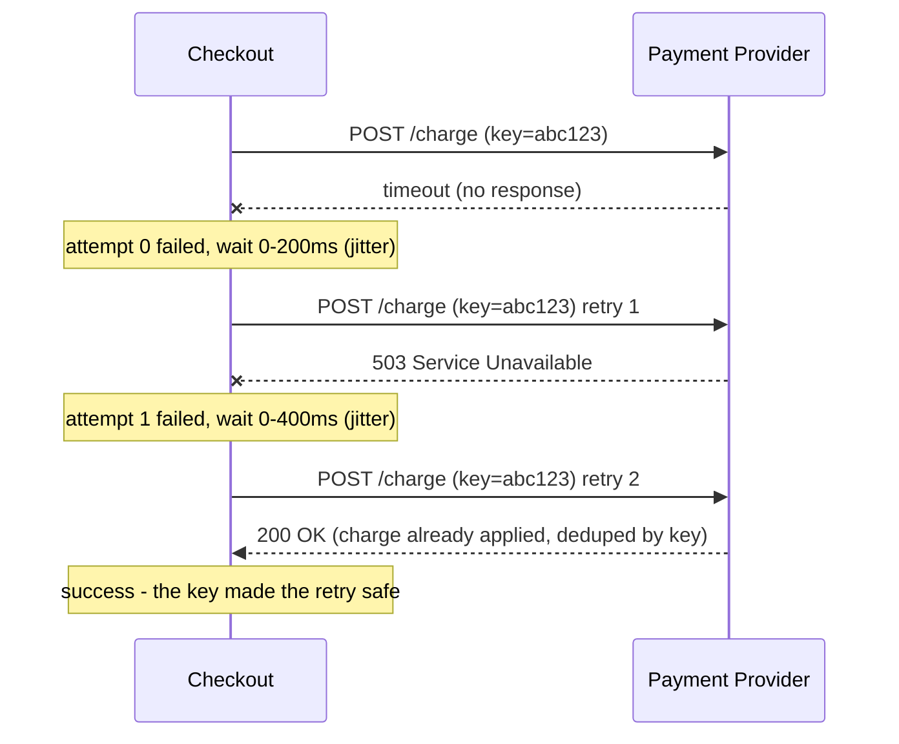
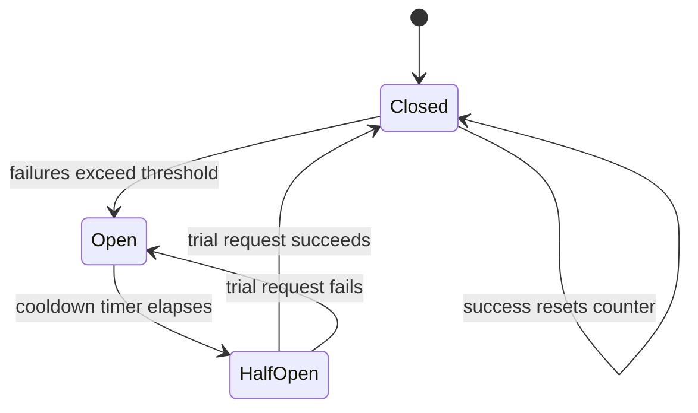
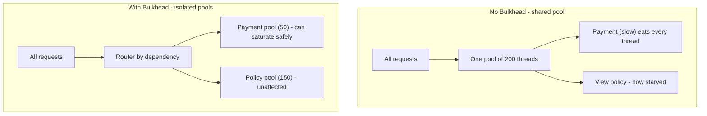
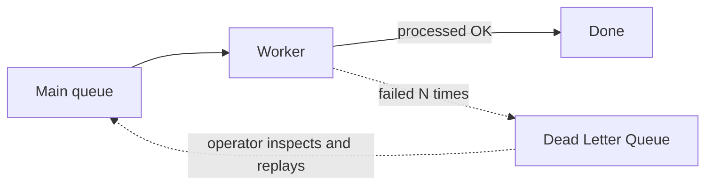

# Resilience Patterns - Surviving Partial Failure

> "In a distributed system you do not get to choose whether dependencies fail. You only get to choose what happens to your users when they do." - Staff Reliability Engineer

---

## At a Glance

| | |
|---|---|
| **The problem** | In a distributed system, parts fail independently and constantly - a slow payment API, a dropped packet, a saturated thread pool - and a naive caller turns one sick dependency into a total outage |
| **The core idea** | Treat every remote call as if it can be slow, fail, or lie. Bound it (timeout), retry it safely (backoff + idempotency), isolate it (bulkhead), and trip away from it (circuit breaker) so failure stays local |
| **The trap** | Adding retries without backoff, jitter, or idempotency - this turns a small hiccup into a self-inflicted retry storm that takes down the very service you were trying to reach |
| **The mindset** | Design for graceful degradation, not for "nothing ever breaks." A checkout that shows "try again in a moment" beats one that hangs for 30 seconds and then 500s |
| **The metric** | Tail latency (p99/p99.9) and error budget - not the average. Averages hide the failures that actually hurt users |

---

## The Story First (Read This Even If You Skip the Rest)

You run the checkout service for an insurance portal. A customer clicks **Pay**, and your service calls an external payment provider over HTTPS. Ninety-nine percent of the time it answers in 200ms. Life is good.

One afternoon the provider has a bad deploy. Their API starts answering in 25 seconds instead of 200ms - not failing, just slow. Here is what happens if you did nothing defensive:

1. Each checkout request now holds a thread (or connection) open for 25 seconds.
2. Your service has a fixed pool of, say, 200 worker threads. Within seconds all 200 are stuck waiting on the slow provider.
3. New requests - including ones that do not even touch payment, like "view my policy" - now queue with nowhere to run. The whole service appears down.
4. Your load balancer marks the instance unhealthy and shifts traffic to the other instances, which immediately fill up the same way.
5. You are now fully down. One slow dependency took out everything. This is a **cascading failure**.

A resilient checkout behaves completely differently. It sets a **timeout** of 2 seconds, so a stuck call fails fast instead of holding a thread. It **retries** once or twice with **backoff and jitter**, but only because the payment call is **idempotent** (guarded by an idempotency key, so a retry never double-charges). After enough failures it opens a **circuit breaker** and stops calling the provider entirely for 30 seconds - failing instantly instead of waiting. The payment calls run in their own **bulkhead** (a separate, bounded pool), so even total payment failure cannot starve "view my policy." And it has a **fallback**: "We could not reach the payment provider - your order is saved, we will retry and email you." The customer is annoyed but not stranded, and the rest of the site stays up.

Same dependency failure. The only difference is whether you built the patterns in this page.

---

## Why Distributed Systems Fail Partially

A single program either runs or crashes. A distributed system has a third, nastier state: **partially up**. Some nodes are healthy, some are slow, some are dead, and the network between them can drop, delay, duplicate, or reorder messages.

The dangerous part is that, from the caller's side, **slow and dead look the same** until your timeout fires. A call that never returns ties up a resource forever. Worse, you usually cannot tell whether a failed request actually executed - the request may have succeeded and only the *response* got lost. That single fact drives almost everything below: it is why retries are dangerous and why idempotency is the precondition for safe retries.


The job of resilience patterns is to keep one component's bad day from becoming everyone's bad day.

---

## Timeouts: Always Set Them

The most common production incident is not a crash - it is a hang. Every default timeout in your stack is probably wrong: many HTTP clients default to **infinite**. An unbounded call is a resource leak waiting for a slow dependency.

```typescript
// BAD - no timeout. One slow provider holds this thread until the heat death of the universe.
const res = await fetch(provider.chargeUrl, { method: "POST", body });

// GOOD - bound the call. Free the resource fast.
async function postWithTimeout(url: string, body: unknown, ms: number) {
  const controller = new AbortController();
  const timer = setTimeout(() => controller.abort(), ms);
  try {
    return await fetch(url, { method: "POST", body: JSON.stringify(body), signal: controller.signal });
  } finally {
    clearTimeout(timer);
  }
}

// 2s is plenty when the dependency normally answers in 200ms.
const res = await postWithTimeout(provider.chargeUrl, body, 2000);
```

!!! tip "Set the timeout from the data, not from a vibe"
    A good rule of thumb: set the timeout near the **p99.9 latency** of the dependency under normal load, not its average. If p99.9 is 800ms, a 2s timeout gives headroom without letting a stuck call hang for half a minute. Then make sure your timeouts get *tighter* as you go down the call chain - an outer request budget of 3s should not contain an inner call allowed to take 5s.

!!! warning "Budget your timeouts end to end"
    If the user-facing request has a 3s budget and you make 3 sequential downstream calls, you cannot give each one a 3s timeout. Allocate a slice to each. Otherwise the outer caller gives up while the inner work keeps burning resources for nothing - this is called **work amplification**.

---

## Retries: Backoff, Jitter, and the Retry Storm

A timeout that just fails is honest but unhelpful. Many failures are **transient** - a momentary blip, a brief spike, a single dropped packet. Retrying fixes those. But naive retries are how you turn a small incident into an outage.

### Why naive retries cause a retry storm

Imagine the provider has a 1-second blip and 10,000 in-flight requests all fail. If every client retries immediately, you get 10,000 retries the instant the provider is most fragile - right as it is trying to recover. That spike knocks it back down, causing another round of failures and another synchronized retry. The system oscillates and never recovers. This is a **retry storm** (also called a thundering herd).

Two fixes, used together:

- **Exponential backoff** - wait longer after each failure: 200ms, 400ms, 800ms, ... This spreads retries out over time instead of slamming the dependency.
- **Jitter** - add randomness so clients do not retry in lockstep. Without jitter, exponential backoff still synchronizes everyone onto the same retry instants.

```typescript
// Exponential backoff with full jitter (the AWS-recommended variant).
function backoffDelay(attempt: number, baseMs = 200, capMs = 5000): number {
  const exp = Math.min(capMs, baseMs * 2 ** attempt);  // 200, 400, 800, ... capped
  return Math.random() * exp;                          // full jitter: pick anywhere in [0, exp]
}

async function withRetry<T>(fn: () => Promise<T>, maxAttempts = 3): Promise<T> {
  let lastErr: unknown;
  for (let attempt = 0; attempt < maxAttempts; attempt++) {
    try {
      return await fn();
    } catch (err) {
      lastErr = err;
      if (!isRetryable(err) || attempt === maxAttempts - 1) throw err;
      await sleep(backoffDelay(attempt));
    }
  }
  throw lastErr;
}
```



!!! warning "Never retry everything"
    Only retry errors that *might* succeed on a second try: timeouts, connection resets, HTTP 502/503/504, and explicit "rate limited, retry after" responses. Do **not** retry a 400 (bad request) or 401 (unauthorized) - the input is wrong and a retry will just fail again, wasting capacity. And cap total attempts: 3 is usually plenty. Retries deeper in the stack multiply, so prefer retrying at **one** layer, not every layer.

---

## Idempotency: The Precondition for Safe Retries

Here is the trap that makes retries scary. Recall that **a successful request whose response got lost looks identical to a failed request**. So when you retry, you might be executing the operation a second time. For a payment, that means **double-charging the customer**.

The fix is **idempotency**: an operation you can apply many times with the same effect as applying it once. Reads are naturally idempotent. Writes usually are not - unless you make them so with an **idempotency key**.

```typescript
// Caller generates ONE key per logical operation and reuses it across retries.
const idempotencyKey = crypto.randomUUID();  // generated once, before the first attempt

await withRetry(() =>
  postWithTimeout(provider.chargeUrl, { amount, currency, idempotencyKey }, 2000)
);
```

```typescript
// Provider side (or your own write endpoint): dedupe by key.
async function charge(req: ChargeRequest): Promise<ChargeResult> {
  const existing = await store.findByKey(req.idempotencyKey);
  if (existing) return existing.result;          // already done - return the SAME result, do not charge again

  const result = await processCharge(req);        // the real, side-effecting work
  await store.save(req.idempotencyKey, result);   // remember it (with a TTL)
  return result;
}
```

!!! note "Idempotency unlocks retries"
    Without idempotency you cannot safely retry writes, which means you lose the single most effective resilience tool you have. Build idempotency keys into write APIs from day one - retrofitting them after a double-charge incident is painful. Stripe, PayPal, and most serious payment APIs support an `Idempotency-Key` header for exactly this reason.

---

## The Circuit Breaker

Retries handle brief blips. But when a dependency is **genuinely down**, retrying is the worst thing you can do - you pile load onto a service that cannot serve it, and you make your own callers wait through timeouts. A **circuit breaker** is a state machine that stops calling a dependency that is clearly broken, and fails fast instead.

It mirrors an electrical breaker: when current is dangerous, it trips open and cuts the circuit.



- **Closed** - normal. Calls pass through. The breaker counts failures. If failures cross a threshold (say, 50% of the last 20 calls), it trips to **Open**.
- **Open** - the dependency is presumed down. Calls **fail instantly** without even attempting the network - no waiting on timeouts, no piling on load. After a cooldown (say 30s) it moves to **Half-Open**.
- **Half-Open** - cautious recovery. It lets a *single* trial request through. If that succeeds, it assumes the dependency healed and goes back to **Closed**. If it fails, it snaps back to **Open** and waits again.

```typescript
class CircuitBreaker {
  private state: "closed" | "open" | "half-open" = "closed";
  private failures = 0;
  private openedAt = 0;

  constructor(private threshold = 10, private cooldownMs = 30_000) {}

  async call<T>(fn: () => Promise<T>): Promise<T> {
    if (this.state === "open") {
      if (Date.now() - this.openedAt < this.cooldownMs) {
        throw new Error("circuit open - failing fast");  // do NOT touch the network
      }
      this.state = "half-open";  // cooldown elapsed - allow one trial
    }
    try {
      const result = await fn();
      this.onSuccess();
      return result;
    } catch (err) {
      this.onFailure();
      throw err;
    }
  }

  private onSuccess() { this.failures = 0; this.state = "closed"; }
  private onFailure() {
    this.failures++;
    if (this.state === "half-open" || this.failures >= this.threshold) {
      this.state = "open";
      this.openedAt = Date.now();
    }
  }
}
```

!!! tip "Circuit breaker and retry are partners"
    Wrap the retry loop *inside* the breaker. The breaker decides whether it is even worth trying; the retry handles transient failures once the breaker lets you through. A breaker without retries is twitchy; retries without a breaker become a storm.

---

## The Bulkhead: Isolate Resource Pools

A ship's hull is divided into watertight **bulkheads** so that a breach in one compartment does not flood the whole vessel. Apply the same idea to resources: give each dependency its own bounded pool of threads/connections, so one saturated dependency cannot starve the rest.

Recall the opening story: the real killer was that *all* 200 threads got consumed by the slow payment call, taking out unrelated traffic. With bulkheads, payment gets at most (say) 50 threads. When payment hangs, those 50 are stuck - but the other 150 keep serving "view my policy" just fine.



```typescript
// A simple semaphore-based bulkhead: at most `limit` concurrent calls into one dependency.
class Bulkhead {
  private active = 0;
  constructor(private limit: number) {}

  async run<T>(fn: () => Promise<T>): Promise<T> {
    if (this.active >= this.limit) throw new Error("bulkhead full - shedding load");
    this.active++;
    try { return await fn(); }
    finally { this.active--; }
  }
}

const paymentBulkhead = new Bulkhead(50);  // payment can never use more than 50 slots
```

!!! note "Bulkheads convert total outages into partial ones"
    The point is not to make payment faster - it is to make sure a payment failure is *contained*. Partial degradation is a feature, not a bug.

---

## Rate Limiting and Load Shedding

Resilience is not only about your dependencies failing - it is also about you protecting yourself from too much load.

- **Rate limiting** caps how many requests a client (or the whole system) may make in a window. It protects you from a single noisy customer and protects your downstreams from your own retries. Common algorithm: **token bucket** - tokens refill at a fixed rate, each request spends one, and a request with no token available is rejected or queued.
- **Load shedding** is the harder, more important discipline: when you are *already* overloaded, deliberately reject some requests fast (HTTP 429/503) so that the rest succeed. A server that accepts everything under overload serves *everyone* slowly and eventually collapses. A server that sheds the excess keeps serving most users well.

```typescript
// Token bucket rate limiter.
class TokenBucket {
  private tokens: number;
  private lastRefill = Date.now();
  constructor(private capacity: number, private refillPerSec: number) {
    this.tokens = capacity;
  }
  tryRemove(): boolean {
    const now = Date.now();
    this.tokens = Math.min(this.capacity, this.tokens + ((now - this.lastRefill) / 1000) * this.refillPerSec);
    this.lastRefill = now;
    if (this.tokens >= 1) { this.tokens -= 1; return true; }
    return false;  // no token - reject (429) instead of accepting work you cannot do
  }
}
```

!!! warning "Shed cheaply, shed early"
    Load shedding only helps if rejecting is *much* cheaper than serving. Reject at the edge (before you do expensive auth, DB lookups, etc.), and prefer to shed low-value traffic first (e.g. health-check pollers or background sync) so paying users get the scarce capacity.

---

## Fallbacks and Graceful Degradation

When a dependency is unavailable, a **fallback** gives the user a degraded-but-useful response instead of an error. The art is choosing a fallback that is honest and safe.

| Scenario | Good fallback | Bad "fallback" |
|---|---|---|
| Recommendations service down | Show a generic best-sellers list | Crash the whole page |
| Pricing service slow | Show last-cached price with a "may be outdated" note | Show a guessed price |
| Payment provider down at checkout | Accept the order as **pending**, queue it, email when charged | Silently mark it paid |

For a payment specifically, you must **never** fabricate success. The correct degradation is to persist the intent and tell the truth: "We saved your order and will complete payment shortly." That keeps the business moving without lying about money.

```typescript
async function checkout(order: Order): Promise<CheckoutResult> {
  try {
    const charge = await breaker.call(() =>
      paymentBulkhead.run(() => withRetry(() => chargeWithTimeout(order)))
    );
    return { status: "paid", chargeId: charge.id };
  } catch (err) {
    // Fallback: do not lie, do not lose the order. Queue it for later.
    await orderRepo.markPending(order.id);
    await deadLetterQueue.publish({ type: "retry_charge", orderId: order.id });
    return { status: "pending", message: "Payment is being processed - we will email you." };
  }
}
```

---

## Dead Letter Queues

Not every failure can be handled inline. When an async message (or a queued job like our pending charge) keeps failing after all retries, you do not want to drop it silently and you do not want it to block the queue forever. Send it to a **dead letter queue (DLQ)** - a separate queue for messages that could not be processed.

A DLQ does three things: it **unblocks** the main queue (a poison message stops jamming everything behind it), it **preserves** the failed message for inspection instead of losing data, and it gives operators a place to **diagnose and replay** once the underlying problem is fixed.



!!! tip "Always alert on the DLQ"
    A DLQ that nobody watches is just a place where data goes to die. Alert when its depth grows, attach the failure reason to each message, and build a replay tool *before* you need it at 3am.

---

## Health Checks: Readiness vs Liveness

Orchestrators (Kubernetes, ECS, your load balancer) need to know two different things about your instance, and conflating them causes outages.

- **Liveness** - "Is this process alive, or is it wedged and should be killed?" If the liveness probe fails, the orchestrator **restarts** the container. Keep it cheap and local: it should check that the process itself is not deadlocked, *not* whether the database is reachable.
- **Readiness** - "Is this instance ready to receive traffic *right now*?" If the readiness probe fails, the orchestrator **stops sending traffic** but does **not** restart. This is where you check that dependencies (DB, cache, downstream) are reachable, and where you report "I am warming up" or "I am draining."

```yaml
# Kubernetes probes - note the different intents and endpoints.
livenessProbe:
  httpGet: { path: /healthz/live, port: 8080 }   # cheap, local: am I deadlocked?
  periodSeconds: 10
  failureThreshold: 3
readinessProbe:
  httpGet: { path: /healthz/ready, port: 8080 }   # checks deps: should I get traffic?
  periodSeconds: 5
  failureThreshold: 2
```

!!! warning "Do not check the database in your liveness probe"
    A classic self-inflicted outage: the liveness probe pings the database. The database has a brief hiccup, every instance's liveness probe fails at once, the orchestrator restarts *all* of them simultaneously, and now you have a cold-start stampede on a fragile database. Dependency health belongs in **readiness**, never in liveness.

---

## Cascading Failures and How to Stop Them

A cascading failure is the opening story: one component fails, its failure consumes a shared resource (threads, connections, memory), that starves other work, callers retry and pile on, and the failure propagates upstream until everything is down. Each pattern in this page is a firewall against one link in that chain:

| Link in the cascade | The pattern that breaks it |
|---|---|
| A slow call holds a resource forever | **Timeout** - free the resource fast |
| Failures pile retries onto a dying service | **Backoff + jitter** and the **circuit breaker** |
| One dependency consumes the whole thread pool | **Bulkhead** - isolated pools |
| Overload makes every request slow until collapse | **Load shedding** - reject excess fast |
| An error breaks the whole user-facing flow | **Fallback / graceful degradation** |
| A poison message jams the queue | **Dead letter queue** |
| A flaky instance keeps getting traffic | **Readiness checks** - drain it |

The unifying principle: **contain failure locally and fail fast**. Slow failure is what spreads; fast failure is what stays put.

---

## Common Mistakes (and the Fix)

| Mistake | Why it hurts | Fix |
|---|---|---|
| No timeout (relying on client defaults) | One slow dependency hangs threads until the service falls over | Set explicit, data-driven timeouts on every remote call; budget them end to end |
| Retries without backoff or jitter | Synchronized retries create a storm that takes down the recovering dependency | Exponential backoff + full jitter, capped attempts |
| Retrying non-idempotent writes | Double-charges, duplicate orders, corrupted state | Idempotency keys on every write before you allow retries |
| Retrying 4xx errors | Wastes capacity; the input is wrong and will never succeed | Retry only timeouts and 5xx/429; never 400/401/403/404 |
| Same thread pool for all dependencies | One slow dependency starves everything (cascading failure) | Bulkhead: bounded, isolated pool per dependency |
| Liveness probe checks the database | A DB blip restarts every instance at once - a stampede | Liveness = local only; dependency checks go in readiness |
| Fallback that fakes success for payments | Silent data loss / financial inconsistency | Persist intent as pending, queue it, tell the user the truth |
| DLQ with no alerting or replay tool | Failed messages pile up unseen; data effectively lost | Alert on DLQ depth; build a replay path before you need it |

---

## In Clean Architecture Terms

Resilience lives almost entirely in the **adapter / infrastructure** layers, and that is deliberate. The dependency rule keeps it there:

- The **entities** (Order, Charge) and **use cases** (PlaceOrder) express *business rules* - "an order is paid when the charge succeeds." They must not know that the payment client uses a circuit breaker or three retries. They depend on a port: `IPaymentGateway`.
- Timeouts, retries, backoff, the circuit breaker, the bulkhead, and rate limiting are all properties of the **adapter** that implements `IPaymentGateway` (e.g. `StripePaymentAdapter`). Swapping providers, or tuning the retry budget, never touches a use case.
- **Idempotency keys** are interesting: the *key* is a business concern (it identifies a logical operation, so it belongs to the use case), but the *dedup mechanism* is infrastructure. The use case generates and passes the key; the adapter and the provider enforce uniqueness.
- **Fallbacks** are a use-case decision ("if payment is unreachable, the order becomes pending") because they encode business policy - so the graceful-degradation branch belongs in the use case, while the mechanics of detecting the failure (breaker open, timeout) belong in the adapter.

Keeping resilience in the adapters means you can test business rules without a network, and test resilience (inject timeouts, force the breaker open) without touching business logic.

---

## Checklist

- [ ] Every outbound network call has an explicit timeout (no infinite defaults)
- [ ] Timeouts are budgeted end to end and get tighter down the call chain
- [ ] Retries use exponential backoff **and** jitter, with a capped attempt count
- [ ] Only transient errors are retried (timeouts, 5xx, 429) - never 4xx
- [ ] Every write endpoint accepts an idempotency key and dedupes on it
- [ ] A circuit breaker wraps each flaky dependency (closed / open / half-open)
- [ ] Each dependency has its own bounded resource pool (bulkhead)
- [ ] The service sheds load (429/503) under overload instead of accepting everything
- [ ] User-facing flows have a defined fallback / graceful-degradation path
- [ ] Fallbacks never fabricate success for money or other irreversible actions
- [ ] Failed async messages go to a DLQ that is alerted on and replayable
- [ ] Liveness and readiness probes are separate; liveness is local-only
- [ ] Resilience config (timeouts, thresholds) lives in adapters, not in use cases

---

## Sources

- [AWS Architecture Blog - Exponential Backoff And Jitter](https://aws.amazon.com/blogs/architecture/exponential-backoff-and-jitter/)
- [Microsoft Azure Architecture Center - Circuit Breaker pattern](https://learn.microsoft.com/en-us/azure/architecture/patterns/circuit-breaker)
- [Microsoft Azure Architecture Center - Bulkhead pattern](https://learn.microsoft.com/en-us/azure/architecture/patterns/bulkhead)
- [Google SRE Book - Handling Overload (load shedding)](https://sre.google/sre-book/handling-overload/)
- [Stripe API Docs - Idempotent requests](https://docs.stripe.com/api/idempotent_requests)
- [Kubernetes Docs - Configure Liveness, Readiness and Startup Probes](https://kubernetes.io/docs/tasks/configure-pod-container/configure-liveness-readiness-startup-probes/)
