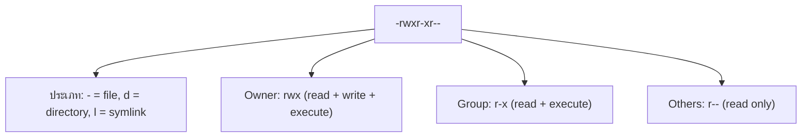
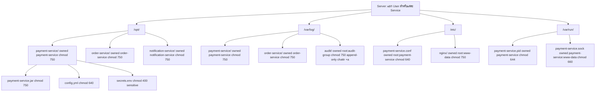

# Linux/Unix Permission - คู่มือฉบับสมบูรณ์ (ภาษาไทย)

> สำหรับ Server ที่รัน Microservices หลายตัว และต้องการความปลอดภัยสูงสุด ผ่าน Pentest ได้

---

## ทำไม Permission ถึงสำคัญมาก?

```
ถ้า Pentest เจอ:
  world-writable file ใน system -> CRITICAL finding -> ต้องแก้ก่อน go-live
  SUID bit ที่ไม่จำเป็น -> HIGH finding -> privilege escalation ได้
  Service รันด้วย root -> HIGH finding -> ถ้า exploit ได้ = เสียทั้ง server
  Permission 777 -> MEDIUM finding -> ข้อมูล leak ได้

สำหรับ Fintech / Payment System:
  PCI DSS ต้องการ: least privilege principle (Requirement 7)
  BOT / SEC ต้องการ: access control documented และ enforced
```

---

## พื้นฐาน: ระบบ Permission ของ Linux

### ผู้ใช้ใน Linux มี 3 ประเภท

```
Owner (User)  = เจ้าของ file/directory
Group         = กลุ่มที่ owner กำหนด
Others        = คนอื่นทั้งหมดที่ไม่ใช่ owner และ group
```

### อ่านค่า Permission

แผนผังการแยกความหมายของแต่ละส่วนใน permission string `-rwxr-xr--`:



```bash
ls -la /var/www/html/index.php
# -rwxr-xr-- 1 www-data www-data 1234 Jan 15 10:00 index.php

# Permission แต่ละตัว:
# r = read    (4) = อ่านได้
# w = write   (2) = เขียนได้
# x = execute (1) = รันได้ (หรือเข้า directory ได้)
# - = ไม่มี permission (0)
```

### เลขฐาน 8 (Octal)

```
rwx = 4+2+1 = 7
rw- = 4+2+0 = 6
r-x = 4+0+1 = 5
r-- = 4+0+0 = 4
--- = 0+0+0 = 0

ตัวอย่าง:
  chmod 755 file = rwxr-xr-x (owner: rwx, group: r-x, others: r-x)
  chmod 644 file = rw-r--r-- (owner: rw-, group: r--, others: r--)
  chmod 600 file = rw------- (owner: rw-, group: none, others: none)
  chmod 000 file = ---------- (ไม่มีใคร access ได้)
```

---

## Permission มาตรฐาน (ตามประเภท file)

```bash
# Regular files (ไม่ต้อง execute):
chmod 644 /etc/config.conf       # owner: rw-, group: r--, others: r--
chmod 600 /etc/secret.key        # owner: rw-, ไม่ให้ group/others อ่าน (sensitive!)
chmod 640 /var/log/app.log       # owner: rw-, group: r-- (group อ่านได้), others: ไม่ได้

# Executable files / scripts:
chmod 755 /usr/local/bin/myapp   # owner: rwx, group: r-x, others: r-x
chmod 700 /root/scripts/admin.sh # เฉพาะ root เท่านั้น

# Directories:
chmod 755 /var/www/html          # owner: rwx, group: r-x, others: r-x (เว็บปกติ)
chmod 750 /opt/payment-service   # owner: rwx, group: r-x, others: ไม่ได้ (service secure)
chmod 700 /root                  # เฉพาะ root เท่านั้น

# Private/sensitive directories:
chmod 700 /home/deploy/.ssh      # SSH keys: เฉพาะ owner เท่านั้น!
chmod 600 /home/deploy/.ssh/id_rsa # Private key: อ่านได้เฉพาะ owner
chmod 644 /home/deploy/.ssh/id_rsa.pub # Public key: อ่านได้ทั่วไป
```

---

## หลัก Least Privilege สำหรับ Microservices

### ปัญหาที่ Pentest มักเจอ

```bash
# [X] BAD: ทุก service รันด้วย root
ps aux | grep "root.*java"
# root  1234  java -jar payment-service.jar <- อันตราย!

# [X] BAD: service file เปิด write ให้ทุกคน
ls -la /opt/payment-service/config.yml
# -rw-rw-rw- 1 root root 2048 Jan 15 /opt/payment-service/config.yml
# (world-writable = attacker แก้ config ได้!)

# [X] BAD: log directory ที่ทุกคน write ได้
ls -la /var/log/
# drwxrwxrwx 2 root root /var/log/payment/ <- อันตราย!
```

### [OK] วิธีที่ถูกต้อง: User แยกต่างหากต่อ Service

```bash
# สร้าง dedicated user สำหรับแต่ละ service (ไม่มี home, ไม่มี shell)
sudo useradd --system --no-create-home --shell /bin/false payment-service
sudo useradd --system --no-create-home --shell /bin/false order-service
sudo useradd --system --no-create-home --shell /bin/false notification-service

# --system = system user (UID < 1000, ไม่ login ได้)
# --no-create-home = ไม่สร้าง /home directory
# --shell /bin/false = ไม่มี shell (SSH เข้าไม่ได้)

# ตรวจสอบ:
grep "payment-service" /etc/passwd
# payment-service:x:998:998::/:/bin/false <- ถูกต้อง: shell = /bin/false
```

### กำหนด Ownership และ Permission สำหรับ Service

```bash
# Payment service
sudo chown -R payment-service:payment-service /opt/payment-service
sudo chmod -R 750 /opt/payment-service          # owner: rwx, group: r-x, others: ไม่ได้
sudo chmod 640 /opt/payment-service/config.yml  # config: owner: rw-, group: r--, others: ไม่ได้
sudo chmod 400 /opt/payment-service/secrets.env # secrets: อ่านได้เฉพาะ owner เท่านั้น!

# Log directory
sudo mkdir -p /var/log/payment-service
sudo chown payment-service:payment-service /var/log/payment-service
sudo chmod 750 /var/log/payment-service         # เฉพาะ service user เขียน log ได้

# Binary/executable
sudo chown root:payment-service /opt/payment-service/payment-service.jar
sudo chmod 750 /opt/payment-service/payment-service.jar
# owner (root): rwx, group (payment-service): r-x, others: ไม่ได้

# ตรวจสอบ:
ls -la /opt/payment-service/
# drwxr-x--- 3 payment-service payment-service 4096 Jan 15 /opt/payment-service/
# -rw-r----- 1 payment-service payment-service 2048 Jan 15 config.yml
# -r-------- 1 payment-service payment-service  512 Jan 15 secrets.env <- 400!
```

---

## Systemd Service - รัน Service ด้วย User ที่กำหนด

```ini
# /etc/systemd/system/payment-service.service
[Unit]
Description=Payment Microservice
After=network.target postgresql.service
Requires=postgresql.service

[Service]
Type=simple
User=payment-service           # <- รันด้วย user นี้ ไม่ใช่ root!
Group=payment-service
WorkingDirectory=/opt/payment-service

# Environment file (chmod 400 ก่อน!)
EnvironmentFile=/opt/payment-service/secrets.env

# รัน service
ExecStart=/usr/bin/java \
  -Xms512m \
  -Xmx1024m \
  -jar /opt/payment-service/payment-service.jar

# Security hardening:
NoNewPrivileges=yes            # ห้าม process escalate privilege
PrivateTmp=yes                 # /tmp แยกต่างหาก ไม่ share กับ process อื่น
ProtectSystem=strict           # filesystem read-only ยกเว้นที่กำหนด
ReadWritePaths=/var/log/payment-service  # เขียนได้เฉพาะ log dir
ProtectHome=yes                # ห้าม access /home, /root, /run/user
RestrictNetworkInterfaces=lo eth0  # ใช้ network เฉพาะ interface ที่กำหนด

[Install]
WantedBy=multi-user.target
```

```bash
# Reload และเริ่ม service
sudo systemctl daemon-reload
sudo systemctl enable payment-service
sudo systemctl start payment-service
sudo systemctl status payment-service

# ตรวจสอบว่ารันด้วย user ที่ถูกต้อง:
ps aux | grep payment-service
# payment-service  1234  java -jar payment-service.jar <- ถูกต้อง!
```

---

## Special Permissions: SUID, SGID, Sticky Bit

### SUID (Set User ID) - อันตราย!

```bash
# SUID = รัน executable ด้วย permission ของ owner แทน user ที่รัน
# ถ้า owner = root และมี SUID = ทุกคนรันได้ด้วย root permission!

# หา SUID files (Pentest จะทำสิ่งนี้):
find / -perm -4000 -type f 2>/dev/null
# -rwsr-xr-x 1 root root /usr/bin/sudo <- จำเป็น (sudo ต้องเป็น root)
# -rwsr-xr-x 1 root root /usr/bin/passwd <- จำเป็น (เปลี่ยน password)
# -rwsr-xr-x 1 root root /usr/bin/ping <- ส่วนใหญ่จำเป็น
# -rwsr-xr-x 1 root root /opt/myapp/tool <- อันตราย! เอาออก!

# ลบ SUID ที่ไม่จำเป็น:
sudo chmod u-s /opt/myapp/tool
# หรือ:
sudo chmod 755 /opt/myapp/tool  # ลบ s bit ออก
```

### SGID (Set Group ID)

```bash
# บน directory: files ที่สร้างใหม่ inherit group ของ directory
# มีประโยชน์สำหรับ shared directories

# สร้าง shared log directory ที่ทุก service ใน group เขียนได้:
sudo mkdir /var/log/shared-services
sudo chgrp microservices /var/log/shared-services
sudo chmod 2770 /var/log/shared-services  # 2 = SGID, 770 = rwxrwx---

# หา SGID files (Pentest ก็ตรวจ):
find / -perm -2000 -type f 2>/dev/null
```

### Sticky Bit - สำหรับ Shared Directories

```bash
# Sticky bit: ใน directory ที่ทุกคนเขียนได้
# เฉพาะ owner ของ file เท่านั้นที่ลบ file ของตัวเองได้

# /tmp มี sticky bit:
ls -la / | grep tmp
# drwxrwxrwt 20 root root /tmp <- t = sticky bit

# ทุกคนสร้างได้ใน /tmp แต่ลบได้เฉพาะ file ของตัวเอง
chmod 1777 /var/www/uploads  # sticky bit สำหรับ upload directory
```

---

## ACL - Access Control Lists (กรณีต้องการ Permission ละเอียดกว่า)

```bash
# ACL ให้กำหนด permission สำหรับ user/group เพิ่มเติมได้
# โดยไม่เปลี่ยน owner หรือ group

# ติดตั้ง:
sudo apt install acl   # Ubuntu/Debian
sudo yum install acl   # RHEL/CentOS

# ให้ user 'jenkins' อ่าน log ของ payment-service ได้ (เพื่อ CI/CD):
sudo setfacl -m u:jenkins:r /var/log/payment-service/app.log

# ให้ group 'monitoring' อ่าน config ได้ (เพื่อ health check):
sudo setfacl -m g:monitoring:r /opt/payment-service/config.yml

# ดู ACL ที่กำหนด:
getfacl /var/log/payment-service/app.log
# file: app.log
# owner: payment-service
# group: payment-service
# user::rw-
# user:jenkins:r-- <- ACL: jenkins อ่านได้
# group::---
# group:monitoring:r-- <- ACL: monitoring group อ่านได้
# mask::r--
# other::---

# ลบ ACL:
sudo setfacl -x u:jenkins /var/log/payment-service/app.log

# Default ACL (files ใหม่ใน directory จะ inherit ACL นี้):
sudo setfacl -d -m u:jenkins:r /var/log/payment-service/
```

---

## umask - ค่า Default Permission สำหรับ Files ใหม่

```bash
# umask กำหนด permission ที่ "ถูกลบออก" เมื่อสร้าง file/directory ใหม่

# ค่า default ของ Linux:
umask
# 0022 <- ลบ write permission ออกจาก group และ others

# อธิบาย (umask ใช้ bitwise AND-NOT ไม่ใช่การลบธรรมดา แต่ผลลัพธ์เหมือนกันในกรณีนี้):
#
# file default: 666 (rw-rw-rw-)  = 110 110 110 ในเลขฐาน 2
# umask 022                       = 000 010 010 ในเลขฐาน 2
# complement of umask             = 111 101 101
# 666 AND (NOT 022)               = 110 100 100 = 644 (rw-r--r--)
#
# directory default: 777          = 111 111 111
# 777 AND (NOT 022)               = 111 101 101 = 755 (rwxr-xr-x)
#
# สรุปง่ายๆ: umask 022 = ตัด write bit ออกจาก group (020) และ others (002)

# สำหรับ production service ที่ต้องการ security สูง:
# ใส่ใน /etc/systemd/system/payment-service.service:
UMask=0027   # file ใหม่ = 640, dir ใหม่ = 750

# ตรวจสอบ umask ของ process:
cat /proc/$(pgrep payment-service)/status | grep Umask
# Umask: 0027
```

---

## ตรวจสอบ Security - สิ่งที่ Pentest จะทำ

```bash
# 1. หา world-writable files (Pentest จะทำก่อน):
find / -not \( -path /proc -prune \) -not \( -path /sys -prune \) \
  -perm -o+w -type f 2>/dev/null | grep -v "^/dev"
# ต้องไม่มี result นอกจาก /tmp, /dev/null, /dev/zero

# 2. หา SUID/SGID files ที่ไม่จำเป็น:
find / -perm /6000 -type f 2>/dev/null | sort
# ตรวจทุก file ว่าจำเป็นจริงๆ หรือเปล่า

# 3. หา files ที่ root เป็น owner แต่ writable โดย others:
find / -user root -perm -o+w -not -path "/proc/*" -not -path "/sys/*" 2>/dev/null

# 4. ตรวจ service ที่รันด้วย root (ไม่ควรมี ยกเว้น system services):
ps aux | awk '$1 == "root" {print $0}' | grep -v "\[" | sort

# 5. ตรวจ SSH keys permission:
find /home -name "authorized_keys" | while read f; do
  stat -c "%a %U %n" "$f"
done
# ต้องเป็น 600 หรือ 640 เท่านั้น

# 6. ตรวจ config files ที่มี permission กว้างเกินไป:
find /etc /opt /var -name "*.conf" -o -name "*.yml" -o -name "*.env" | \
  xargs ls -la | awk '$1 ~ /....w..w./ {print "RISKY:", $0}'
# ไฟล์ที่ group/others write ได้ = อันตราย

# 7. ตรวจ directory ที่ไม่ควร executable สำหรับ others:
find /opt /srv -perm -o+x -type d 2>/dev/null
# Service directories ไม่ควร executable สำหรับ others
```

---

## Server ที่รัน Microservices หลายตัว - Best Practice

แผนผังโครงสร้างไฟล์ของ Server ที่แยก user/permission ให้แต่ละ service:



```bash
# Script สำหรับ setup แต่ละ service ใหม่:
setup_microservice() {
  local SERVICE_NAME=$1
  local SERVICE_PORT=$2

  echo "Setting up ${SERVICE_NAME}..."

  # 1. สร้าง system user
  sudo useradd --system --no-create-home --shell /bin/false "${SERVICE_NAME}"

  # 2. สร้าง directories
  sudo mkdir -p "/opt/${SERVICE_NAME}"
  sudo mkdir -p "/var/log/${SERVICE_NAME}"

  # 3. กำหนด ownership
  sudo chown -R "${SERVICE_NAME}:${SERVICE_NAME}" "/opt/${SERVICE_NAME}"
  sudo chown -R "${SERVICE_NAME}:${SERVICE_NAME}" "/var/log/${SERVICE_NAME}"

  # 4. กำหนด permission
  sudo chmod 750 "/opt/${SERVICE_NAME}"
  sudo chmod 750 "/var/log/${SERVICE_NAME}"

  echo "Done. Deploy your JAR to /opt/${SERVICE_NAME}/ and set config to chmod 640"
}

# ใช้งาน:
setup_microservice "payment-service" 8080
setup_microservice "order-service" 8081
setup_microservice "notification-service" 8082
```

---

## chattr - Make Files Truly Immutable (สำหรับ Audit Log)

```bash
# chattr +a = append-only: เพิ่มได้อย่างเดียว ลบ/แก้ไม่ได้ (แม้แต่ root!)
sudo chattr +a /var/log/payment-service/audit.log

# ลอง rm:
sudo rm /var/log/payment-service/audit.log
# rm: cannot remove 'audit.log': Operation not permitted <- สำเร็จ!

# ลอง truncate:
> /var/log/payment-service/audit.log
# bash: /var/log/payment-service/audit.log: Operation not permitted <- สำเร็จ!

# แต่เพิ่มได้:
echo "new log entry" >> /var/log/payment-service/audit.log <- OK

# ดู attribute:
lsattr /var/log/payment-service/audit.log
# -----a--------e-- /var/log/payment-service/audit.log
# a = append only!

# chattr +i = immutable: แก้ไขไม่ได้เลย (แม้แต่เพิ่ม)
sudo chattr +i /etc/passwd  # <- ทำได้ใน emergency lock-down

# ลบ attribute:
sudo chattr -a /var/log/payment-service/audit.log
sudo chattr -i /etc/passwd
```

---

## Pentest Checklist - สิ่งที่ต้องผ่านทุกข้อ

```
Category: File Permissions
[ ] ไม่มี world-writable files นอก /tmp
[ ] ไม่มี world-writable directories ที่ไม่ควรมี
[ ] SUID files มีเฉพาะที่จำเป็น (sudo, passwd, ping, etc.)
[ ] SGID files มีเฉพาะที่จำเป็น
[ ] /etc ไม่มี world-readable sensitive files (เช่น .env, secrets)
[ ] SSH private keys: chmod 600 เท่านั้น
[ ] ~/.ssh directory: chmod 700 เท่านั้น

Category: Process Permissions
[ ] ไม่มี web server/app server รันด้วย root
[ ] แต่ละ service มี dedicated system user
[ ] Service users: shell = /bin/false หรือ /usr/sbin/nologin
[ ] Service users: no home directory
[ ] systemd service file: User= และ Group= กำหนดแล้ว

Category: Configuration Files
[ ] Database passwords: chmod 400 หรือ 600
[ ] API keys/secrets: chmod 400
[ ] Application config: chmod 640 (owner rw-, group r--)
[ ] ไม่มี secrets ใน environment variables ที่ readable ด้วย /proc/PID/environ
  (ใช้ secrets management เช่น HashiCorp Vault แทน)

Category: Logging
[ ] Log files: chmod 640 (service user เขียน, log group อ่าน)
[ ] Audit log: chattr +a (append-only)
[ ] Log rotation: configured (logrotate) ไม่ให้ log ใหญ่เกินไป
[ ] Log ไม่บันทึก passwords, card numbers, tokens ใน plaintext

Category: Network
[ ] firewalld/ufw: เปิดเฉพาะ port ที่จำเป็น
[ ] Service bind to localhost ถ้าไม่ต้อง expose ออก
[ ] Redis/PostgreSQL: ไม่ bind to 0.0.0.0 (ใช้ 127.0.0.1 หรือ Unix socket)
```

---

## Quick Reference - Permission Numbers ที่ใช้บ่อย

```
400  r-------- <- Secrets, private keys (อ่านได้เฉพาะ owner)
440  r--r----- <- อ่านได้ owner + group
600  rw------- <- Config, credentials (อ่าน/เขียนเฉพาะ owner)
640  rw-r----- <- Application config (owner rw, group r)
644  rw-r--r-- <- Public files, static content
700  rwx------ <- Scripts เฉพาะ owner
750  rwxr-x--- <- Service binary (owner rwx, group r-x)
755  rwxr-xr-x <- Public executables, public directories
770  rwxrwx--- <- Shared team directories (owner + group full)
777  rwxrwxrwx <- [X] อย่าใช้! อันตรายมาก
```

---

**Sources:**
- PCI DSS Requirement 7: Restrict Access to System Components
- OWASP Linux Security Best Practices
- CIS Benchmark for Linux (Center for Internet Security)
- NIST SP 800-123: Guide to General Server Security
